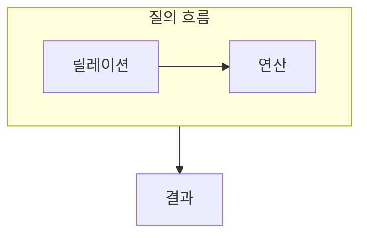

> [!abstract] 관계 데이터 연산은 릴레이션에서 원하는 튜플과 속성을 얻는 질의의 언어다.
> 무엇을 얻을지와 어떤 연산을 조합할지를 분리해 이해한다.

## 이 노트의 지도



## 1. 관계 대수의 조합

선택, 투영, 합집합, 차집합, 곱, 조인은 릴레이션을 입력으로 받아 새로운 릴레이션을 만든다. ==선택== 은 조건을 만족하는 튜플을 고르고, 투영은 필요한 속성을 남긴다.

## 2. 관계 해석의 관점

관계 해석은 원하는 결과가 만족해야 할 조건을 선언적으로 표현한다.

<details>
<summary>질의 읽기 순서</summary>

먼저 입력 릴레이션과 결과에 남겨야 할 속성을 정한다. 이어서 조건으로 튜플을 제한하고, 둘 이상의 릴레이션이 필요하면 연결 기준을 확인한다.

</details>

> [!tip] 연산 기호를 암기 순서로 쓰지 않기
> 어떤 연산을 먼저 적용할지는 결과 의미와 중간 릴레이션의 크기에 영향을 준다. 입력과 조건을 문장으로 설명해 본다.

## 한눈에 비교

```html preview
<div style="font-family:system-ui,sans-serif;padding:20px">
  <div id="cards" style="display:flex;gap:14px;flex-wrap:wrap"></div>
  <script>
    var stats = [
      ['선택', '조건 튜플', '행', 'var(--chart-1)'],
      ['투영', '필요 속성', '열', 'var(--chart-2)'],
      ['조인', '관계 연결', '결합', 'var(--chart-3)']
    ];
    document.getElementById('cards').innerHTML = stats.map(function (s) {
      return '<div style="flex:1;min-width:150px;padding:16px;background:var(--card);' +
        'color:var(--card-foreground);border:1px solid var(--border);' +
        'border-radius:var(--radius)">' +
        '<div style="font-size:13px;color:var(--muted-foreground)">' + s[0] + '</div>' +
        '<div style="font-size:26px;font-weight:700;margin-top:4px">' + s[1] + '</div>' +
        '<div style="font-size:12px;font-weight:600;margin-top:4px;color:' + s[3] + '">' +
        s[2] + '</div>' +
        '</div>';
    }).join('');
  </script>
</div>
```

## 선택 기준

<details>
<summary>두 관점을 나란히 보기</summary>

**대수.** 연산자를 조합해 결과 릴레이션을 만드는 절차적 표현에 가깝다.

**해석.** 결과가 만족해야 할 조건을 중심으로 원하는 집합을 기술한다.

</details>

## 식으로 확인

$$
\sigma_{\theta}(R)
$$

## 핵심 정리

| 구분 | 핵심 | 학습에서 확인할 점 |
| :-- | :-- | :-- |
| 선택 | 튜플 제한 | 조건이 무엇인가 |
| 투영 | 속성 선택 | 결과에 남길 열은 무엇인가 |
| 조인 | 릴레이션 연결 | 연결 기준이 무엇인가 |

> [!question]- 스스로 점검
> **Q.** 선택과 투영을 구분하면 질의에서 어떤 점이 명확해지는가?
>
> **A.** 어떤 튜플을 남길지와 그 튜플에서 어떤 속성을 보여줄지를 따로 설명할 수 있다.

## 출처 처리

> [!info] 공개 노트 정책
> 원본 연결, 이미지, 페이지 단서는 공개 노트에 남기지 않았다.
