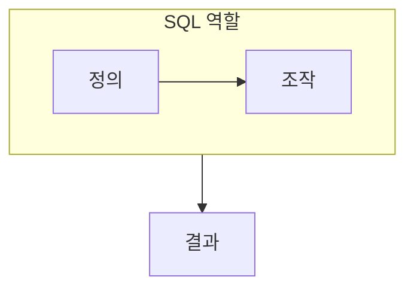

> [!abstract] SQL은 관계 데이터베이스의 구조를 정의하고 데이터를 조회·변경하는 표준 언어다.
> 명령의 문법보다 정의, 조작, 뷰, 응용 연결이라는 역할을 구분한다.

## 이 노트의 지도



## 1. 언어의 역할 나누기

데이터 정의는 테이블과 제약을 만들고, 데이터 조작은 데이터를 조회하거나 바꾼다. ==뷰== 는 필요한 데이터만 보이게 하는 논리적 테이블로, 질의 재사용과 접근 범위 조정에 쓰인다.

## 2. 응용과 SQL

삽입 SQL은 응용 프로그램 안에서 SQL 문을 사용해 데이터베이스와 연결하는 방식을 다룬다.

<details>
<summary>명령을 고르는 질문</summary>

새 구조나 제약을 만드는가, 현재 튜플을 찾거나 바꾸는가, 특정 사용자에게 보여줄 관점을 만들려는가를 먼저 묻는다.

</details>

> [!warning] 조회가 항상 상태를 바꾸는 것은 아니다
> 구조 정의와 데이터 조작을 같은 작업으로 보지 않는다. 특히 조회는 원하는 결과를 얻는 작업이고, 변경은 데이터 상태를 바꾸는 작업이다.

## 한눈에 비교

```html preview
<div style="font-family:system-ui,sans-serif;padding:20px">
  <div id="cards" style="display:flex;gap:14px;flex-wrap:wrap"></div>
  <script>
    var stats = [
      ['DDL', '구조 정의', '스키마', 'var(--chart-1)'],
      ['DML', '데이터 조작', '튜플', 'var(--chart-2)'],
      ['뷰', '논리 테이블', '관점', 'var(--chart-3)']
    ];
    document.getElementById('cards').innerHTML = stats.map(function (s) {
      return '<div style="flex:1;min-width:150px;padding:16px;background:var(--card);' +
        'color:var(--card-foreground);border:1px solid var(--border);' +
        'border-radius:var(--radius)">' +
        '<div style="font-size:13px;color:var(--muted-foreground)">' + s[0] + '</div>' +
        '<div style="font-size:26px;font-weight:700;margin-top:4px">' + s[1] + '</div>' +
        '<div style="font-size:12px;font-weight:600;margin-top:4px;color:' + s[3] + '">' +
        s[2] + '</div>' +
        '</div>';
    }).join('');
  </script>
</div>
```

## 선택 기준

<Tabs>
  <Tab label="정의">

테이블·제약·뷰처럼 데이터베이스가 지킬 구조를 선언한다.

  </Tab>
  <Tab label="조작">

현재 데이터에서 필요한 결과를 찾거나 삽입·수정·삭제를 수행한다.

  </Tab>
</Tabs>

## 핵심 정리

| 구분 | 핵심 | 학습에서 확인할 점 |
| :-- | :-- | :-- |
| DDL | 구조와 제약 | 무엇을 만들고 바꾸는가 |
| DML | 데이터 상태 | 어떤 튜플을 조회·변경하는가 |
| 뷰 | 논리적 관점 | 누구에게 무엇을 보이는가 |

<details>
<summary>스스로 점검</summary>

**Q.** 뷰가 물리적인 복사본이 아니라 논리적 테이블이라는 말은 무엇을 뜻하는가?

**A.** 뷰는 정의된 질의 결과를 통해 데이터를 보게 하며, 별도의 저장 복사본을 항상 뜻하지는 않는다.

</details>

## 출처 처리

공개 노트에는 원본 연결, 이미지, 페이지 단서를 남기지 않았다.

---

## 원본 강의 흐름 인터랙티브

```html preview
<div style="font-family:system-ui,sans-serif;padding:20px;color:var(--foreground)">
  <label for="noteFlow469456" style="font-size:14px;font-weight:600">SQL의 정의와 조작 단계</label>
  <div id="noteFlow469456-out" style="font-size:26px;font-weight:700;color:var(--chart-1);margin:6px 0">SQL의 정의와 조작 핵심 개념</div>
  <input id="noteFlow469456" type="range" min="1" max="3" step="1" value="1" style="width:100%;accent-color:var(--primary)" />
  <p style="font-size:13px;color:var(--muted-foreground)">슬라이더를 움직이면 원본 PDF에서 정리한 이 노트의 흐름을 확인합니다.</p>
  <script>
    var noteFlow469456 = document.getElementById('noteFlow469456');
    var noteFlow469456Out = document.getElementById('noteFlow469456-out');
    var noteFlow469456Steps = ["SQL의 정의와 조작 핵심 개념","SQL의 정의와 조작 처리 절차","SQL의 정의와 조작 검증·응용"];
    noteFlow469456.addEventListener('input', function () { noteFlow469456Out.textContent = noteFlow469456Steps[Number(noteFlow469456.value) - 1]; });
  </script>
</div>
```
