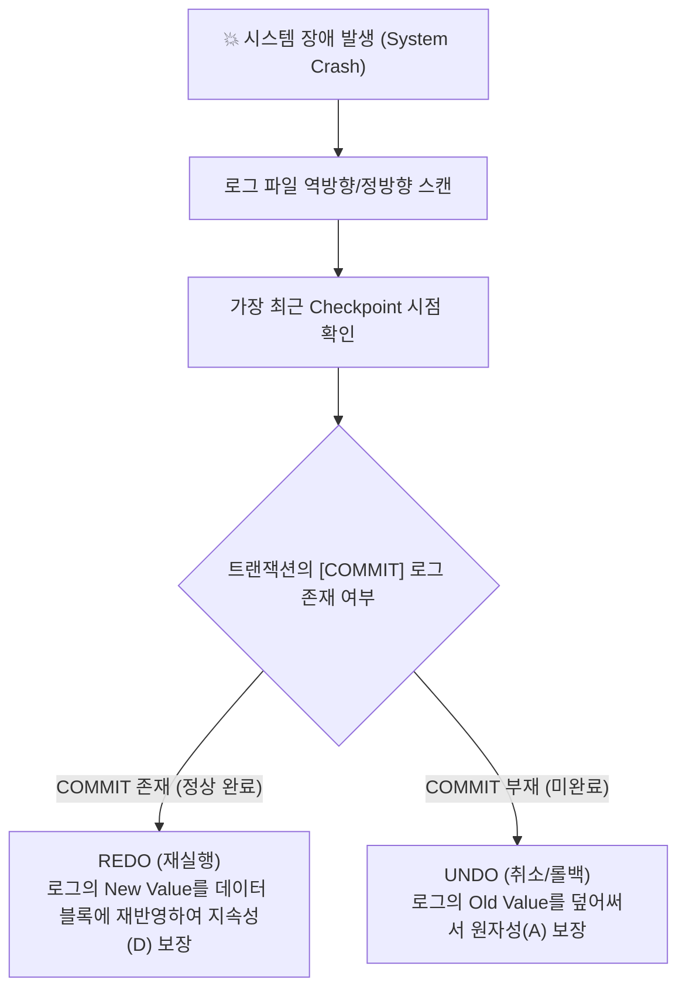

> [!abstract] 핵심 요약
> **데이터베이스 회복(Recovery)**의 핵심은 디스크 쓰기 전 로그를 먼저 기록하는 **WAL(Write-Ahead Logging)** 원칙이다. 시스템 장애 발생 시 DBMS는 마지막 **체크포인트(Checkpoint)**를 기점으로 커밋된 트랜잭션은 **REDO(재실행)**하여 영속성을 보장하고, 커밋되지 않은 미완료 트랜잭션은 **UNDO(취소)**하여 원자성을 복원한다.
> 대규모 분산 환경에서는 RDBMS의 강한 일관성(ACID) 한계를 극복하기 위해 **CAP 정리**에 기반하여 가용성과 확장성을 중점 지원하는 **NoSQL(Document, Column-family, Key-Value)** 아키텍처가 널리 채택된다.

---

## 1. WAL 로그 기반 즉시 갱신 회복 (REDO vs UNDO)



---

## 2. 분산 시스템 CAP 정리와 NoSQL 4대 모델

| NoSQL 모델 | 핵심 저장 구조 | CAP 분류 | 대표 구현체 및 최적 유스케이스 |
| :-- | :-- | :-- | :-- |
| **Key-Value Store** | Key-Value 해시 맵 | AP / CP | Redis, AWS DynamoDB (초고속 캐싱, 세션 저장소) |
| **Document Store** | JSON / BSON 계층 문서 | CP / AP | MongoDB, Couchbase (유연한 스키마, 전자상거래 카탈로그) |
| **Wide-Column Store** | Row Key, Column Family, Timestamp | AP (Cassandra) / CP (HBase) | Apache Cassandra, HBase (시계열 IoT 데이터, 대규모 로그) |
| **Graph DB** | Node, Edge, Property 그래프 | CA / CP | Neo4j, Amazon Neptune (소셜 네트워크, 지식 그래프, 추천) |

---

## 3. 실시간 트랜잭션 상태별 REDO/UNDO 회복 액션 시뮬레이터

```html preview
<div style="font-family:system-ui,-apple-system,sans-serif;padding:20px;background:var(--card);color:var(--card-foreground);border:1px solid var(--border);border-radius:var(--radius)">
  <div style="font-size:16px;font-weight:700;margin-bottom:14px;color:var(--primary);display:flex;align-items:center;gap:8px">
    <span>🛡️ WAL 로그 기반 데이터베이스 장애 회복(Recovery) 시뮬레이터</span>
  </div>

  <div style="margin-bottom:14px">
    <label style="font-size:11px;color:var(--muted-foreground)">장애 시점 트랜잭션의 로그 기록 상태 선택:</label>
    <select id="selCrashLog" style="width:100%;padding:6px;background:var(--background);color:var(--foreground);border:1px solid var(--border);border-radius:var(--radius);font-weight:700">
      <option value="commit">1. [START] -> [WRITE A, 10 -> 20] -> [COMMIT] 로그 기록 후 크래시</option>
      <option value="uncommit">2. [START] -> [WRITE A, 10 -> 20] (COMMIT 없음) 상태에서 크래시</option>
      <option value="checkpoint_commit">3. [CHECKPOINT] 이전 이미 완료된 트랜잭션</option>
    </select>
  </div>

  <div style="padding:12px;background:var(--background);border:1px solid var(--border);border-radius:var(--radius)">
    <div style="font-size:11px;font-weight:700;color:var(--muted-foreground);margin-bottom:4px">회복 관리자(Recovery Manager) 수행 작업</div>
    <div id="recoveryActionOut" style="font-size:13px;line-height:1.6;color:var(--foreground)">
      <strong style="color:var(--primary)">REDO(재실행) 대상:</strong> 트랜잭션이 이미 정상 COMMIT되었으므로, 디스크 버퍼 플러시 여부와 무관하게 로그의 New Value(20)를 디스크에 강제 재반영하여 지속성(Durability)을 보장합니다.
    </div>
  </div>

  <script>
    document.getElementById('selCrashLog').onchange = function() {
      var val = this.value;
      var out = document.getElementById('recoveryActionOut');
      if (val === 'commit') {
        out.innerHTML = "<strong style='color:var(--primary)'>⚡ REDO (재실행) 수행:</strong><br/>트랜잭션이 이미 COMMIT 되었으므로, 로그의 신규 값(20)을 디스크에 다시 기록하여 <strong>지속성(Durability)</strong>을 완벽히 보장합니다.";
      } else if (val === 'uncommit') {
        out.innerHTML = "<strong style='color:var(--destructive,#ef4444)'>⚡ UNDO (취소/롤백) 수행:</strong><br/>COMMIT 로그가 없으므로 미완료 트랜잭션입니다. 변경된 데이터 블록을 로그의 이전 값(10)으로 되돌려 <strong>원자성(Atomicity)</strong>을 복구합니다.";
      } else {
        out.innerHTML = "<strong style='color:var(--primary)'>⚡ 무작업 (No-op):</strong><br/>해당 트랜잭션의 변경 사항은 Checkpoint 시점에 이미 디스크에 안전하게 반영 완료되었으므로 추가 복구 연산이 불필요합니다.";
      }
    };
  </script>
</div>
```
