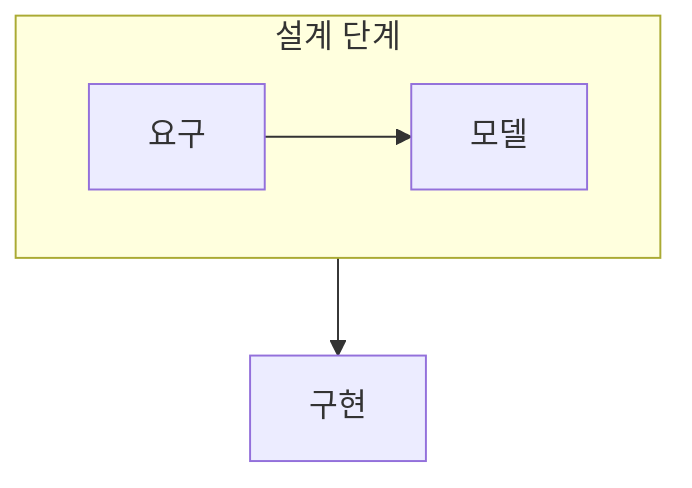

> [!abstract] 데이터베이스 설계는 요구를 분석해 개념 모델, 논리 구조, 물리 구현으로 구체화하는 과정이다.
> 각 단계가 남기는 산출물과 다음 단계로 넘기는 결정을 구별한다.

## 이 노트의 지도



## 1. 요구에서 개념 모델로

사용자 요구를 모아 데이터와 업무 규칙을 찾고, 이를 개체·관계 중심의 개념 모델로 표현한다. ==요구 사항 분석== 은 설계 이전에 무엇을 저장하고 어떤 규칙을 지킬지 확인하는 단계다.

## 2. 논리에서 물리 구현으로

개념 모델을 선택한 데이터 모델의 구조로 바꾸고, 저장과 접근의 성능을 고려해 구현을 준비한다.

<details>
<summary>단계별 산출물</summary>

요구 분석은 업무 규칙과 질문을, 개념 설계는 개체·관계를, 논리 설계는 스키마를, 물리 설계는 저장·접근 결정을 남긴다.

</details>

> [!important] 단계를 건너뛰어 인덱스부터 고르지 않기
> 물리적 선택은 요구와 논리 구조가 정해진 뒤에 의미가 있다. 앞 단계의 규칙이 불분명하면 성능 선택도 흔들린다.

## 한눈에 비교

```html preview
<div style="font-family:system-ui,sans-serif;padding:20px;color:var(--foreground)">
  <label for="amt" style="font-size:14px;font-weight:600">설계 단계</label>
  <div id="out" style="font-size:30px;font-weight:700;color:var(--chart-1);margin:6px 0">1</div>
  <input id="amt" type="range" min="1" max="5" step="1" value="1"
    style="width:100%;accent-color:var(--primary)" />
  <p style="font-size:13px;color:var(--muted-foreground)">1 요구 분석, 2 개념 설계, 3 논리 설계, 4 물리 설계, 5 구현 순서로 움직여 본다.</p>
  <script>
    var amt = document.getElementById('amt');
    var out = document.getElementById('out');
    amt.addEventListener('input', function () {
      out.textContent = Number(amt.value);
    });
  </script>
</div>
```

## 선택 기준

<details>
<summary>두 관점을 나란히 보기</summary>

**의미.** 업무 요구와 개체·관계는 데이터가 무엇을 뜻하는지 정한다.

**구현.** 스키마와 저장·접근 방식은 선택한 의미를 실제 시스템으로 옮긴다.

</details>

## 핵심 정리

| 구분 | 핵심 | 학습에서 확인할 점 |
| :-- | :-- | :-- |
| 요구 분석 | 업무 규칙 | 무엇을 저장해야 하는가 |
| 개념·논리 설계 | 모델·스키마 | 어떤 구조로 표현하는가 |
| 물리·구현 | 저장·접근 | 어떻게 효율적으로 실행하는가 |

> [!question]- 스스로 점검
> **Q.** 개념 설계와 물리 설계를 분리하는 이유는 무엇인가?
>
> **A.** 업무 의미를 먼저 안정시키고, 그 의미를 보존하는 여러 구현 선택을 나중에 비교하기 위해서다.

## 출처 처리

> [!info] 공개 노트 정책
> 원본 연결, 이미지, 페이지 단서는 공개 노트에 남기지 않았다.
