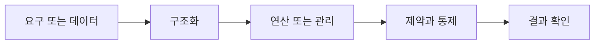

> [!abstract] 핵심
> 데이터베이스 설계는 사용자 요구를 고려해 데이터베이스를 만드는 과정이며, 요구 분석·개념·논리·물리 설계와 구현을 단계적으로 수행한다.

## 구조를 먼저 구분하기

관계 데이터베이스는 E-R 모델과 릴레이션 변환 규칙을 이용하거나, 정규화를 이용해 설계할 수 있다. 설계 단계는 요구 사항 분석에서 시작해 개념적·논리적·물리적 설계와 구현으로 이어진다.



| 관점 | 핵심 질문 | 점검 방법 |
| --- | --- | --- |
| 요구 분석 | 필요한 데이터와 규칙 | 누가 무엇을 하는지 확인한다 |
| 개념 설계 | E-R 모델 | 개체·관계·제약을 검토한다 |
| 논리·물리 설계 | 릴레이션과 구현 | 키·정규화·저장 전략을 점검한다 |

> [!note] 적용 순서
> 요구에서 데이터·업무 규칙·사용자를 추출하고, 개념 모델을 만든다. 이를 릴레이션으로 변환해 키와 제약을 정의한 뒤 물리 구현의 성능·운영 조건을 검토한다.

```html preview h=170
<div style="font-family:system-ui,sans-serif;padding:16px;border:1px solid var(--border);background:var(--card);color:var(--foreground);border-radius:var(--radius)">
  <div style="font-weight:700;margin-bottom:10px">08. 데이터베이스 설계 · 구조 점검</div>
  <div style="display:grid;grid-template-columns:repeat(4,minmax(0,1fr));gap:8px">
    <div style="padding:9px;border:1px solid var(--border);border-radius:var(--radius)">입력</div>
    <div style="padding:9px;border:1px solid var(--border);border-radius:var(--radius)">구조</div>
    <div style="padding:9px;border:1px solid var(--border);border-radius:var(--radius)">연산</div>
    <div style="padding:9px;border:1px solid var(--border);border-radius:var(--radius)">검증</div>
  </div>
</div>
```

## 세 관점

<Tabs>
<Tab label="개념">

설계는 테이블부터 만드는 일이 아니라 요구에서 시작한다. 각 단계는 다른 질문에 답한다.

</Tab>
<Tab label="적용">

E-R 모델을 릴레이션으로 바꾸고 제약을 정의한다. 물리 설계에서는 구현 환경의 성능·저장 조건을 다룬다.

</Tab>
<Tab label="검증">

사용자 요구가 바뀌면 어느 설계 산출물이 영향을 받는지 추적한다. 단계별 검토 기록을 남긴다.

</Tab>
</Tabs>

<details>
<summary>복습 질문</summary>

요구 분석을 생략하고 바로 테이블을 만들면 무엇을 놓치기 쉬운가? 개념 설계와 물리 설계는 어떤 질문이 다른가?

</details>

> [!tip] 학습 전략
> 구조, 연산, 제약을 분리해 적은 뒤 서로 어떤 조건으로 연결되는지 설명한다. 예시를 바꿀 때는 한 조건씩 바꾼다.
> [!warning] 해석 주의
> 정규화와 물리 성능 최적화는 같은 단계의 동일한 목표가 아니다. 설계 의도를 구분한다.
