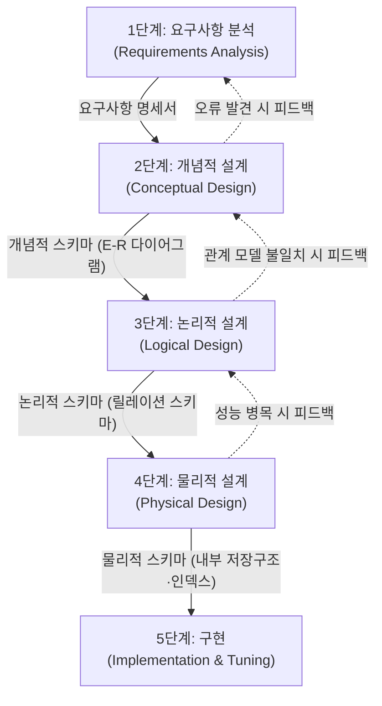
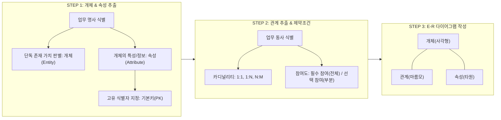
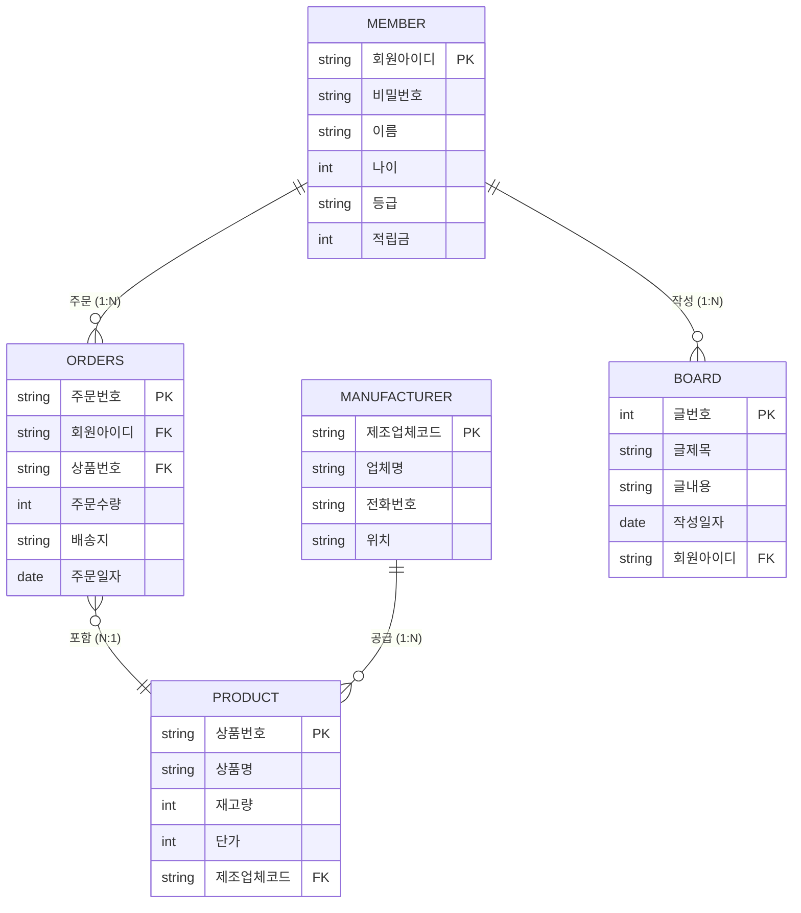

> [!abstract] 핵심 요약
> **데이터베이스 설계(Database Design)**는 사용자의 복잡하고 다양한 요구사항을 체계적으로 수집·분석하여 컴퓨터 시스템의 데이터베이스 구조로 구현하는 공학적 과정이다. 
> 관계 데이터베이스 설계는 주로 **E-R 모델을 이용한 개념적 모델링**과 **릴레이션 변환 규칙을 통한 논리적 스키마 도출**, 그리고 **정규화(Normalization)**를 통한 구조 최적화의 3대 축으로 완성된다.

---

## 1. 데이터베이스 설계 5단계 수명주기

데이터베이스 설계는 업무의 현실 세계를 추상화하여 컴퓨터 저장 구조로 변환하는 일련의 단계적 절차를 거친다. 설계 과정 중 오류나 누락이 발견되면 언제든지 이전 단계로 되돌아가 피드백(Feedback)을 수행한다.



| 설계 단계 | 주요 목표 및 작업 | 핵심 산출물 | 독립성 보장 수준 |
| :-- | :-- | :-- | :-- |
| **1. 요구사항 분석** | 사용자 범위 결정, 업무 프로세스 조사, 면담·설문·문서 분석 | **요구사항 명세서** | 특정 DBMS·하드웨어 독립 |
| **2. 개념적 설계** | 핵심 개체(Entity), 속성(Attribute), 관계(Relationship) 추출 | **개념적 스키마 (E-R 다이어그램)** | DBMS 독립 (개념 모델링) |
| **3. 논리적 설계** | E-R 다이어그램을 관계형 테이블 스키마로 변환, 정규화 수행 | **논리적 스키마 (릴레이션 스키마, DDL 명세)** | 특정 데이터 모델(관계형) 종속 |
| **4. 물리적 설계** | 저장 레코드 양식, 인덱스 구조, 파일 조직, 파티셔닝, 역정규화 검토 | **물리적 스키마 (내부 스키마, 인덱스 명세)** | 특정 DBMS 엔진·하드웨어 종속 |
| **5. 구현** | DBMS DDL 실행으로 실제 테이블·뷰 생성 및 데이터 적재 | **운영 데이터베이스 인스턴스** | 실가동 시스템 |

---

## 2. 개념적 설계 (E-R 모델링 프로세스)

개념적 설계는 사용자의 언어로 기술된 요구사항 명세서에서 데이터베이스의 핵심 골격을 추출하는 작업이다.



> [!TIP] 개체와 속성 추출 시 유의사항
> 1. **광범위한 일반 명사 배제**: 예를 들어 "인터넷 쇼핑몰 시스템", "회사" 등 전체 시스템을 지칭하는 단어는 개체로 모델링하지 않는다.
> 2. **단순 명사와 개체의 구별**: 단독으로 의미를 가지지 못하고 다른 대상을 설명하는 속성(이름, 가격, 생년월일)과 독립적으로 식별 가능한 개체(회원, 상품, 주문)를 엄격히 분리한다.

---

## 3. 논리적 설계: E-R 다이어그램의 릴레이션 매핑 5대 규칙

개념적 스키마인 E-R 다이어그램을 관계형 데이터 모델의 릴레이션(Relation) 스키마로 변환하기 위해 다음 **5가지 표준 변환 규칙**을 적용한다.

<Tabs>
  <Tab label="규칙 1: 개체 변환">
    <strong>규칙 1: 모든 개체(Entity)는 독립된 릴레이션으로 변환한다.</strong><br/>
    <ul>
      <li>개체의 이름 $\rightarrow$ 릴레이션 이름</li>
      <li>개체의 일반 속성 $\rightarrow$ 릴레이션의 열(Column)</li>
      <li>개체의 키 속성 $\rightarrow$ 릴레이션의 기본키(Primary Key, PK)</li>
      <li><em>복합 속성(Composite Attribute)</em>은 세부 단순 속성들만 릴레이션의 속성으로 포함한다.</li>
    </ul>
  </Tab>
  <Tab label="규칙 2: 1:1 관계 변환">
    <strong>규칙 2: 1:1 관계는 외래키(Foreign Key)로 표현하거나 릴레이션을 통합한다.</strong><br/>
    <ul>
      <li><strong>필수 참여 - 필수 참여</strong>: 두 개체 릴레이션을 하나로 통합하여 단일 테이블로 설계.</li>
      <li><strong>필수 참여 - 선택 참여</strong>: <em>필수 참여하는 개체</em>의 릴레이션에 선택 참여 개체의 기본키를 외래키(FK)로 추가 (NULL 값 최소화).</li>
      <li><strong>선택 참여 - 선택 참여</strong>: 어느 한쪽 릴레이션에 외래키를 추가하거나 별도의 연결 릴레이션 생성.</li>
    </ul>
  </Tab>
  <Tab label="규칙 3: 1:N 관계 변환">
    <strong>규칙 3: 1:N 관계는 N측(다측) 릴레이션에 1측의 기본키를 외래키(FK)로 추가한다.</strong><br/>
    <ul>
      <li>부모(1) 개체의 기본키를 자식(N) 릴레이션의 외래키로 배치.</li>
      <li>관계 자체가 가지는 속성(예: 주문일자, 배송상태 등)도 N측 릴레이션의 속성으로 흡수.</li>
    </ul>
  </Tab>
  <Tab label="규칙 4: N:M 관계 변환">
    <strong>규칙 4: N:M (다대다) 관계는 반드시 별도의 '교차 릴레이션(연결 테이블)'으로 변환한다.</strong><br/>
    <ul>
      <li>관계 이름을 릴레이션 이름으로 사용.</li>
      <li>관계에 참여하는 두 개체의 기본키를 모두 가져와 <strong>복합 기본키(Composite PK)</strong> 구성 및 각각 외래키(FK) 지정.</li>
      <li>관계가 가지는 고유 속성들도 교차 릴레이션의 열로 추가.</li>
    </ul>
  </Tab>
  <Tab label="규칙 5: 다중값 속성 변환">
    <strong>규칙 5: 다중값 속성(Multivalued Attribute)은 별도의 독립 릴레이션으로 변환한다.</strong><br/>
    <ul>
      <li>제1정규형($1\text{NF}$)을 만족하기 위해 원자값이 아닌 다중값(예: 회원의 여러 전화번호)은 별도 릴레이션으로 분리.</li>
      <li>원래 개체의 기본키(FK)와 다중값 속성을 묶어 복합 기본키로 지정.</li>
    </ul>
  </Tab>
</Tabs>

---

## 4. 실시간 인터랙티브 E-R $\rightarrow$ 릴레이션 매핑 시뮬레이터

아래 인터랙티브 컴포넌트를 통해 관계의 카디널리티(1:1, 1:N, N:M)와 참여 특성을 직접 선택하고, 정규화된 릴레이션 스키마와 DDL이 어떻게 자동 도출되는지 실시간으로 시각화할 수 있다.

```html preview
<div style="font-family:system-ui,-apple-system,sans-serif;padding:20px;background:var(--card);color:var(--card-foreground);border:1px solid var(--border);border-radius:var(--radius)">
  <div style="font-size:16px;font-weight:700;margin-bottom:14px;color:var(--primary);display:flex;align-items:center;gap:8px">
    <span>🔄 E-R 관계 $\rightarrow$ 릴레이션 스키마 변환 시뮬레이터</span>
  </div>
  
  <div style="display:grid;grid-template-columns:1fr 1fr;gap:12px;margin-bottom:16px">
    <div>
      <label style="font-size:12px;font-weight:600;color:var(--muted-foreground);display:block;margin-bottom:4px">관계 유형 (Cardinality)</label>
      <select id="cardinalitySelect" style="width:100%;padding:8px;background:var(--background);color:var(--foreground);border:1px solid var(--border);border-radius:var(--radius);font-size:13px">
        <option value="1N">1 : N 관계 (예: 부서 1 : 사원 N)</option>
        <option value="NM">N : M 관계 (예: 학생 N : 과목 M)</option>
        <option value="11_opt">1 : 1 관계 (필수-선택 참여, 예: 사원 1 : 컴퓨터 1)</option>
        <option value="multi">다중값 속성 (예: 사원의 여러 연락처)</option>
      </select>
    </div>
    <div>
      <label style="font-size:12px;font-weight:600;color:var(--muted-foreground);display:block;margin-bottom:4px">변환 규칙 적용</label>
      <div id="ruleBadge" style="padding:8px;background:var(--background);border:1px solid var(--primary);border-radius:var(--radius);font-size:12px;font-weight:600;color:var(--primary)">
        규칙 3 (1:N 외래키 매핑)
      </div>
    </div>
  </div>

  <div style="background:var(--background);padding:14px;border:1px solid var(--border);border-radius:var(--radius);margin-bottom:14px">
    <div style="font-size:12px;font-weight:700;color:var(--chart-1);margin-bottom:6px">도출된 릴레이션 스키마 (Relational Schema):</div>
    <div id="schemaOutput" style="font-family:monospace;font-size:13px;line-height:1.6;color:var(--foreground);white-space:pre-wrap"></div>
  </div>

  <div style="background:var(--background);padding:14px;border:1px solid var(--border);border-radius:var(--radius)">
    <div style="font-size:12px;font-weight:700;color:var(--chart-2);margin-bottom:6px">생성된 SQL DDL 명세:</div>
    <pre id="ddlOutput" style="font-family:monospace;font-size:12px;margin:0;color:var(--foreground);white-space:pre-wrap;overflow-x:auto"></pre>
  </div>

  <script>
    var cardSelect = document.getElementById('cardinalitySelect');
    var ruleBadge = document.getElementById('ruleBadge');
    var schemaOut = document.getElementById('schemaOutput');
    var ddlOut = document.getElementById('ddlOutput');

    var mappings = {
      '1N': {
        rule: '규칙 3 (1:N 외래키 매핑)',
        schema: '• 부서(부서번호(PK), 부서명, 위치)\n• 사원(사원번호(PK), 사원명, 직급, 부서번호(FK), 입사일)',
        ddl: 'CREATE TABLE 부서 (\n  부서번호 VARCHAR(10) PRIMARY KEY,\n  부서명 VARCHAR(50) NOT NULL,\n  위치 VARCHAR(50)\n);\n\nCREATE TABLE 사원 (\n  사원번호 VARCHAR(10) PRIMARY KEY,\n  사원명 VARCHAR(50) NOT NULL,\n  직급 VARCHAR(20),\n  입사일 DATE,\n  부서번호 VARCHAR(10),\n  FOREIGN KEY (부서번호) REFERENCES 부서(부서번호)\n);'
      },
      'NM': {
        rule: '규칙 4 (N:M 교차 릴레이션 생성)',
        schema: '• 학생(학번(PK), 이름, 전공)\n• 과목(과목코드(PK), 과목명, 학점)\n• 수강(학번(PK/FK), 과목코드(PK/FK), 성적, 신청일자)',
        ddl: 'CREATE TABLE 학생 (\n  학번 VARCHAR(10) PRIMARY KEY,\n  이름 VARCHAR(50) NOT NULL,\n  전공 VARCHAR(50)\n);\n\nCREATE TABLE 과목 (\n  과목코드 VARCHAR(10) PRIMARY KEY,\n  과목명 VARCHAR(50) NOT NULL,\n  학점 INT DEFAULT 3\n);\n\nCREATE TABLE 수강 (\n  학번 VARCHAR(10),\n  과목코드 VARCHAR(10),\n  성적 VARCHAR(5),\n  신청일자 DATE,\n  PRIMARY KEY (학번, 과목코드),\n  FOREIGN KEY (학번) REFERENCES 학생(학번),\n  FOREIGN KEY (과목코드) REFERENCES 과목(과목코드)\n);'
      },
      '11_opt': {
        rule: '규칙 2 (1:1 필수 참여측 외래키 배치)',
        schema: '• 사원(사원번호(PK), 사원명, 부서)\n• 업무용PC(PC관리번호(PK), 모델명, 사원번호(FK/UNIQUE), 지급일)',
        ddl: 'CREATE TABLE 사원 (\n  사원번호 VARCHAR(10) PRIMARY KEY,\n  사원명 VARCHAR(50) NOT NULL\n);\n\nCREATE TABLE 업무용PC (\n  PC관리번호 VARCHAR(20) PRIMARY KEY,\n  모델명 VARCHAR(50),\n  사원번호 VARCHAR(10) UNIQUE,\n  지급일 DATE,\n  FOREIGN KEY (사원번호) REFERENCES 사원(사원번호)\n);'
      },
      'multi': {
        rule: '규칙 5 (다중값 속성 독립 릴레이션화 - 1NF 만족)',
        schema: '• 사원(사원번호(PK), 사원명, 직급)\n• 사원연락처(사원번호(PK/FK), 전화번호(PK))',
        ddl: 'CREATE TABLE 사원 (\n  사원번호 VARCHAR(10) PRIMARY KEY,\n  사원명 VARCHAR(50) NOT NULL,\n  직급 VARCHAR(20)\n);\n\nCREATE TABLE 사원연락처 (\n  사원번호 VARCHAR(10),\n  전화번호 VARCHAR(20),\n  PRIMARY KEY (사원번호, 전화번호),\n  FOREIGN KEY (사원번호) REFERENCES 사원(사원번호) ON DELETE CASCADE\n);'
      }
    };

    function update() {
      var val = cardSelect.value;
      var data = mappings[val];
      ruleBadge.textContent = data.rule;
      schemaOut.textContent = data.schema;
      ddlOut.textContent = data.ddl;
    }

    cardSelect.addEventListener('change', update);
    update();
  </script>
</div>
```

---

## 5. 종합 사례 실습: 한빛마트 쇼핑몰 스키마 모델링

요구사항 명세서로부터 최종 릴레이션 스키마까지 완성하는 전체 파이프라인의 실무 적용 결과는 다음과 같다.



<details>
<summary>한빛마트 최종 물리 릴레이션 스키마 및 무결성 제약조건</summary>

1. **회원(<u>회원아이디</u>, 비밀번호, 이름, 나이, 등급, 적립금)**
   - 기본키: `회원아이디`
   - 제약조건: `적립금 >= 0`, `등급 IN ('일반', 'VIP', '골드')`
2. **제조업체(<u>제조업체코드</u>, 업체명, 전화번호, 위치)**
   - 기본키: `제조업체코드`
3. **상품(<u>상품번호</u>, 상품명, 재고량, 단가, <i>제조업체코드</i>)**
   - 기본키: `상품번호`
   - 외래키: `제조업체코드` $\rightarrow$ 제조업체(`제조업체코드`)
   - 제약조건: `재고량 >= 0`, `단가 > 0`
4. **주문(<u>주문번호</u>, <i>회원아이디</i>, <i>상품번호</i>, 주문수량, 배송지, 주문일자)**
   - 기본키: `주문번호`
   - 외래키: `회원아이디` $\rightarrow$ 회원(`회원아이디`), `상품번호` $\rightarrow$ 상품(`상품번호`)
   - 제약조건: `주문수량 >= 1`
5. **게시글(<u>글번호</u>, 글제목, 글내용, 작성일자, <i>회원아이디</i>)**
   - 기본키: `글번호`
   - 외래키: `회원아이디` $\rightarrow$ 회원(`회원아이디`)

</details>

> [!IMPORTANT] 논리 설계에서 물리 설계로의 전이 기준
> E-R 다이어그램에서 도출된 릴레이션 스키마가 **제3정규형(3NF) 또는 BCNF**를 만족하는지 검증한 후, 쿼리 빈도와 응답 속도를 감안하여 인덱스(`CREATE INDEX`) 및 역정규화(Denormalization) 전략을 결정한다.
