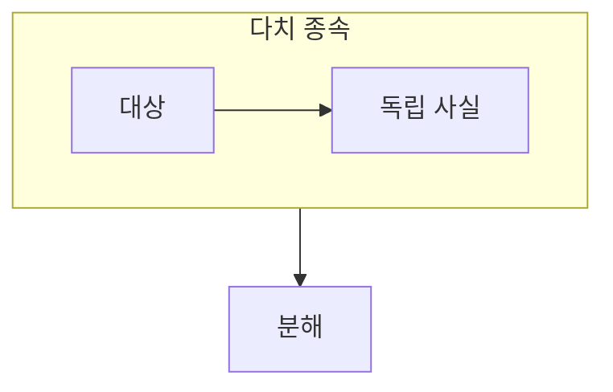

> [!abstract] 고급 정규형은 함수 종속만으로 드러나지 않는 다치 종속의 중복을 다룬다.
> 한 대상에 대해 서로 독립적인 여러 값 집합이 있을 때 조합 중복이 생기는지 본다.

## 이 노트의 지도



## 1. 독립적인 다중 사실

한 과목에 여러 교수와 여러 교재가 연결되지만 교수와 교재 사이에 직접 관계가 없다면, 한 릴레이션에는 불필요한 조합이 생길 수 있다. ==다치 종속== 은 한 결정자에 대해 서로 독립적인 값 집합이 존재할 때 나타나는 규칙이다.

## 2. 제4정규형의 관점

제4정규형은 비자명한 다치 종속이 후보키에 의해 결정되지 않을 때 관계를 분해해 독립 사실을 나누려 한다.

<details>
<summary>관계가 독립인지 묻기</summary>

교수 정보를 바꾸어도 교재 목록이 변하지 않는지, 교재 정보를 바꾸어도 교수 목록이 변하지 않는지 확인한다. 두 답이 모두 그렇다면 독립 사실일 가능성이 있다.

</details>

> [!tip] 조합 수와 의미를 함께 보기
> 여러 조합이 있다는 사실만으로 분해하지 않는다. 조합이 실제 업무 사실인지, 독립 목록의 곱인지 판단한다.

## 한눈에 비교

```html preview
<div style="font-family:system-ui,sans-serif;padding:20px">
  <div id="cards" style="display:flex;gap:14px;flex-wrap:wrap"></div>
  <script>
    var stats = [
      ['결정자', '과목', '기준', 'var(--chart-1)'],
      ['다중 값', '교수·교재', '독립', 'var(--chart-2)'],
      ['4NF', '관계 분해', '중복 감소', 'var(--chart-3)']
    ];
    document.getElementById('cards').innerHTML = stats.map(function (s) {
      return '<div style="flex:1;min-width:150px;padding:16px;background:var(--card);' +
        'color:var(--card-foreground);border:1px solid var(--border);' +
        'border-radius:var(--radius)">' +
        '<div style="font-size:13px;color:var(--muted-foreground)">' + s[0] + '</div>' +
        '<div style="font-size:26px;font-weight:700;margin-top:4px">' + s[1] + '</div>' +
        '<div style="font-size:12px;font-weight:600;margin-top:4px;color:' + s[3] + '">' +
        s[2] + '</div>' +
        '</div>';
    }).join('');
  </script>
</div>
```

## 선택 기준

<Tabs>
  <Tab label="다치 종속">

하나의 결정자에 대해 여러 값이 연결되며, 그 값 집합들이 서로 독립일 수 있다.

  </Tab>
  <Tab label="분해">

독립 사실을 별도 관계로 나누어 불필요한 조합 반복을 줄인다.

  </Tab>
</Tabs>

## 식으로 확인

$$
X \twoheadrightarrow Y
$$

## 핵심 정리

| 구분 | 핵심 | 학습에서 확인할 점 |
| :-- | :-- | :-- |
| 함수 종속 | 하나의 값 결정 | X가 Y를 정하는가 |
| 다치 종속 | 값 집합 독립 | 두 목록이 서로 영향을 주는가 |
| 제4정규형 | 관계 분해 | 독립 사실을 분리하는가 |

<details>
<summary>스스로 점검</summary>

**Q.** 과목과 교수·교재의 관계에서 교수와 교재가 독립이라는 말은 무엇을 뜻하는가?

**A.** 특정 교수의 배정이 교재 목록을 바꾸지 않고, 특정 교재의 선택이 교수 목록을 바꾸지 않는다는 뜻이다.

</details>

## 출처 처리

> [!info] 공개 노트 정책
> 원본 연결, 이미지, 페이지 단서는 공개 노트에 남기지 않았다.
