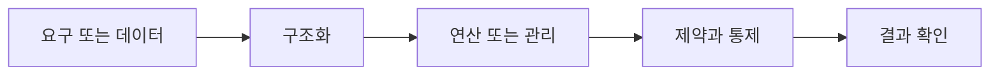

> [!abstract] 핵심
> 정규화는 불필요한 데이터 중복으로 생기는 삽입·수정·삭제 이상을 줄이며 데이터베이스를 올바르게 설계하는 과정이다.

## 구조를 먼저 구분하기

이상 현상은 불필요한 데이터 중복 때문에 릴레이션의 삽입·수정·삭제에서 발생할 수 있는 부작용이다. 정규화는 함수 종속을 바탕으로 릴레이션을 분해하고 정규형 조건을 만족시키는 방식으로 이를 줄인다.



| 관점 | 핵심 질문 | 점검 방법 |
| --- | --- | --- |
| 이상 현상 | 삽입·수정·삭제 부작용 | 중복 원인을 찾는다 |
| 함수 종속 | 속성 사이 결정 관계 | 결정자와 종속 속성을 적는다 |
| 정규화 | 릴레이션 분해 과정 | 정규형·손실·제약을 확인한다 |

> [!note] 적용 순서
> 릴레이션의 속성과 함수 종속을 정리하고, 어떤 갱신에서 이상이 생기는지 예로 확인한다. 정규형 조건에 맞춰 분해한 뒤 정보 손실과 제약 표현을 검토한다.

```html preview h=170
<div style="font-family:system-ui,sans-serif;padding:16px;border:1px solid var(--border);background:var(--card);color:var(--foreground);border-radius:var(--radius)">
  <div style="font-weight:700;margin-bottom:10px">09. 정규화와 이상 현상 · 구조 점검</div>
  <div style="display:grid;grid-template-columns:repeat(4,minmax(0,1fr));gap:8px">
    <div style="padding:9px;border:1px solid var(--border);border-radius:var(--radius)">입력</div>
    <div style="padding:9px;border:1px solid var(--border);border-radius:var(--radius)">구조</div>
    <div style="padding:9px;border:1px solid var(--border);border-radius:var(--radius)">연산</div>
    <div style="padding:9px;border:1px solid var(--border);border-radius:var(--radius)">검증</div>
  </div>
</div>
```

## 세 관점

<Tabs>
<Tab label="개념">

정규화의 목표는 표를 잘게 나누는 자체가 아니라 중복으로 생기는 이상을 줄이는 것이다.

</Tab>
<Tab label="적용">

갱신 시나리오에서 이상을 먼저 보이고, 함수 종속을 근거로 분해한다. 각 결과 릴레이션의 키를 확인한다.

</Tab>
<Tab label="검증">

분해 뒤에도 필요한 질의를 다시 표현할 수 있는지, 제약을 유지할 수 있는지 점검한다.

</Tab>
</Tabs>

<details>
<summary>복습 질문</summary>

삽입·수정·삭제 이상은 왜 같은 중복 구조에서 생길 수 있는가? 함수 종속은 분해 결정에 어떤 근거를 주는가?

</details>

> [!tip] 학습 전략
> 구조, 연산, 제약을 분리해 적은 뒤 서로 어떤 조건으로 연결되는지 설명한다. 예시를 바꿀 때는 한 조건씩 바꾼다.
> [!warning] 해석 주의
> 정규형 이름을 외우는 것만으로 좋은 분해가 되지 않는다. 실제 갱신 시나리오와 종속 관계를 함께 검토한다.
