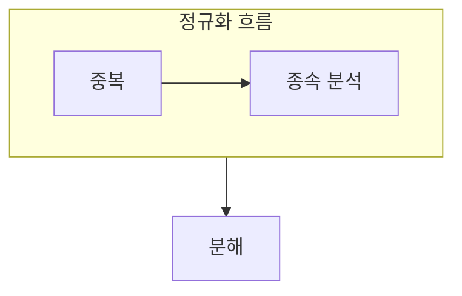

> [!abstract] 정규화는 중복된 사실에서 생기는 이상을 줄이도록 릴레이션 구조를 다듬는 과정이다.
> 어떤 속성이 무엇을 결정하는지 찾고, 그 종속이 만드는 중복을 분석한다.

## 이 노트의 지도



## 1. 이상 현상의 출발

한 릴레이션에 서로 다른 사실을 함께 저장하면 삽입·수정·삭제할 때 원치 않는 부작용이 생길 수 있다. ==함수 종속== 은 한 속성 집합의 값이 다른 속성 집합의 값을 결정하는 규칙이다.

## 2. 정규형으로 점검하기

기본 정규형은 반복과 부분·이행 종속을 단계적으로 줄이며, 필요한 정보를 잃지 않는 분해를 목표로 한다.

<details>
<summary>분해 전 확인할 것</summary>

어떤 속성이 기본키에 완전하게 종속되는지, 다른 일반 속성을 거쳐 결정되는지 확인한다. 분해 뒤에도 필요한 사실을 다시 연결할 수 있는지 점검한다.

</details>

> [!caution] 정규화가 모든 중복을 없애는 것은 아니다
> 일부 중복은 성능이나 업무 규칙을 위해 의도될 수 있다. 이상을 줄이는 구조와 조회 비용을 함께 비교한다.

## 한눈에 비교

```html preview
<div style="font-family:system-ui,sans-serif;padding:20px">
  <div id="cards" style="display:flex;gap:14px;flex-wrap:wrap"></div>
  <script>
    var stats = [
      ['삽입 이상', '사실 누락', '중복', 'var(--chart-1)'],
      ['수정 이상', '불일치', '종속', 'var(--chart-2)'],
      ['삭제 이상', '정보 손실', '분해', 'var(--chart-3)']
    ];
    document.getElementById('cards').innerHTML = stats.map(function (s) {
      return '<div style="flex:1;min-width:150px;padding:16px;background:var(--card);' +
        'color:var(--card-foreground);border:1px solid var(--border);' +
        'border-radius:var(--radius)">' +
        '<div style="font-size:13px;color:var(--muted-foreground)">' + s[0] + '</div>' +
        '<div style="font-size:26px;font-weight:700;margin-top:4px">' + s[1] + '</div>' +
        '<div style="font-size:12px;font-weight:600;margin-top:4px;color:' + s[3] + '">' +
        s[2] + '</div>' +
        '</div>';
    }).join('');
  </script>
</div>
```

## 선택 기준

<details>
<summary>두 관점을 나란히 보기</summary>

**문제.** 한 사실의 변경이 여러 튜플에 흩어지면 불일치와 누락이 생길 수 있다.

**해결.** 함수 종속을 기준으로 사실을 분리하고 필요한 연결 가능성을 검토한다.

</details>

## 식으로 확인

$$
X \to Y
$$

## 핵심 정리

| 구분 | 핵심 | 학습에서 확인할 점 |
| :-- | :-- | :-- |
| 이상 현상 | 중복의 부작용 | 어떤 작업에서 생기는가 |
| 함수 종속 | 결정 규칙 | 무엇이 무엇을 정하는가 |
| 정규화 | 구조 정리 | 사실을 분리해도 연결되는가 |

> [!question]- 스스로 점검
> **Q.** 수정 이상이 발생한다는 것은 어떤 구조적 문제를 뜻하는가?
>
> **A.** 같은 사실이 여러 튜플에 반복되어 한 곳만 바꾸면 서로 다른 값이 남을 수 있음을 뜻한다.

## 출처 처리

공개 노트에는 원본 연결, 이미지, 페이지 단서를 남기지 않았다.

---

## 원본 강의 흐름 인터랙티브

```html preview
<div style="font-family:system-ui,sans-serif;padding:20px;color:var(--foreground)">
  <label for="noteFlow163308" style="font-size:14px;font-weight:600">정규화와 이상 현상 단계</label>
  <div id="noteFlow163308-out" style="font-size:26px;font-weight:700;color:var(--chart-1);margin:6px 0">정규화와 이상 현상 핵심 개념</div>
  <input id="noteFlow163308" type="range" min="1" max="3" step="1" value="1" style="width:100%;accent-color:var(--primary)" />
  <p style="font-size:13px;color:var(--muted-foreground)">슬라이더를 움직이면 원본 PDF에서 정리한 이 노트의 흐름을 확인합니다.</p>
  <script>
    var noteFlow163308 = document.getElementById('noteFlow163308');
    var noteFlow163308Out = document.getElementById('noteFlow163308-out');
    var noteFlow163308Steps = ["정규화와 이상 현상 핵심 개념","정규화와 이상 현상 처리 절차","정규화와 이상 현상 검증·응용"];
    noteFlow163308.addEventListener('input', function () { noteFlow163308Out.textContent = noteFlow163308Steps[Number(noteFlow163308.value) - 1]; });
  </script>
</div>
```
