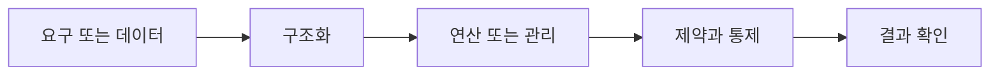

> [!abstract] 핵심
> 병행 제어는 여러 사용자가 동시에 데이터베이스에 접근할 때 트랜잭션 수행을 통제해 데이터의 일관성을 유지하는 기술이다.

## 구조를 먼저 구분하기

여러 사용자가 동시에 접근하는 환경에서는 트랜잭션 수행 순서가 데이터 상태에 영향을 줄 수 있다. 병행 제어는 트랜잭션을 중요한 단위로 삼아 동시 실행을 통제하고, 회복과 함께 데이터베이스의 무결성과 일관성을 지키는 역할을 한다.



| 관점 | 핵심 질문 | 점검 방법 |
| --- | --- | --- |
| 동시 접근 | 여러 사용자의 실행 | 공유 항목을 확인한다 |
| 트랜잭션 | 통제의 기본 단위 | 읽기·쓰기 경계를 정한다 |
| 일관성 | 동시 실행 뒤의 상태 | 순서 차이를 시험한다 |

> [!note] 적용 순서
> 동시에 실행될 수 있는 작업과 공유 데이터 항목을 찾는다. 각 작업의 읽기·변경 시점을 기록하고, 어떤 순서에서도 일관된 결과가 유지되는지 검토한다.

```html preview h=170
<div style="font-family:system-ui,sans-serif;padding:16px;border:1px solid var(--border);background:var(--card);color:var(--foreground);border-radius:var(--radius)">
  <div style="font-weight:700;margin-bottom:10px">10. 병행 제어 · 구조 점검</div>
  <div style="display:grid;grid-template-columns:repeat(4,minmax(0,1fr));gap:8px">
    <div style="padding:9px;border:1px solid var(--border);border-radius:var(--radius)">입력</div>
    <div style="padding:9px;border:1px solid var(--border);border-radius:var(--radius)">구조</div>
    <div style="padding:9px;border:1px solid var(--border);border-radius:var(--radius)">연산</div>
    <div style="padding:9px;border:1px solid var(--border);border-radius:var(--radius)">검증</div>
  </div>
</div>
```

## 세 관점

<Tabs>
<Tab label="개념">

병행 제어의 목적은 동시에 실행되는 모든 작업을 막는 것이 아니라 일관성이 유지되도록 통제하는 것이다.

</Tab>
<Tab label="적용">

공유 데이터와 트랜잭션의 읽기·변경 단계를 시나리오로 적는다. 충돌 가능 지점을 먼저 찾는다.

</Tab>
<Tab label="검증">

단독 실행 결과와 동시 실행 결과를 비교해 비정상 상태가 생기는지 확인한다. 회복 전략과도 연결한다.

</Tab>
</Tabs>

<details>
<summary>복습 질문</summary>

동시 접근이 가능한 시스템에서 트랜잭션이 필요한 이유는 무엇인가? 일관성을 확인하려면 어떤 실행 순서를 비교해야 하는가?

</details>

> [!tip] 학습 전략
> 구조, 연산, 제약을 분리해 적은 뒤 서로 어떤 조건으로 연결되는지 설명한다. 예시를 바꿀 때는 한 조건씩 바꾼다.
> [!warning] 해석 주의
> 병행 제어를 고려하지 않은 테스트는 단일 사용자 환경에서만 정상으로 보일 수 있다.
