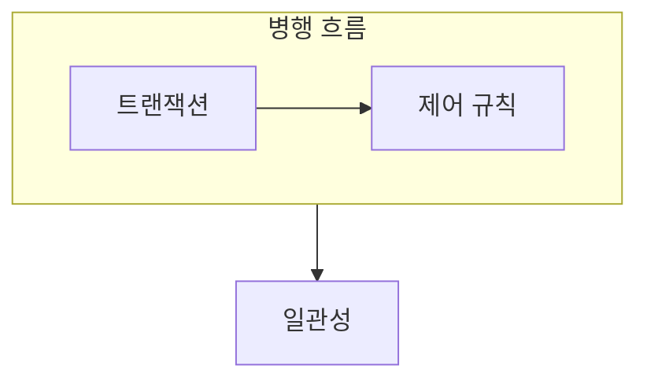

> [!abstract] 병행 제어는 여러 트랜잭션이 함께 실행되어도 일관된 결과를 유지하도록 순서를 조정한다.
> 실행 속도를 높이는 동시성과 올바른 결과를 보장하는 직렬성의 균형을 다룬다.

## 이 노트의 지도



## 1. 동시 실행의 위험

같은 데이터를 읽고 쓰는 두 트랜잭션의 순서가 적절히 관리되지 않으면 갱신 손실이나 모순된 읽기가 생길 수 있다. ==직렬 가능성== 은 병행 실행 결과가 어떤 직렬 실행 결과와 동등하다는 기준이다.

## 2. 제어 방식

잠금은 데이터 접근 순서를 제한하고, 타임스탬프나 검증 기법은 다른 방식으로 충돌을 다룬다.

<details>
<summary>스케줄을 읽는 순서</summary>

각 트랜잭션의 읽기·쓰기 연산을 시간 순서로 적고, 같은 데이터 항목에 대한 충돌 연산을 표시한다. 그 순서가 직렬 실행으로 바뀔 수 있는지 검토한다.

</details>

> [!caution] 동시 실행 자체를 오류로 보지 않기
> 문제는 여러 작업이 겹친다는 사실이 아니라, 겹침이 제약을 깨는 결과로 이어지는지다.

## 한눈에 비교

```html preview
<div style="font-family:system-ui,sans-serif;padding:20px">
  <div id="cards" style="display:flex;gap:14px;flex-wrap:wrap"></div>
  <script>
    var stats = [
      ['잠금', '접근 제한', '순서', 'var(--chart-1)'],
      ['직렬성', '동등 결과', '정확성', 'var(--chart-2)'],
      ['교착', '상호 대기', '회피', 'var(--chart-3)']
    ];
    document.getElementById('cards').innerHTML = stats.map(function (s) {
      return '<div style="flex:1;min-width:150px;padding:16px;background:var(--card);' +
        'color:var(--card-foreground);border:1px solid var(--border);' +
        'border-radius:var(--radius)">' +
        '<div style="font-size:13px;color:var(--muted-foreground)">' + s[0] + '</div>' +
        '<div style="font-size:26px;font-weight:700;margin-top:4px">' + s[1] + '</div>' +
        '<div style="font-size:12px;font-weight:600;margin-top:4px;color:' + s[3] + '">' +
        s[2] + '</div>' +
        '</div>';
    }).join('');
  </script>
</div>
```

## 선택 기준

<Tabs>
  <Tab label="충돌">

같은 항목의 읽기·쓰기가 순서에 따라 결과를 바꿀 때 제어가 필요하다.

  </Tab>
  <Tab label="보장">

병행 스케줄이 어떤 직렬 스케줄과 같은 결과를 내는지 확인한다.

  </Tab>
</Tabs>

## 핵심 정리

| 구분 | 핵심 | 학습에서 확인할 점 |
| :-- | :-- | :-- |
| 병행 실행 | 작업 겹침 | 성능 기회를 늘리는가 |
| 충돌 | 같은 항목 접근 | 순서가 결과를 바꾸는가 |
| 직렬 가능성 | 정확성 기준 | 직렬 결과와 동등한가 |

<details>
<summary>스스로 점검</summary>

**Q.** 직렬 가능성이 병행 제어의 중요한 기준인 이유는 무엇인가?

**A.** 동시에 실행해도 예측 가능한 올바른 결과를 설명할 수 있는 기준을 제공하기 때문이다.

</details>

## 출처 처리

공개 노트에는 원본 연결, 이미지, 페이지 단서를 남기지 않았다.

---

## 원본 강의 흐름 인터랙티브

```html preview
<div style="font-family:system-ui,sans-serif;padding:20px;color:var(--foreground)">
  <label for="noteFlow946119" style="font-size:14px;font-weight:600">병행 제어 단계</label>
  <div id="noteFlow946119-out" style="font-size:26px;font-weight:700;color:var(--chart-1);margin:6px 0">병행 제어 핵심 개념</div>
  <input id="noteFlow946119" type="range" min="1" max="3" step="1" value="1" style="width:100%;accent-color:var(--primary)" />
  <p style="font-size:13px;color:var(--muted-foreground)">슬라이더를 움직이면 원본 PDF에서 정리한 이 노트의 흐름을 확인합니다.</p>
  <script>
    var noteFlow946119 = document.getElementById('noteFlow946119');
    var noteFlow946119Out = document.getElementById('noteFlow946119-out');
    var noteFlow946119Steps = ["병행 제어 핵심 개념","병행 제어 처리 절차","병행 제어 검증·응용"];
    noteFlow946119.addEventListener('input', function () { noteFlow946119Out.textContent = noteFlow946119Steps[Number(noteFlow946119.value) - 1]; });
  </script>
</div>
```
