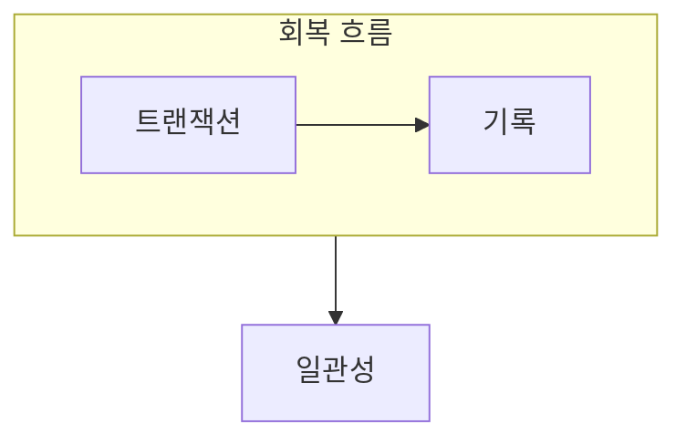

> [!abstract] 트랜잭션은 데이터베이스 상태를 일관되게 바꾸기 위해 묶은 논리적 작업 단위다.
> 정상 종료와 장애 상황에서 어떤 변경을 보장하거나 되돌릴지 구분한다.

## 이 노트의 지도



## 1. 작업 단위로 묶기

여러 데이터 변경이 하나의 업무를 이룰 때 일부만 남으면 데이터베이스가 모순된 상태가 될 수 있다. ==원자성== 은 트랜잭션의 변경이 전부 반영되거나 전혀 반영되지 않아야 한다는 성질이다.

## 2. 장애와 회복

장애가 발생해도 기록과 회복 기법을 이용해 필요한 변경은 다시 적용하고, 불완전한 변경은 취소한다.

<details>
<summary>회복 판단 순서</summary>

완료된 작업인지, 완료 전에 중단된 작업인지 구분하고 기록을 확인한다. 그 뒤 일관된 상태로 돌아가기 위해 재실행 또는 취소가 필요한지 결정한다.

</details>

> [!warning] 저장 완료와 논리 완료를 섞지 않기
> 작업이 화면에서 끝난 것처럼 보여도 장애 뒤에 유지될 기록과 취소할 기록을 따로 판단해야 한다.

## 한눈에 비교

```html preview
<div style="font-family:system-ui,sans-serif;padding:20px">
  <div id="cards" style="display:flex;gap:14px;flex-wrap:wrap"></div>
  <script>
    var stats = [
      ['원자성', '전부 또는 없음', '완결', 'var(--chart-1)'],
      ['일관성', '제약 유지', '상태', 'var(--chart-2)'],
      ['지속성', '완료 후 보존', '회복', 'var(--chart-3)']
    ];
    document.getElementById('cards').innerHTML = stats.map(function (s) {
      return '<div style="flex:1;min-width:150px;padding:16px;background:var(--card);' +
        'color:var(--card-foreground);border:1px solid var(--border);' +
        'border-radius:var(--radius)">' +
        '<div style="font-size:13px;color:var(--muted-foreground)">' + s[0] + '</div>' +
        '<div style="font-size:26px;font-weight:700;margin-top:4px">' + s[1] + '</div>' +
        '<div style="font-size:12px;font-weight:600;margin-top:4px;color:' + s[3] + '">' +
        s[2] + '</div>' +
        '</div>';
    }).join('');
  </script>
</div>
```

## 선택 기준

<details>
<summary>두 관점을 나란히 보기</summary>

**정상.** 트랜잭션이 정상 완료되면 결과는 데이터베이스의 일관된 다음 상태가 된다.

**장애.** 중단 시점과 기록을 바탕으로 일부 변경을 취소하거나 완료된 변경을 보장한다.

</details>

## 핵심 정리

| 구분 | 핵심 | 학습에서 확인할 점 |
| :-- | :-- | :-- |
| 트랜잭션 | 논리 작업 단위 | 어떤 변경을 함께 묶는가 |
| 장애 | 정상 흐름 중단 | 어느 시점에 멈췄는가 |
| 회복 | 일관성 복원 | 재실행·취소가 필요한가 |

> [!question]- 스스로 점검
> **Q.** 원자성이 없으면 송금 같은 작업에서 어떤 문제가 생길 수 있는가?
>
> **A.** 한쪽 변경만 반영되고 다른 쪽 변경이 빠져 업무 전체의 의미가 깨질 수 있다.

## 출처 처리

공개 노트에는 원본 연결, 이미지, 페이지 단서를 남기지 않았다.
