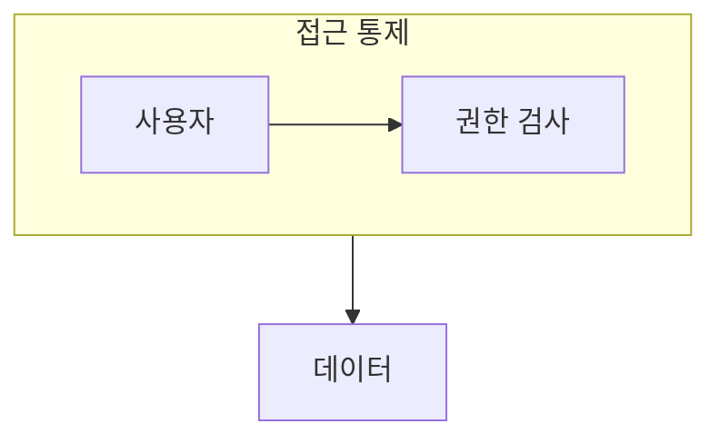

> [!abstract] 데이터베이스 보안은 필요한 사용자가 필요한 범위에서만 데이터에 접근하게 하는 통제다.
> 인증, 권한, 역할을 서로 다른 질문으로 나누어 본다.

## 이 노트의 지도



## 1. 보안의 범위

보안은 데이터의 기밀성만이 아니라 무단 변경을 막고, 필요한 사용자가 서비스에 접근할 수 있게 하는 운영 문제를 포함한다. ==권한== 은 특정 객체에 대해 사용자가 수행할 수 있는 작업의 범위를 정한다.

## 2. 역할로 관리하기

여러 사용자에게 공통 권한이 반복될 때 역할을 만들고 사용자를 역할에 연결하면 관리 기준을 단순화할 수 있다.

<details>
<summary>권한 부여 전 확인</summary>

누가 접근하는지, 어떤 객체에 접근하는지, 무엇을 할 수 있는지, 언제 권한을 회수할지 순서대로 확인한다.

</details>

> [!important] 최소 권한 원칙
> 업무에 필요한 범위보다 넓은 권한을 기본으로 주면 오용과 실수의 영향 범위가 커진다.

## 한눈에 비교

```html preview
<div style="font-family:system-ui,sans-serif;padding:20px">
  <div id="cards" style="display:flex;gap:14px;flex-wrap:wrap"></div>
  <script>
    var stats = [
      ['인증', '사용자 확인', '누구', 'var(--chart-1)'],
      ['권한', '작업 범위', '무엇', 'var(--chart-2)'],
      ['역할', '공통 묶음', '관리', 'var(--chart-3)']
    ];
    document.getElementById('cards').innerHTML = stats.map(function (s) {
      return '<div style="flex:1;min-width:150px;padding:16px;background:var(--card);' +
        'color:var(--card-foreground);border:1px solid var(--border);' +
        'border-radius:var(--radius)">' +
        '<div style="font-size:13px;color:var(--muted-foreground)">' + s[0] + '</div>' +
        '<div style="font-size:26px;font-weight:700;margin-top:4px">' + s[1] + '</div>' +
        '<div style="font-size:12px;font-weight:600;margin-top:4px;color:' + s[3] + '">' +
        s[2] + '</div>' +
        '</div>';
    }).join('');
  </script>
</div>
```

## 선택 기준

<details>
<summary>두 관점을 나란히 보기</summary>

**개별 권한.** 사용자와 객체의 조합마다 가능한 작업을 직접 부여하고 취소한다.

**역할.** 여러 사용자가 공유하는 업무 권한을 역할로 묶어 일관되게 관리한다.

</details>

## 핵심 정리

| 구분 | 핵심 | 학습에서 확인할 점 |
| :-- | :-- | :-- |
| 인증 | 신원 확인 | 누가 접근하는가 |
| 권한 | 행위 허용 | 무엇을 할 수 있는가 |
| 역할 | 권한 묶음 | 공통 업무를 어떻게 관리하는가 |

> [!question]- 스스로 점검
> **Q.** 역할을 이용하면 권한 관리가 단순해지는 이유는 무엇인가?
>
> **A.** 동일 업무의 권한을 사용자마다 반복해 설정하지 않고 역할 단위로 부여·회수할 수 있기 때문이다.

## 출처 처리

> [!info] 공개 노트 정책
> 원본 연결, 이미지, 페이지 단서는 공개 노트에 남기지 않았다.
