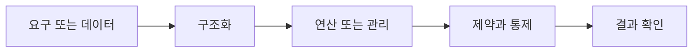

> [!abstract] 핵심
> 데이터베이스 응용 기술은 객체지향·객체관계·분산·멀티미디어 등 관계 모델만으로 표현하기 어려운 요구에 대응하는 다양한 모델과 시스템을 포함한다.

## 구조를 먼저 구분하기

객체지향 데이터 모델은 객체·객체 식별자·속성·메서드·클래스·상속·복합 객체를 지원한다. 객체는 객체 식별자로 시스템 안에서 유일하게 식별되고, 객체 사이 관계는 식별자를 통해 참조할 수 있다. 분산·멀티미디어 같은 응용도 데이터 형태와 배치 요구를 확장한다.



| 관점 | 핵심 질문 | 점검 방법 |
| --- | --- | --- |
| 객체 | 상태와 메서드를 가진 표현 | 식별자와 속성을 구분한다 |
| 객체 식별자 | 시스템 내 유일 식별 | 객체 참조를 확인한다 |
| 응용 기술 | 분산·멀티미디어 등 | 데이터 형태·배치 요구를 비교한다 |

> [!note] 적용 순서
> 응용의 데이터 형태와 동작 요구를 식별한 뒤, 객체·관계·분산 중 어떤 표현이 필요한지 비교한다. 식별·참조·저장 위치·질의 요구를 함께 설계한다.

```html preview h=170
<div style="font-family:system-ui,sans-serif;padding:16px;border:1px solid var(--border);background:var(--card);color:var(--foreground);border-radius:var(--radius)">
  <div style="font-weight:700;margin-bottom:10px">12. 데이터베이스 응용 기술 · 구조 점검</div>
  <div style="display:grid;grid-template-columns:repeat(4,minmax(0,1fr));gap:8px">
    <div style="padding:9px;border:1px solid var(--border);border-radius:var(--radius)">입력</div>
    <div style="padding:9px;border:1px solid var(--border);border-radius:var(--radius)">구조</div>
    <div style="padding:9px;border:1px solid var(--border);border-radius:var(--radius)">연산</div>
    <div style="padding:9px;border:1px solid var(--border);border-radius:var(--radius)">검증</div>
  </div>
</div>
```

## 세 관점

<Tabs>
<Tab label="개념">

객체지향 모델은 현실의 개체를 객체로 표현하고 속성과 메서드를 함께 다룬다.

</Tab>
<Tab label="적용">

관계 모델과 비교해 복합 객체·상속·참조가 필요한 요구를 찾는다. 객체 식별자로 관계를 표현한다.

</Tab>
<Tab label="검증">

새 모델이 필요한 이유와 관리 비용을 함께 검토한다. 응용의 질의·갱신·분산 요구가 기준이다.

</Tab>
</Tabs>

<details>
<summary>복습 질문</summary>

객체 식별자는 왜 객체 관계 표현에 유용한가? 객체지향 데이터 모델이 관계 모델과 다른 표현 요소는 무엇인가?

</details>

> [!tip] 학습 전략
> 구조, 연산, 제약을 분리해 적은 뒤 서로 어떤 조건으로 연결되는지 설명한다. 예시를 바꿀 때는 한 조건씩 바꾼다.
> [!warning] 해석 주의
> 새로운 데이터 모델이 관계 모델을 모든 상황에서 대체한다는 뜻은 아니다. 응용 요구와 관리 비용을 함께 비교한다.
