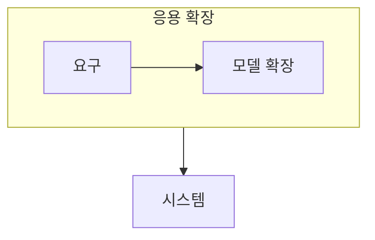

> [!abstract] 데이터베이스 응용 기술은 관계 모델만으로 표현하기 어려운 객체·분산·복합 데이터 요구에 대응한다.
> 어떤 데이터 특성과 배치 조건이 다른 모델·시스템 선택을 요구하는지 비교한다.

## 이 노트의 지도



## 1. 객체와 복합 데이터

객체지향·객체관계 데이터베이스는 복잡한 구조와 객체의 정체성, 사용자 정의 타입 같은 요구를 다룬다. ==분산 데이터베이스== 는 여러 위치에 나뉜 데이터를 하나의 시스템처럼 관리하려는 접근이다.

## 2. 응용별 선택

멀티미디어처럼 대용량·복합 형식의 데이터를 다루는 경우에는 저장, 검색, 전송의 특성이 설계 기준이 된다.

<details>
<summary>확장 기술을 비교하는 기준</summary>

데이터가 객체 구조를 갖는지, 여러 위치에 분산되는지, 복합 형식과 대용량 처리가 필요한지 먼저 확인한다. 그 뒤 관계 모델의 기본 기능만으로 충분한지 판단한다.

</details>

> [!tip] 새 기술을 관계 모델의 완전한 대체로 보지 않기
> 응용 요구에 따라 확장 모델과 관계형 기능이 함께 쓰일 수 있다. 데이터 특성과 운영 제약을 기준으로 선택한다.

## 한눈에 비교

```html preview
<div style="font-family:system-ui,sans-serif;padding:20px">
  <div id="cards" style="display:flex;gap:14px;flex-wrap:wrap"></div>
  <script>
    var stats = [
      ['객체', '복합 구조', '정체성', 'var(--chart-1)'],
      ['분산', '여러 위치', '투명성', 'var(--chart-2)'],
      ['멀티미디어', '복합 형식', '처리', 'var(--chart-3)']
    ];
    document.getElementById('cards').innerHTML = stats.map(function (s) {
      return '<div style="flex:1;min-width:150px;padding:16px;background:var(--card);' +
        'color:var(--card-foreground);border:1px solid var(--border);' +
        'border-radius:var(--radius)">' +
        '<div style="font-size:13px;color:var(--muted-foreground)">' + s[0] + '</div>' +
        '<div style="font-size:26px;font-weight:700;margin-top:4px">' + s[1] + '</div>' +
        '<div style="font-size:12px;font-weight:600;margin-top:4px;color:' + s[3] + '">' +
        s[2] + '</div>' +
        '</div>';
    }).join('');
  </script>
</div>
```

## 선택 기준

<Tabs>
  <Tab label="표현">

객체와 복합 데이터는 관계형 기본 구조만으로 표현하기 어려운 특성을 가질 수 있다.

  </Tab>
  <Tab label="배치">

분산 환경에서는 데이터 위치와 여러 시스템 사이의 조정이 핵심 문제가 된다.

  </Tab>
</Tabs>

## 핵심 정리

| 구분 | 핵심 | 학습에서 확인할 점 |
| :-- | :-- | :-- |
| 객체지향·객체관계 | 복합 구조 | 객체 특성이 필요한가 |
| 분산 | 다중 위치 | 위치 투명성과 조정이 필요한가 |
| 멀티미디어 | 복합 형식 | 저장·검색 특성이 다른가 |

> [!question]- 스스로 점검
> **Q.** 분산 데이터베이스에서 위치 투명성이 의미하는 바는 무엇인가?
>
> **A.** 사용자가 데이터의 실제 위치를 매번 의식하지 않고 하나의 시스템처럼 접근하게 하는 목표다.

## 출처 처리

공개 노트에는 원본 연결, 이미지, 페이지 단서를 남기지 않았다.
