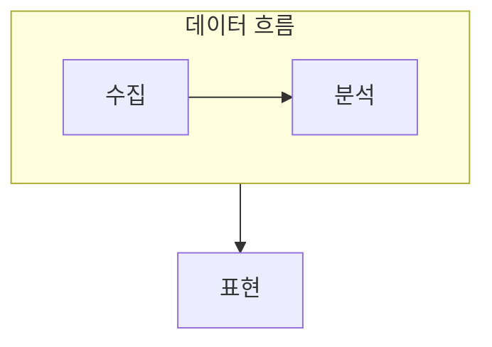

> [!abstract] 데이터 과학은 데이터를 생성·수집·저장·분석·표현해 새로운 지식을 찾는 과정이다.
> 빅데이터는 이 흐름의 규모와 속도, 다양한 형식이 만드는 저장·분석·표현의 변화를 다룬다.

## 이 노트의 지도



## 1. 과정으로 보는 데이터 과학

질문을 세우고 데이터를 다루는 일은 수집에서 끝나지 않으며, 저장·분석·표현까지 이어져 해석 가능한 결과를 만든다. ==데이터 마이닝== 은 많은 데이터에서 유용한 패턴과 지식을 찾는 분석 기술이다.

## 2. 빅데이터 기술의 역할

NoSQL 같은 저장 기술, 분석 기술, 데이터 시각화는 대규모·다양한 데이터의 활용 방식을 넓힌다.

<details>
<summary>흐름의 끊김 찾기</summary>

수집한 데이터가 저장 구조에 맞는지, 분석 결과가 질문에 답하는지, 표현 방식이 결과를 오해 없이 전달하는지 각각 점검한다.

</details>

> [!important] 도구 이름이 목표를 대신하지 않는다
> 저장·분석·표현 기술은 질문과 데이터 특성에 맞게 선택한다. 기술을 사용했다는 사실만으로 지식 발견이 보장되지는 않는다.

## 한눈에 비교

```html preview
<div style="font-family:system-ui,sans-serif;padding:20px;color:var(--foreground)">
  <label for="amt" style="font-size:14px;font-weight:600">데이터 과학 단계</label>
  <div id="out" style="font-size:30px;font-weight:700;color:var(--chart-1);margin:6px 0">1</div>
  <input id="amt" type="range" min="1" max="5" step="1" value="1"
    style="width:100%;accent-color:var(--primary)" />
  <p style="font-size:13px;color:var(--muted-foreground)">1 생성, 2 수집, 3 저장, 4 분석, 5 표현 순서로 학습 흐름을 움직여 본다.</p>
  <script>
    var amt = document.getElementById('amt');
    var out = document.getElementById('out');
    amt.addEventListener('input', function () {
      out.textContent = Number(amt.value);
    });
  </script>
</div>
```

## 선택 기준

<details>
<summary>두 관점을 나란히 보기</summary>

**과정.** 생성·수집·저장·분석·표현은 결과를 만드는 연결된 단계다.

**기술.** 저장·분석·표현 기술은 데이터 규모와 형식에 따라 서로 다른 병목을 해결한다.

</details>

## 핵심 정리

| 구분 | 핵심 | 학습에서 확인할 점 |
| :-- | :-- | :-- |
| 데이터 과학 | 지식 발견 과정 | 질문과 결과가 연결되는가 |
| NoSQL | 저장 기술 | 규모·형식 요구에 맞는가 |
| 데이터 마이닝·시각화 | 분석·표현 | 패턴과 해석을 전달하는가 |

<details>
<summary>스스로 점검</summary>

**Q.** 분석 결과를 표현 단계에서 다시 검토해야 하는 이유는 무엇인가?

**A.** 표현 방식이 결과의 의미를 왜곡하거나 중요한 차이를 숨길 수 있기 때문이다.

</details>

## 출처 처리

> [!info] 공개 노트 정책
> 원본 연결, 이미지, 페이지 단서는 공개 노트에 남기지 않았다.
