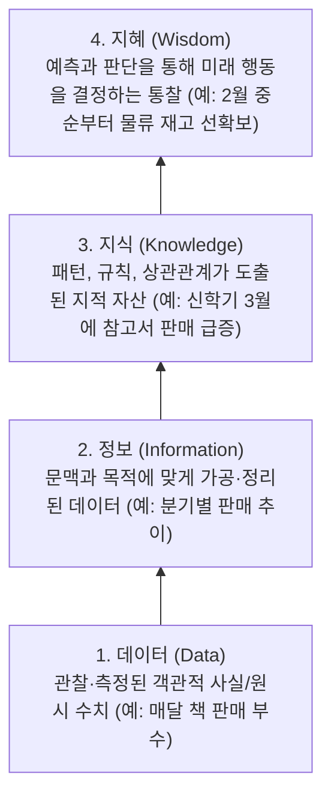
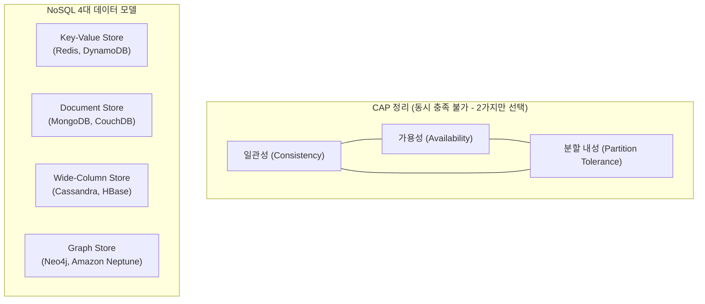
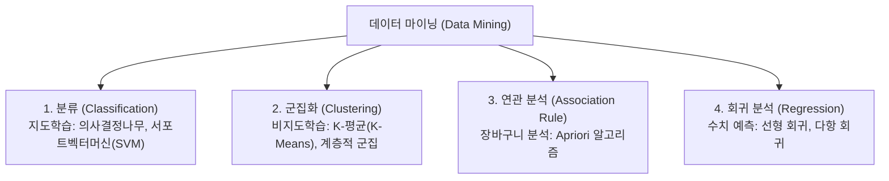

> [!abstract] 핵심 요약
> **데이터 과학(Data Science)**은 비정형·대용량의 원시 데이터(Raw Data)로부터 정제된 정보(Information)와 지식(Knowledge)을 도출하고, 이를 바탕으로 미래를 예측하고 최적의 의사결정을 내리는 **지혜(Wisdom)**를 추출하는 종합 학문이다.
> RDBMS의 수직적 확장 한계를 극복하기 위해 **NoSQL 데이터베이스(BASE 특성, CAP 정리)**와 **데이터 마이닝(분류·군집·연관·회귀)** 기법이 핵심 인프라로 활용된다.

---

## 1. DIKW 지식 피라미드 구조

데이터 과학의 궁극적인 목적은 원시 사실의 단순 나열에서 출발하여 실행 가능한 통찰(Actionable Insight)인 지혜로 승화시키는 것이다.



| 계층 | 정의 | 실무 예시 (서점 데이터) | 컴퓨터 시스템 표현 |
| :-- | :-- | :-- | :-- |
| **데이터 (Data)** | 가공되지 않은 순수한 측정치 및 기호 | "2026-03: 1,500권", "2026-04: 300권" | DBMS 레코드의 원시 컬럼 값 |
| **정보 (Information)** | 의미를 부여하고 집계·분류한 데이터 | "3월 판매량이 전월 대비 500% 증가함" | SQL `GROUP BY`, `SUM()`, 뷰(View) |
| **지식 (Knowledge)** | 데이터 간의 유의미한 상관 패턴과 원인 분석 | "매년 봄 학기 시작 시 전공서 수요가 폭증함" | 머신러닝 모델, 데이터 마이닝 규칙 |
| **지혜 (Wisdom)** | 지식을 바탕으로 한 미래 예측과 전략적 의사결정 | "차년도 2월 초 선제적 출판 부수 20% 증편" | 비즈니스 자동 의사결정 시스템 (BI) |

---

## 2. 빅데이터의 5V 특성과 데이터 유형

현대 빅데이터는 기존 RDBMS의 처리 범위를 넘어서는 고유의 복합적 특성을 지닌다.

```mermaid
mindmap
  root((빅데이터 5V 특성))
    규모 (Volume)
      페타바이트(PB)·엑사바이트(EB)급 방대한 크기
    속도 (Velocity)
      실시간 스트리밍 생성·처리 속도 (IoT, 로그)
    다양성 (Variety)
      정형(RDB), 반정형(JSON/XML), 비정형(영상/텍스트)
    정확성 (Veracity)
      노이즈 필터링 및 데이터 신뢰성 확보
    가치 (Value)
      비즈니스 가치 창출 및 통찰 도출
```

---

## 3. 빅데이터 저장 인프라: NoSQL의 4대 분류와 CAP 정리

전통적인 관계형 데이터베이스가 엄격한 **ACID 트랜잭션**과 고정 스키마를 고수하는 반면, **NoSQL(Not Only SQL)**은 **BASE(Basically Available, Soft state, Eventually consistent)** 모델을 바탕으로 수평적 분산 확장(Scale-out)을 제공한다.



<Tabs>
  <Tab label="1. Key-Value 저장소">
    <strong>키-값(Key-Value) 모델</strong><br/>
    <ul>
      <li>가장 단순한 구조로 고유한 Key에 임의의 Value(Binary/String)가 1:1로 매핑.</li>
      <li>초고속 조회($O(1)$) 및 캐싱에 최적화.</li>
      <li><strong>대표 기술</strong>: Redis, Memcached, AWS DynamoDB.</li>
    </ul>
  </Tab>
  <Tab label="2. Document 저장소">
    <strong>문서(Document) 모델</strong><br/>
    <ul>
      <li>JSON, BSON, XML 등의 계층적 문서 형태로 데이터를 저장.</li>
      <li>스키마가 유연(Schema-free)하며 중첩된 객체나 배열을 자연스럽게 표현.</li>
      <li><strong>대표 기술</strong>: MongoDB, CouchDB.</li>
    </ul>
  </Tab>
  <Tab label="3. Wide-Column 저장소">
    <strong>열 지향(Column-Family) 모델</strong><br/>
    <ul>
      <li>행(Row) 기반이 아닌 열(Column) 단위로 연속 저장하여 대규모 집계 쿼리에 최적화.</li>
      <li>행마다 서로 다른 컬럼을 가질 수 있는 희소(Sparse) 행렬 지원.</li>
      <li><strong>대표 기술</strong>: Apache Cassandra, Google Bigtable, Apache HBase.</li>
    </ul>
  </Tab>
  <Tab label="4. Graph 저장소">
    <strong>그래프(Graph) 모델</strong><br/>
    <ul>
      <li>노드(Node, 개체)와 엣지(Edge, 관계), 프로퍼티(Property)로 연결 관계를 표현.</li>
      <li>소셜 네트워크 분석, 추천 엔진, 지식 그래프 구축에 필수적.</li>
      <li><strong>대표 기술</strong>: Neo4j, ArangoDB, Amazon Neptune.</li>
    </ul>
  </Tab>
</Tabs>

---

## 4. 실시간 인터랙티브 NoSQL 아키텍처 & CAP 분석기

아래 시뮬레이터를 통해 시스템 요구사항(처리 성능, 데이터 구조, 분산 전략)에 따라 최적의 NoSQL 모델과 CAP 특성을 실시간으로 비교 분석할 수 있다.

```html preview
<div style="font-family:system-ui,-apple-system,sans-serif;padding:20px;background:var(--card);color:var(--card-foreground);border:1px solid var(--border);border-radius:var(--radius)">
  <div style="font-size:16px;font-weight:700;margin-bottom:14px;color:var(--primary);display:flex;align-items:center;gap:8px">
    <span>📊 NoSQL 데이터베이스 모델 및 CAP 아키텍처 비교기</span>
  </div>

  <div style="display:grid;grid-template-columns:1fr 1fr;gap:12px;margin-bottom:16px">
    <div>
      <label style="font-size:12px;font-weight:600;color:var(--muted-foreground);display:block;margin-bottom:4px">NoSQL 모델 선택</label>
      <select id="modelSelect" style="width:100%;padding:8px;background:var(--background);color:var(--foreground);border:1px solid var(--border);border-radius:var(--radius);font-size:13px">
        <option value="kv">Key-Value 모델 (예: Redis)</option>
        <option value="doc">Document 모델 (예: MongoDB)</option>
        <option value="col">Wide-Column 모델 (예: Cassandra)</option>
        <option value="graph">Graph 모델 (예: Neo4j)</option>
      </select>
    </div>
    <div>
      <label style="font-size:12px;font-weight:600;color:var(--muted-foreground);display:block;margin-bottom:4px">CAP 트레이드오프 영역</label>
      <div id="capBadge" style="padding:8px;background:var(--background);border:1px solid var(--chart-1);border-radius:var(--radius);font-size:12px;font-weight:700;color:var(--chart-1)">
        CP (Consistency + Partition Tolerance)
      </div>
    </div>
  </div>

  <div style="display:grid;grid-template-columns:repeat(auto-fit, minmax(140px, 1fr));gap:10px;margin-bottom:14px">
    <div style="padding:10px;background:var(--background);border:1px solid var(--border);border-radius:var(--radius)">
      <div style="font-size:11px;color:var(--muted-foreground)">읽기/쓰기 복잡도</div>
      <div id="perfComplexity" style="font-size:15px;font-weight:700;color:var(--chart-2);margin-top:2px">O(1)</div>
    </div>
    <div style="padding:10px;background:var(--background);border:1px solid var(--border);border-radius:var(--radius)">
      <div style="font-size:11px;color:var(--muted-foreground)">주요 데이터 구조</div>
      <div id="dataStructure" style="font-size:15px;font-weight:700;color:var(--chart-3);margin-top:2px">Key - String/Blob</div>
    </div>
    <div style="padding:10px;background:var(--background);border:1px solid var(--border);border-radius:var(--radius)">
      <div style="font-size:11px;color:var(--muted-foreground)">대표 활용 사례</div>
      <div id="useCase" style="font-size:13px;font-weight:600;color:var(--chart-4);margin-top:4px">세션 캐시, 리더보드</div>
    </div>
  </div>

  <div style="background:var(--background);padding:12px;border:1px solid var(--border);border-radius:var(--radius)">
    <div style="font-size:12px;font-weight:700;color:var(--primary);margin-bottom:4px">아키텍처 분석 및 특성:</div>
    <div id="descText" style="font-size:12px;color:var(--foreground);line-height:1.5"></div>
  </div>

  <script>
    var sel = document.getElementById('modelSelect');
    var capB = document.getElementById('capBadge');
    var perf = document.getElementById('perfComplexity');
    var stru = document.getElementById('dataStructure');
    var uc = document.getElementById('useCase');
    var desc = document.getElementById('descText');

    var dbInfo = {
      'kv': {
        cap: 'CP 또는 AP (설정 가능, 기본 AP/메모리 CP)',
        perf: 'O(1) 초고속',
        stru: '키-값 해시 테이블',
        uc: '인메모리 세션, 캐싱, 토큰 인증',
        desc: '단순한 Key를 통한 직접 해싱으로 지연시간(Latency)을 서브 밀리초(sub-ms) 단위로 단축합니다. 복잡한 다중 컬럼 조건 검색이나 조인은 지원하지 않습니다.'
      },
      'doc': {
        cap: 'CP (일관성 + 분할 내성 중심)',
        perf: 'O(log N) 인덱스 기반',
        stru: 'JSON / BSON 문서',
        uc: '전자상거래 상품 카탈로그, CMS',
        desc: '동적 스키마를 지원하여 상품별로 상이한 속성(의류 사이즈, 전자제품 전압 등)을 자유롭게 중첩 저장할 수 있으며, 보조 인덱스를 강력하게 지원합니다.'
      },
      'col': {
        cap: 'AP (가용성 + 최종 일관성 Eventual Consistency)',
        perf: 'O(1) 쓰기 극대화 (LSM-Tree)',
        stru: 'Column-Family & Key',
        uc: 'IoT 센서 시계열 로그, 대용량 통계',
        desc: '마스터리스(Masterless) 피어투피어 구조로 단일 장애점(SPOF)이 없으며, 초당 수십만 건의 대규모 쓰기 트래픽을 분산 노드에 안정적으로 흡수합니다.'
      },
      'graph': {
        cap: 'CA / ACID 중심 (단일 인스턴스 위주)',
        perf: 'O(k) 관계 포인터 추적',
        stru: 'Node, Edge, Property',
        uc: 'SNS 친구 추천, 금융 사기 탐지(FDS)',
        desc: '외래키 조인의 성능 한계를 인덱스 없는 포인터 직접 순회(Index-free Adjacency)로 극복하여 수백만 건의 복잡한 다단계 관계 탐색을 밀리초 내에 처리합니다.'
      }
    };

    function update() {
      var item = dbInfo[sel.value];
      capB.textContent = item.cap;
      perf.textContent = item.perf;
      stru.textContent = item.stru;
      uc.textContent = item.uc;
      desc.textContent = item.desc;
    }

    sel.addEventListener('change', update);
    update();
  </script>
</div>
```

---

## 5. 빅데이터 분석 기술: 데이터 마이닝 4대 알고리즘

데이터 마이닝(Data Mining)은 방대한 데이터베이스 속에 잠재된 유용한 규칙이나 패턴을 찾아내는 핵심 기법이다.



### 연관 규칙의 3대 수학적 평가 지표
아이템 집합 $X$를 구매했을 때 아이템 집합 $Y$를 함께 구매하는 규칙 ($X \rightarrow Y$)의 유의성은 다음 세 가지 척도로 정량화된다:

1. **지지도 (Support)**: 전체 거래($N$) 중 $X$와 $Y$가 동시에 포함된 거래의 비율
   $$\text{Support}(X \rightarrow Y) = P(X \cap Y) = \frac{n(X \cap Y)}{N}$$

2. **신뢰도 (Confidence)**: $X$를 포함한 거래 중 $Y$도 함께 포함된 조건부 확률
   $$\text{Confidence}(X \rightarrow Y) = P(Y \mid X) = \frac{P(X \cap Y)}{P(X)} = \frac{n(X \cap Y)}{n(X)}$$

3. **향상도 (Lift)**: $X$와 $Y$가 독립일 때 대비 함께 발생할 확률의 증가 배수
   $$\text{Lift}(X \rightarrow Y) = \frac{P(X \cap Y)}{P(X) \cdot P(Y)} = \frac{\text{Confidence}(X \rightarrow Y)}{P(Y)}$$
   - $\text{Lift} = 1$: $X$와 $Y$는 상호 독립적임
   - $\text{Lift} > 1$: $X$의 구매가 $Y$의 구매 확률을 유의미하게 상승시킴 (양의 상관관계)
   - $\text{Lift} < 1$: $X$와 $Y$는 대체재 성격 (음의 상관관계)

> [!TIP] 마이닝 기법 선택 기준
> - **레이블(정답)이 있는 경우**: 목표 변수가 범주형이면 **분류**, 연속 수치이면 **회귀** 적용.
> - **레이블(정답)이 없는 경우**: 고객 그룹화는 **군집화**, 상품 간 동시 구매 패턴 발견은 **연관 분석** 적용.
