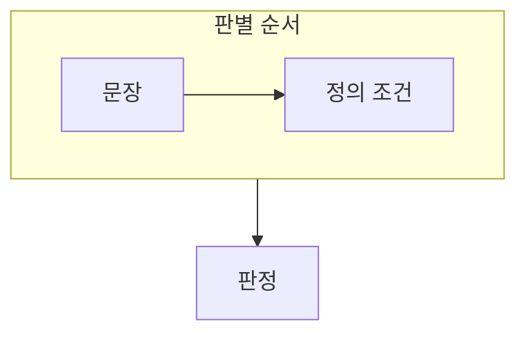

> [!abstract] 기본 개념 문제는 용어를 외우기보다 정의의 조건을 하나씩 대조해 푸는 편이 정확하다.
> 가공 여부, 의사결정 활용, 통합·저장·운영 조건을 분리해 문장을 판별한다.

## 이 노트의 지도



## 1. 데이터와 정보 판별

데이터는 관찰·측정한 사실이나 값이고, 정보는 그 데이터를 처리해 의사결정에 활용할 수 있는 결과다. ==조건 대조== 는 보기의 모든 표현을 정의의 핵심 조건과 비교하는 방법이다.

## 2. 데이터베이스 정의 읽기

통합, 저장, 운영, 공유 같은 조건이 데이터베이스의 성격을 설명하는지 확인한다.

<details>
<summary>오답을 찾는 절차</summary>

문장에서 주장하는 기준을 표시하고, 정의에 없는 조건을 추가하거나 정의의 방향을 바꾼 부분이 있는지 찾는다. 한 단어만 비슷해도 전체 문장의 방향이 다를 수 있다.

</details>

> [!warning] 키워드만 겹친다고 정답은 아니다
> 가공, 통합, 공유 같은 단어가 있어도 정의 관계를 뒤집거나 범위를 과장하면 틀린 설명이 될 수 있다.

## 한눈에 비교

```html preview
<div style="font-family:system-ui,sans-serif;padding:20px">
  <div id="cards" style="display:flex;gap:14px;flex-wrap:wrap"></div>
  <script>
    var stats = [
      ['데이터', '사실·값', '수집', 'var(--chart-1)'],
      ['정보', '처리 결과', '활용', 'var(--chart-2)'],
      ['정의', '조건 대조', '판별', 'var(--chart-3)']
    ];
    document.getElementById('cards').innerHTML = stats.map(function (s) {
      return '<div style="flex:1;min-width:150px;padding:16px;background:var(--card);' +
        'color:var(--card-foreground);border:1px solid var(--border);' +
        'border-radius:var(--radius)">' +
        '<div style="font-size:13px;color:var(--muted-foreground)">' + s[0] + '</div>' +
        '<div style="font-size:26px;font-weight:700;margin-top:4px">' + s[1] + '</div>' +
        '<div style="font-size:12px;font-weight:600;margin-top:4px;color:' + s[3] + '">' +
        's[2] + '</div>' +
        '</div>';
    }).join('');
  </script>
</div>
```

## 선택 기준

<details>
<summary>두 관점을 나란히 보기</summary>

**문장.** 보기에서 무엇을 데이터·정보·데이터베이스라고 주장하는지 분해한다.

**조건.** 정의의 필수 조건과 대조해 빠진 조건이나 뒤집힌 관계를 찾는다.

</details>

## 핵심 정리

| 구분 | 핵심 | 학습에서 확인할 점 |
| :-- | :-- | :-- |
| 데이터 | 관찰·측정 사실 | 가공 전 사실인가 |
| 정보 | 활용 가능한 결과 | 처리와 목적이 있는가 |
| 데이터베이스 | 통합 저장 | 운영·공유 조건을 담는가 |

> [!question]- 스스로 점검
> **Q.** ‘정보를 가공하면 데이터를 얻는다’가 부정확한 이유는 무엇인가?
>
> **A.** 데이터와 정보의 관계를 뒤집었기 때문이다. 정보는 데이터를 처리해 활용 가능한 결과로 본다.

## 출처 처리

공개 노트에는 원본 연결, 이미지, 페이지 단서를 남기지 않았다.
