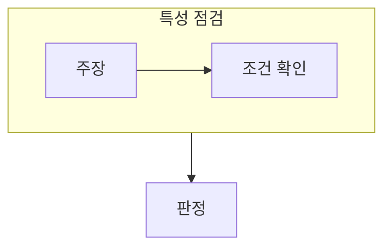

> [!abstract] 데이터베이스 특성 문제는 하나의 정의에 여러 조건이 함께 들어 있음을 확인하는 훈련이다.
> 통합, 저장, 운영, 공유라는 조건을 각각 확인한 뒤 문장의 과장과 누락을 찾는다.

## 이 노트의 지도



## 1. 통합과 저장

데이터베이스는 중복을 줄이며 조직적으로 저장된 데이터를 다루고, 필요하면 통제된 중복을 허용한다. ==공유== 는 여러 사용자나 응용이 데이터를 함께 활용할 수 있음을 뜻하며, 접근 통제와 함께 이해한다.

## 2. 운영 데이터의 의미

데이터베이스는 실제 업무 수행에 쓰이는 데이터를 지속적으로 관리하므로, 한 번의 계산 결과만을 뜻하지 않는다.

<details>
<summary>선택지의 누락 찾기</summary>

문장이 통합·저장·운영·공유 중 어떤 조건을 설명하는지 표시한다. 그 뒤 전용 데이터처럼 공유성과 반대되는 표현, 또는 일시적 결과처럼 운영성과 맞지 않는 표현을 찾는다.

</details>

> [!caution] 공유와 무제한 접근을 혼동하지 않기
> 데이터를 공유한다는 것은 권한 통제 아래 여러 사용자가 활용한다는 뜻이지, 누구나 임의로 변경할 수 있다는 뜻은 아니다.

## 한눈에 비교

```html preview
<div style="font-family:system-ui,sans-serif;padding:20px">
  <div id="cards" style="display:flex;gap:14px;flex-wrap:wrap"></div>
  <script>
    var stats = [
      ['통합', '중복 관리', '일관성', 'var(--chart-1)'],
      ['저장', '지속 관리', '보존', 'var(--chart-2)'],
      ['공유', '다중 활용', '통제', 'var(--chart-3)']
    ];
    document.getElementById('cards').innerHTML = stats.map(function (s) {
      return '<div style="flex:1;min-width:150px;padding:16px;background:var(--card);' +
        'color:var(--card-foreground);border:1px solid var(--border);' +
        'border-radius:var(--radius)">' +
        '<div style="font-size:13px;color:var(--muted-foreground)">' + s[0] + '</div>' +
        '<div style="font-size:26px;font-weight:700;margin-top:4px">' + s[1] + '</div>' +
        '<div style="font-size:12px;font-weight:600;margin-top:4px;color:' + s[3] + '">' +
        's[2] + '</div>' +
        '</div>';
    }).join('');
  </script>
</div>
```

## 선택 기준

<Tabs>
  <Tab label="특성">

통합·저장·운영·공유는 데이터베이스 정의를 이루는 서로 다른 조건이다.

  </Tab>
  <Tab label="판별">

선택지의 표현이 어느 조건을 지키거나 어기는지 대조해 판단한다.

  </Tab>
</Tabs>

## 핵심 정리

| 구분 | 핵심 | 학습에서 확인할 점 |
| :-- | :-- | :-- |
| 통합 | 중복 최소화 | 같은 사실이 무분별하게 반복되는가 |
| 저장·운영 | 지속적 관리 | 업무에 쓰이는가 |
| 공유 | 여러 사용자 활용 | 권한 통제 아래 공유되는가 |

<details>
<summary>스스로 점검</summary>

**Q.** ‘전용 데이터’가 데이터베이스의 정의와 거리가 먼 이유는 무엇인가?

**A.** 데이터베이스는 여러 사용자와 응용이 통제된 방식으로 함께 활용하는 공유 데이터를 전제로 하기 때문이다.

</details>

## 출처 처리

공개 노트에는 원본 연결, 이미지, 페이지 단서를 남기지 않았다.
