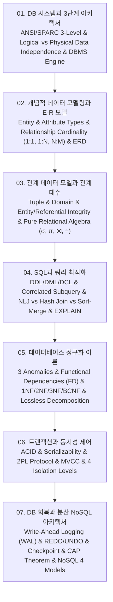

# 📚 데이터베이스 시스템 및 엔지니어링 (Database Systems & Data Architecture) 전체 강의 로드맵

ANSI/SPARC 3단계 데이터베이스 아키텍처와 논리적·물리적 데이터 독립성, 개체-관계(E-R) 모델링과 카디널리티($1:1, 1:N, N:M$), 관계 데이터 모델 릴레이션 무결성 제약조건과 순수 관계 대수($\sigma, \pi, \bowtie, \div$), ANSI SQL 쿼리 최적화와 NLJ/Hash Join 비용 계산, 릴레이션 이상 현상(삽입·삭제·갱신 이상)과 1NF~BCNF/4NF 정규화 이론, 트랜잭션 ACID 원칙과 2PL 동시성 제어 및 MVCC 격리 수준, 그리고 Write-Ahead Logging(WAL) 회복(REDO/UNDO)과 분산 CAP 정리 NoSQL 데이터 모델까지 데이터베이스 공학 전반을 체계적으로 다룹니다.

---

## 🗺️ 강의 목차 (Curriculum Overview)

---

## 📑 개별 정리 문서 목록

1. [01. 데이터베이스 시스템과 3단계 아키텍처 - 데이터 독립성(논리적·물리적), 3단계 스키마와 DBMS 엔진 구조](file:///Users/um-yunsang/work/edu/ComputerScience/05_software-engineering/database-systems/notes/01.%20%EB%8D%B0%EC%9D%B4%ED%84%B0%EB%B2%A0%EC%9D%B4%EC%8A%A4%20%EC%8B%9C%EC%8A%A4%ED%85%9C%EA%B3%BC%203%EB%8B%A8%EA%B3%84%20%EC%95%84%ED%82%A4%ED%85%8D%EC%B2%98%20-%20%EB%8D%B0%EC%9D%B4%ED%84%B0%20%EB%8F%85%EB%A6%BD%EC%84%B1(%EB%85%BC%EB%A6%AC%EC%A0%81%C2%B7%EB%AC%BC%EB%A6%AC%EC%A0%81),%203%EB%8B%A8%EA%B3%84%20%EC%8A%A4%ED%82%A4%EB%A7%88%EC%99%80%20DBMS%20%EC%97%94%EC%A7%84%20%EA%B5%AC%EC%A1%B0.md)
   - ANSI/SPARC 3단계 구조, 논리적 vs 물리적 데이터 독립성 비교, 대화형 3단계 스키마 변경 시뮬레이터
2. [02. 개념적 데이터 모델링과 E-R 모델 - 개체-관계 다이어그램(ERD), 카디널리티(1:1, 1:N, N:M)와 식별자](file:///Users/um-yunsang/work/edu/ComputerScience/05_software-engineering/database-systems/notes/02.%20%EA%B0%9C%EB%85%90%EC%A0%81%20%EB%8D%B0%EC%9D%B4%ED%84%B0%20%EB%AA%A8%EB%8D%B8%EB%A7%81%EA%B3%BC%20E-R%20%EB%AA%A8%EB%8D%B8%20-%20%EA%B0%9C%EC%B2%B4-%EA%B4%80%EA%B3%84%20%EB%8B%A4%EC%9D%B4%EC%96%B4%EA%B7%B8%EB%9E%A8(ERD),%20%EC%B9%B4%EB%94%94%EB%84%90%EB%A6%AC%ED%8B%B0(1:1,%201:N,%20N:M)%EC%99%80%20%EC%8B%9D%EB%B3%84%EC%9E%90.md)
   - E-R 핵심 구성요소, 속성 4대 분류 체계, 대화형 관계 카디널리티 매핑 시뮬레이터
3. [03. 관계 데이터 모델과 관계 대수 - 릴레이션 제약조건(개체·참조 무결성)과 순수 관계 연산자(σ, π, ⨝, ÷)](file:///Users/um-yunsang/work/edu/ComputerScience/05_software-engineering/database-systems/notes/03.%20%EA%B4%80%EA%B3%84%20%EB%8D%B0%EC%9D%B4%ED%84%B0%20%EB%AA%A8%EB%8D%B8%EA%B3%BC%20%EA%B4%80%EA%B3%84%20%EB%8C%80%EC%88%98%20-%20%EB%A6%B4%EB%A0%88%EC%9D%B4%EC%85%98%20%EC%A0%9C%EC%95%BD%EC%A1%B0%EA%B1%B4(%EA%B0%9C%EC%B2%B4%C2%B7%EC%B0%B8%EC%A1%B0%20%EB%AC%B4%EA%B2%B0%EC%84%B1)%EA%B3%BC%20%EC%88%9C%EC%88%98%20%EA%B4%80%EA%B3%84%20%EC%97%B0%EC%82%B0%EC%9E%90(%CF%83,%20%CF%80,%20%E2%A8%9D,%20%C3%B7).md)
   - 관계 대수 순수 연산자 수식, 무결성 제약조건 표, 대화형 관계 대수 연산기
4. [04. 구조적 질의 언어(SQL)와 고급 쿼리 최적화 - DDL·DML·DCL, 서브쿼리, 조인 알고리즘과 실행 계획](file:///Users/um-yunsang/work/edu/ComputerScience/05_software-engineering/database-systems/notes/04.%20%EA%B5%AC%EC%A1%B0%EC%A0%81%20%EC%A7%88%EC%9D%98%20%EC%96%B8%EC%96%B4(SQL)%EC%99%80%20%EA%B3%A0%EA%B8%89%20%EC%BF%BC%EB%A6%AC%20%EC%B5%9C%EC%A0%81%ED%99%94%20-%20DDL%C2%B7DML%C2%B7DCL,%20%EC%84%9C%EB%B8%8C%EC%BF%BC%EB%A6%AC,%20%EC%A1%B0%EC%9D%B8%20%EC%95%8C%EA%B3%A0%EB%A6%AC%EC%A6%98%EA%B3%BC%20%EC%8B%A4%ED%96%89%20%EA%B3%84%ED%9A%8D.md)
   - 조인 알고리즘(NLJ, Hash, SMJ), SQL 서브셋 분류표, 대화형 조인 I/O 비용 계산기
5. [05. 데이터베이스 정규화 이론과 이상 현상 - 함수 종속성(FD), 1NF·2NF·3NF·BCNF 및 고급 정규형(4NF·5NF)](file:///Users/um-yunsang/work/edu/ComputerScience/05_software-engineering/database-systems/notes/05.%20%EB%8D%B0%EC%9D%B4%ED%84%B0%EB%B2%A0%EC%9D%B4%EC%8A%A4%20%EC%A0%95%EA%B7%9C%ED%99%94%20%EC%9D%B4%EB%A1%A0%EA%B3%BC%20%EC%9D%B4%EC%83%81%20%ED%98%84%EC%83%81%20-%20%ED%95%A8%EC%88%98%20%EC%A2%85%EC%86%8D%EC%84%B1(FD),%201NF%C2%B72NF%C2%B73NF%C2%B7BCNF%20%EB%B0%8F%20%EA%B3%A0%EA%B8%89%20%EC%A0%95%EA%B7%9C%ED%98%95(4NF%C2%B75NF).md)
   - 이상 현상 원인, 정규화 계층 트리, 무손실 분해 조건, 대화형 정규형 판별기
6. [06. 트랜잭션 격리성과 동시성 제어 - ACID 원칙, 2단계 로킹(2PL), MVCC 및 트랜잭션 격리 수준](file:///Users/um-yunsang/work/edu/ComputerScience/05_software-engineering/database-systems/notes/06.%20%ED%8A%B8%EB%9E%9C%EC%9E%AD%EC%85%98%20%EA%B2%A9%EB%A6%AC%EC%84%B1%EA%B3%BC%20%EB%8F%99%EC%8B%9C%EC%84%B1%20%EC%A0%9C%EC%96%B4%20-%20ACID%20%EC%9B%90%EC%B9%99,%202%EB%8B%A8%EA%B3%84%20%EB%A1%9C%ED%82%B9(2PL),%20MVCC%20%EB%B0%8F%20%ED%8A%B8%EB%9E%9C%EC%9E%AD%EC%85%98%20%EA%B2%A9%EB%A6%AC%20%EC%88%98%EC%A4%80.md)
   - ACID 서브시스템, 4대 격리 수준 이상 현상 매트릭스, 대화형 격리 수준 검증기
7. [07. 데이터베이스 회복과 분산 NoSQL 아키텍처 - WAL 로그 회복(UNDO·REDO), Checkpoint, CAP 정리와 NoSQL 모델](file:///Users/um-yunsang/work/edu/ComputerScience/05_software-engineering/database-systems/notes/07.%20%EB%8D%B0%EC%9D%B4%ED%84%B0%EB%B2%A0%EC%9D%B4%EC%8A%A4%20%ED%9A%8C%EB%B3%B5%EA%B3%BC%20%EB%B6%84%EC%82%B0%20NoSQL%20%EC%95%84%ED%82%A4%ED%85%8D%EC%B2%98%20-%20WAL%20%EB%A1%9C%EA%B7%B8%20%ED%9A%8C%EB%B3%B5(UNDO%C2%B7REDO),%20Checkpoint,%20CAP%20%EC%A0%95%EB%A6%AC%EC%99%80%20NoSQL%20%EB%AA%A8%EB%8D%B8.md)
   - WAL REDO/UNDO 복구 트리, CAP 정리 및 NoSQL 4대 모델 비교, 대화형 WAL 회복 시뮬레이터
