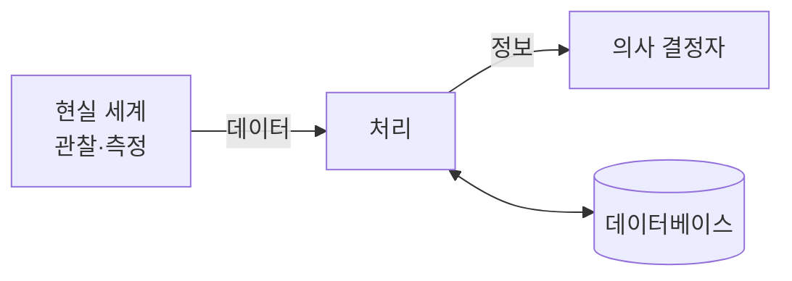

> [!abstract] 한 줄 요약
> 데이터를 쌓아두는 것과 데이터베이스로 관리하는 것은 무엇이 다른가.

## 이 노트의 지도

## 1. 데이터베이스의 필요성

### 데이터와 정보는 같은 것이 아니다

- ==데이터(data)== — 현실 세계에서 단순히 관찰하거나 측정하여 수집한 사실이나 값
- ==정보(information)== — 의사 결정에 유용하게 활용할 수 있도록 데이터를 처리한 결과물
- ==정보 처리(information processing)== — 데이터에서 정보를 추출하는 과정 또는 방법

교재는 이 차이를 ==원유와 가공 우유==로 설명한다. 원유는 그 자체로 상품이 아니고, 살균과 포장이라는 처리를 거쳐야 마실 수 있는 우유가 된다. 데이터도 같다 — 모으기만 해서는 판단 근거가 되지 못하고, 처리를 거쳐야 정보가 된다.

### 정보 시스템 안에서 데이터베이스가 맡는 자리

- ==정보 시스템(information system)== — 조직 운영에 필요한 데이터를 수집·저장해 두었다가 필요할 때 유용한 정보를 만들어 주는 수단
- ==데이터베이스== — 정보 시스템 안에서 데이터를 저장하고 있다가 필요할 때 제공하는 역할

이미지를 찾을 수 없음http\://127.0.0.1:62245/ComputerScience/05\_software-engineering/database-systems/notes/<../assets/1-기본-개념-p007.png>

그림에서 눈여겨볼 곳은 ==처리와 데이터베이스 사이의 화살표가 양방향==이라는 점이다. 데이터베이스는 처리의 결과를 받아 두기도 하고, 처리에 필요한 값을 내주기도 한다. 저장소가 흐름의 끝이 아니라 가운데에 있다.

## 2. 데이터베이스의 정의와 특징

### 정의에 든 네 낱말

> [!important] 데이터베이스(DB; DataBase)
> 특정 조직의 여러 사용자가 ==공유==하여 사용할 수 있도록 ==통합==해서 ==저장==한 ==운영== 데이터의 집합

정의가 길어 보이지만 네 낱말이 각각 하나씩 조건을 건다.

| 낱말 | 무엇을 요구하는가 |
| :-- | :-- |
| 공유 데이터 (shared data) | 특정 조직의 여러 사용자가 함께 소유하고 이용할 수 있는 공용 데이터 |
| 통합 데이터 (integrated data) | 최소의 중복과 통제 가능한 중복만 허용하는 데이터 |
| 저장 데이터 (stored data) | 컴퓨터가 접근할 수 있는 매체에 저장된 데이터 |
| 운영 데이터 (operational data) | 조직의 주요 기능을 수행하기 위해 지속적으로 꼭 필요한 데이터 |

통합 데이터가 "중복을 없앤"이 아니라 =="통제 가능한 중복만 허용하는"==이라는 데 주의한다. 중복을 완전히 제거하는 것이 목표가 아니라, 어디에 얼마나 중복이 있는지 알고 관리하는 것이 목표다.

### 네 가지 특징

| 특징 | 원어 | 뜻 |
| :-- | :-- | :-- |
| 실시간 접근성 | real-time accessibility | 사용자의 데이터 요구에 실시간으로 응답한다 |
| 계속 변화 | continuous evolution | 삽입·삭제·수정을 통해 현재의 정확한 상태를 유지한다 |
| 동시 공유 | concurrent sharing | 서로 다른 데이터는 물론 같은 데이터의 동시 사용도 지원한다 |
| 내용 기반 참조 | content reference | 저장된 주소나 위치가 아니라 내용으로 찾는다 |

내용 기반 참조가 가장 덜 와닿는 항목인데, 예를 들면 이런 것이다 — "재고량이 1,000개 이상인 제품의 이름을 검색하시오". 몇 번째 레코드인지 몰라도 조건만으로 찾을 수 있다.

## 3. 데이터 과학 시대의 데이터 분류

같은 데이터를 두 기준으로 나눈다. ==형태==는 구조가 있느냐를 묻고, ==특성==은 값이 무엇을 뜻하느냐를 묻는다.

### 형태에 따른 분류

| 분류 | 원어 | 뜻 |
| :-- | :-- | :-- |
| 정형 데이터 | structured data | 미리 정해진 구조에 따라 저장된 데이터 |
| 반정형 데이터 | semi-structured data | 구조에 따라 저장되지만 내용 안에 구조에 대한 설명이 함께 있는 데이터 |
| 비정형 데이터 | unstructured data | 정해진 구조 없이 저장된 데이터 |

### 특성에 따른 분류

| 분류 | 원어 | 하위 구분 | 뜻 |
| :-- | :-- | :-- | :-- |
| 범주형 데이터 | categorical data | 명목 · 순서 | 범주로 구분할 수 있는, 종류를 나타내는 값 |
| 수치형 데이터 | numerical data | 이산 · 연속 | 크기 비교와 산술 연산이 가능한 숫자 값 |

## 핵심 정리

| 개념 | 정의 | 왜 중요한가 |
| :-- | :-- | :-- |
| 데이터 vs 정보 | 수집한 사실 vs 처리된 판단 근거 | 데이터베이스가 왜 "저장"만으로 끝나지 않는지의 출발점 |
| 통합 데이터 | 통제 가능한 중복만 허용 | 정규화가 중복 제거가 아니라 중복 관리인 이유 |
| 내용 기반 참조 | 위치가 아닌 내용으로 접근 | SQL 이 절차가 아니라 조건을 쓰는 언어인 이유 |

## 관련 개념

- **evidences** — [1. 기본 개념.pdf](<../sources/1. 기본 개념.pdf>) : 이 노트의 모든 정의와 그림이 나온 강의 슬라이드 23쪽

> [!question]- 스스로 점검
> **Q.** 통합 데이터를 "중복이 없는 데이터"라고 답하면 왜 틀린가?
>
> **A.** 정의는 ==최소의 중복과 통제 가능한 중복만 허용==한다고 말한다. 중복을 0으로 만드는 것이 아니라, 남은 중복을 파악하고 관리하는 것이 목표다. 실제로 성능을 위해 의도적으로 중복을 두기도 한다.

## 출처

- [1. 기본 개념.pdf](<../sources/1. 기본 개념.pdf>) — 23쪽. 슬라이드 p.4 · p.7 · p.10 을 본문에 인용했다.
