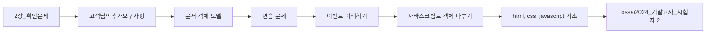

> [!abstract] 사용법
> 이 문서는 **원본 파일명 순서 → 핵심 단서 → 학습 점검**으로 읽는 입문 지도입니다. 세부 내용은 같은 폴더의 주제 노트와 원본 PDF를 함께 대조하세요.

## 강의 흐름



<Tabs>
  <Tab label="파일 순서">
    원본 PDF를 파일명 순서로 배열했습니다. 번호가 붙은 주차·장 제목은 수업의 진행 신호로 사용합니다.
  </Tab>
  <Tab label="읽기 전략">
    먼저 제목과 첫 페이지 단서를 훑고, 실습·이론·평가 자료를 짝지어 읽습니다. 동일한 내용의 사본은 한 주제의 보조 자료로 취급합니다.
  </Tab>
  <Tab label="검증">
    텍스트 추출이 빈약한 자료는 표의 경고를 확인하고 원본의 시각 요소를 직접 대조합니다. 추출되지 않은 수치나 그림은 임의로 보완하지 않습니다.
  </Tab>
</Tabs>

## 원본 PDF 목록

| 파일 | 쪽수 | 첫 페이지 단서 |
| :-- | --: | :-- |
| 2장_확인문제.pdf | — | 1번문제는 질문이
01 다음 중 객체에서 데이터를 조작하는 것과 가장 관련 있는 용어는 무엇인가?   너무 모호해서 패스
 ① 프로퍼티             ② 메서드
 ③ 속성값              ④ 태그
02 객체를 사용하는 이유와 관련 없는 |
| 고객님의추가요구사항.pdf | — | #1 음성인식

#1 음성인식 시스템 수정

음성을 텍스트로 바꿔주는 프로그램이 개발되었는데,
고객님께서 사용하시다가 추가 요구사항이 들어왔습니다.
요구사항을 모두 반영하세요. "고객 감동!!"


             ossai 고객추가요구사항 |
| 문서 객체 모델.pdf | — | OSS기반 AI프로그래밍

                     3장. 문서 객체 모델

                           동아대학교 컴퓨터•AI공학부
                                양 선


• 문서 객체모델 |
| 연습 문제.pdf | — | Quiz #1   아래 메소드들의 차이를 설명하세요.


          document.getElementById()

          document.getElementsByClassName()
          document.getEleme |
| 이벤트 이해하기.pdf | — | OSS기반 AI프로그래밍

         1장. 이벤트 이해하기

                동아대학교 컴퓨터•AI공학부
                     양 선


                          교재의 9장에 해당합니다.
 |
| 자바스크립트 객체 다루기.pdf | — | OSS기반 AI프로그래밍

              2장. 자바스크립트 객체 다루기

                                     동아대학교 컴퓨터•AI공학부
                                        |
| html, css, javascript 기초.pdf | — | 2024   OSS기반 AI프로그래밍
               동아대학교 AI학과


        • 강의   :    양선
        • 연구실 :     공대1호관(S03) 302호
        • 연락    :   연구실방문, LMS |
| ossai2024_기말고사_시험지 2.pdf | — | 텍스트 추출 빈약 — 원본 시각 자료 확인 필요 |
| ossai2024_기말고사_시험지.pdf | — | 텍스트 추출 빈약 — 원본 시각 자료 확인 필요 |
| Quiz 1 !DOCTYPE html 의 의미는 ossai 0장 확인문제.pdf | — | Quiz #1 <!DOCTYPE html>의 의미는?


                    ossai 0장 확인문제   1 |
| Quiz 1 예제1 소스에서 이벤트리스너와 이벤트핸들러는 각각 어느 부분일까요.pdf | — | Quiz #1 예제1 소스에서 이벤트리스너와 이벤트핸들러는 각각
    어느 부분일까요?


                ossai 1장 확인문제         1 |

## 원본 단계 인터랙티브

```html preview
<div style="font-family:system-ui,sans-serif;padding:20px;color:var(--foreground)">
  <label for="flowopensourcesoftware" style="font-size:14px;font-weight:600">원본 자료 단계</label>
  <div id="flowopensourcesoftware-out" style="font-size:24px;font-weight:700;color:var(--chart-1);margin:6px 0">2장_확인문제</div>
  <input id="flowopensourcesoftware" type="range" min="1" max="11" step="1" value="1" style="width:100%;accent-color:var(--primary)" />
  <p style="font-size:13px;color:var(--muted-foreground)">슬라이더를 움직이면 파일명 순서대로 자료의 역할을 확인합니다.</p>
  <script>
    var flowopensourcesoftware = document.getElementById('flowopensourcesoftware');
    var flowopensourcesoftwareOut = document.getElementById('flowopensourcesoftware-out');
    var flowopensourcesoftwareSteps = ["2장_확인문제","고객님의추가요구사항","문서 객체 모델","연습 문제","이벤트 이해하기","자바스크립트 객체 다루기","html, css, javascript 기초","ossai2024_기말고사_시험지 2","ossai2024_기말고사_시험지","Quiz 1 !DOCTYPE html 의 의미는 ossai 0장 확인문제","Quiz 1 예제1 소스에서 이벤트리스너와 이벤트핸들러는 각각 어느 부분일까요"];
    flowopensourcesoftware.addEventListener('input', function () {
      flowopensourcesoftwareOut.textContent = flowopensourcesoftwareSteps[Number(flowopensourcesoftware.value) - 1];
    });
  </script>
</div>
```

## 점검 포인트

- **범위:** 11개 PDF, 총 0쪽.
- **텍스트 근거:** 첫 페이지 추출 단서를 표에 남겨 제목·주제의 근거로 삼았습니다.
- **시각 자료:** 2개 파일은 첫 페이지 텍스트가 빈약하므로, HTML/SVG로 옮길 수 없는 도식은 승인된 크롭 후보로만 별도 검토합니다.

> [!warning] 과해석 방지
> 이 지도는 파일명·쪽수·추출된 첫 페이지 단서만 요약합니다. PDF에 없는 구현 세부, 성능 수치, 평가 결과는 추가하지 않습니다.

<details>
<summary>다음 읽기</summary>

이 문서에서 현재 단계의 파일을 선택한 뒤, 같은 폴더의 주제 노트에서 정의·절차·실습 결과를 확인하세요.

</details>
