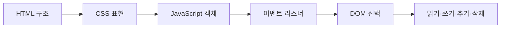

> [!abstract] 한 줄 요약
> 문서 구조를 HTML로 만들고 CSS로 표현한 뒤 JavaScript 객체·이벤트·DOM 조작으로 상호작용을 구현한다.

## 강의 흐름 지도



---
## 개념을 연결하는 순서

강의 자료의 장 구분은 웹 문서가 동작하는 층을 순서대로 쌓는다.

- HTML은 !DOCTYPE html과 태그로 문서 구조를 선언한다.
- CSS는 선택자·속성·transition으로 표현과 상태 변화를 제어한다.
- JavaScript는 속성(property)과 메서드(method)를 가진 객체로 데이터를 조작한다.
- 이벤트 자료는 리스너가 이벤트를 등록하고 핸들러가 실행할 동작을 제공하는 관계를 예제로 보여 준다.
- DOM 자료는 HTML 태그를 객체 트리로 보고 getElementById, 클래스·태그·이름 선택, querySelectorAll로 읽고 수정하는 방법을 다룬다.

<Tabs>
  <Tab label="문서">HTML·CSS·JavaScript가 각각 구조·표현·동작을 맡는 경계를 확인한다.</Tab>
  <Tab label="이벤트">리스너·핸들러·transition으로 사용자 입력과 화면 변화를 연결한다.</Tab>
  <Tab label="DOM">선택·읽기·쓰기·추가·삭제를 작은 실습으로 검증한다.</Tab>
</Tabs>

---
## 원본에서 읽는 적용 장면

| 구현 단계 | 강의에서 확인할 코드 단서 | 결과 |
| :-- | :-- | :-- |
| 구조 | !DOCTYPE html, 짝/솔로 태그 | 브라우저 문서 |
| 상호작용 | addEventListener, handler | 클릭·회전·입력 반응 |
| 객체 | Array·String·Date·Math·사용자 정의 객체 | 데이터 조작 |
| DOM | 요소 선택, innerHTML·스타일 수정 | 화면 갱신 |
| 과제 | 음성 인식 원본에 추가 요구사항 반영 | 요구사항 추적 |

퀴즈와 연습 문제는 용어를 외우는 데서 멈추지 않고, 선택자 교체·빈 입력 검증·템플릿 리터럴 변환처럼 코드 한 줄의 결과를 설명하도록 요구한다.

```html preview
<div style="font-family:system-ui,sans-serif;padding:20px;color:var(--foreground)">
  <label for="flow896306" style="font-size:14px;font-weight:600">원본 강의 단계</label>
  <div id="flow896306-out" style="font-size:30px;font-weight:700;color:var(--chart-1);margin:6px 0">HTML·CSS·JavaScript 문서 기초</div>
  <input id="flow896306" type="range" min="1" max="3" step="1" value="1"
    style="width:100%;accent-color:var(--primary)" />
  <p style="font-size:13px;color:var(--muted-foreground)">슬라이더로 PDF에서 정리한 강의 단계를 순서대로 확인합니다.</p>
  <script>
    var flow896306 = document.getElementById('flow896306');
    var flow896306Out = document.getElementById('flow896306-out');
    var flow896306Steps = ["HTML·CSS·JavaScript 문서 기초","객체와 이벤트 모델","DOM 선택·수정·검증"];
    flow896306.addEventListener('input', function () {
      flow896306Out.textContent = flow896306Steps[Number(flow896306.value) - 1] || '';
    });
  </script>
</div>
```

---
## 점검과 경계

<details>
<summary>스스로 점검하기</summary>

1. 이벤트 리스너와 이벤트 핸들러의 위치를 구분한다.
2. 객체의 속성과 메서드를 점 연산자로 접근하는 이유를 설명한다.
3. DOM 선택자 여러 종류의 반환 대상과 사용 목적을 비교한다.

</details>

> [!tip] 오류 예방
> 원본 문제의 표현이 모호한 경우에는 선택지를 임의로 보정하지 말고, 어떤 정보가 빠졌는지 먼저 기록한다.

> [!warning] 출처 경계
> 이 노트는 현재 폴더의 `sources/*.pdf`에서 추출·대조한 강의 내용을 묶었습니다. 동일 장의 '2'·'update' 파일은 별도 새 이론으로 세지 않고 보충·개정 관계로 확인합니다. 원본 PDF 전체나 원본 슬라이드 이미지는 삽입하지 않습니다.
