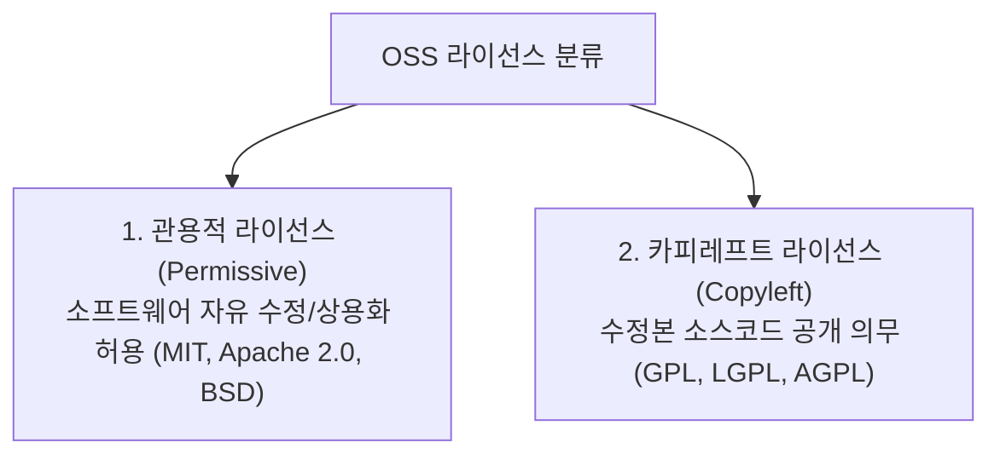

> [!abstract] 핵심 요약
> **오픈소스 소프트웨어**는 소스 코드가 공개되어 누구나 열람, 수정, 재배포할 수 있는 소프트웨어이다. 
> 라이선스는 강한 전염성을 지닌 **카피레프트(GPL v3, AGPL)**와 상용 독점 소프트웨어 결합이 허용되는 **관용적 라이선스(MIT, Apache 2.0)**로 양분된다.

```mermaid
flowchart TD
    ROOT["OSS 라이선스 분류"]
    ROOT --> PERM["1. 관용적 라이선스 (Permissive)<br/>소프트웨어 자유 수정/상용화 허용 (MIT, Apache 2.0, BSD)"]
    ROOT --> COPY["2. 카피레프트 라이선스 (Copyleft)<br/>수정본 소스코드 공개 의무 (GPL, LGPL, AGPL)"]
```
