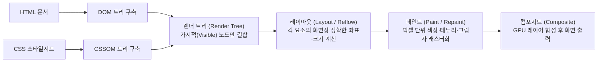

> [!abstract] 핵심 요약
> **웹 표준**은 다양한 브라우저와 기기에서 동일한 사용자 경험과 접근성을 보장하기 위한 W3C 표준 규격이다.
> 브라우저는 HTML과 CSS를 파싱하여 **DOM 트리**와 **CSSOM 트리**를 구축하고 이를 결합하여 **렌더 트리(Render Tree)**를 생성한다. 웹 성능 최적화의 핵심은 기하학적 배치를 재계산하는 비용이 큰 **Reflow(Layout)** 연산을 최소화하고 `transform`, `opacity` 속성을 활용하여 GPU 컴포지팅 단계로 직행시키는 것이다.

---

## 1. 브라우저 렌더링 엔진 파이프라인 6단계



---

## 2. Reflow vs Repaint vs Composite 발생 속성 비교

| 렌더링 단계 | 발생 유발 CSS 속성 | 연산 비용 | 성능 최적화 가이드 |
| :-- | :-- | :-- | :-- |
| **Reflow (Layout)** | `width`, `height`, `margin`, `padding`, `display`, `fontSize` | 최고 비용 (전체 서브트리 재배치) | 애니메이션에 기하 속성 직접 변경 금지 |
| **Repaint** | `color`, `background-color`, `box-shadow`, `border-style` | 중간 비용 (기하 구조 불변, 픽셀 재색칠) | DOM 변경 최소화, DocumentFragment 활용 |
| **Composite (GPU 직행)** | `transform`, `opacity`, `filter`, `will-change` | 최저 비용 (CPU Layout/Paint 스킵) | CSS 3D 트랜스폼 및 하드웨어 가속 활용 |

---

## 3. 실시간 CSS 변경에 따른 브라우저 렌더링 파이프라인 트리거 시뮬레이터

```html preview
<div style="font-family:system-ui,-apple-system,sans-serif;padding:20px;background:var(--card);color:var(--card-foreground);border:1px solid var(--border);border-radius:var(--radius)">
  <div style="font-size:16px;font-weight:700;margin-bottom:14px;color:var(--primary);display:flex;align-items:center;gap:8px">
    <span>🖥️ 브라우저 CSS 변경 시 렌더링 파이프라인 트리거 분석기</span>
  </div>

  <div style="margin-bottom:14px">
    <label style="font-size:11px;color:var(--muted-foreground)">동적으로 변경할 CSS 속성 선택:</label>
    <select id="selCssProp" style="width:100%;padding:6px;background:var(--background);color:var(--foreground);border:1px solid var(--border);border-radius:var(--radius);font-weight:700">
      <option value="reflow">1. width / height / margin 변경 (요소 크기·배치 수정)</option>
      <option value="repaint">2. background-color / color 변경 (색상 수정)</option>
      <option value="gpu">3. transform: translateX(100px) / opacity (GPU 가속)</option>
    </select>
  </div>

  <div style="display:grid;grid-template-columns:1fr 1fr 1fr;gap:8px;margin-bottom:12px">
    <div style="padding:8px;background:var(--background);border:1px solid var(--border);border-radius:var(--radius);text-align:center">
      <div style="font-size:10px;color:var(--muted-foreground)">Reflow (Layout)</div>
      <div id="statReflow" style="font-weight:800;color:var(--destructive,#ef4444);font-size:12px;margin-top:2px">발생 (고비용) ❌</div>
    </div>
    <div style="padding:8px;background:var(--background);border:1px solid var(--border);border-radius:var(--radius);text-align:center">
      <div style="font-size:10px;color:var(--muted-foreground)">Repaint</div>
      <div id="statRepaint" style="font-weight:800;color:var(--destructive,#ef4444);font-size:12px;margin-top:2px">발생 (중비용) ❌</div>
    </div>
    <div style="padding:8px;background:var(--background);border:1px solid var(--border);border-radius:var(--radius);text-align:center">
      <div style="font-size:10px;color:var(--muted-foreground)">GPU Composite</div>
      <div id="statComp" style="font-weight:800;color:var(--primary);font-size:12px;margin-top:2px">통과 ✅</div>
    </div>
  </div>

  <script>
    document.getElementById('selCssProp').onchange = function() {
      var val = this.value;
      var r = document.getElementById('statReflow');
      var p = document.getElementById('statRepaint');
      var c = document.getElementById('statComp');

      if (val === 'reflow') {
        r.innerHTML = "<span style='color:var(--destructive,#ef4444)'>발생 (고비용) ❌</span>";
        p.innerHTML = "<span style='color:var(--destructive,#ef4444)'>연쇄 발생 ❌</span>";
        c.innerHTML = "<span style='color:var(--primary)'>통과 ✅</span>";
      } else if (val === 'repaint') {
        r.innerHTML = "<span style='color:var(--primary)'>스킵 (Layout 불변) ✅</span>";
        p.innerHTML = "<span style='color:var(--chart-1)'>발생 (중비용) ⚠️</span>";
        c.innerHTML = "<span style='color:var(--primary)'>통과 ✅</span>";
      } else {
        r.innerHTML = "<span style='color:var(--primary)'>스킵 ✅</span>";
        p.innerHTML = "<span style='color:var(--primary)'>스킵 ✅</span>";
        c.innerHTML = "<span style='color:var(--primary)'>GPU 고속 합성 🚀</span>";
      }
    };
  </script>
</div>
```
