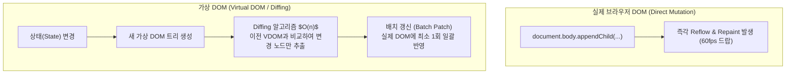

> [!abstract] 핵심 요약
> **DOM(문서 객체 모델)**은 HTML 태그를 JavaScript가 접근하고 조작할 수 있는 객체 트리 노드로 추상화한 API이다.
> 빈번한 실제 DOM의 직접 수정은 매번 Reflow/Repaint를 유발하여 심각한 렌더링 프레임 드랍을 초래한다. 이를 해결하기 위해 메모리 상에서 이전 상태와 신규 상태의 차이(Diff)를 계산한 후 최소한의 실제 DOM 변경만 일괄 반영하는 **가상 DOM(Virtual DOM)** 및 **DocumentFragment** 기법이 필수적으로 활용된다.

---

## 1. DOM 계층 트리와 가상 DOM(Virtual DOM) Diffing 워크플로우



---

## 2. DOM 탐색 및 조작 API 비교

| API 메서드 | 반환 타입 | 특징 및 성능 가이드 |
| :-- | :-- | :-- |
| `getElementById('id')` | 단일 `Element` | ID 해시 테이블 즉각 참조로 속도 최고 |
| `querySelector('css_selector')` | 단일 `Element` | CSS 선택자 문법 지원, 첫 번째 일치 요소 반환 |
| `querySelectorAll('css_selector')` | `NodeList` (정적 컬렉션) | 일치하는 모든 노드 반환 (스냅샷 형태) |
| `innerHTML` vs `textContent` | 문자열 할당 | `innerHTML`: HTML 파싱(XSS 취약) / `textContent`: 단순 텍스트(안전 & 빠름) |

---

## 3. 실시간 DOM 노드 동적 생성 및 DocumentFragment 배치 시뮬레이터

```html preview
<div style="font-family:system-ui,-apple-system,sans-serif;padding:20px;background:var(--card);color:var(--card-foreground);border:1px solid var(--border);border-radius:var(--radius)">
  <div style="font-size:16px;font-weight:700;margin-bottom:14px;color:var(--primary);display:flex;align-items:center;gap:8px">
    <span>🌲 DOM 노드 동적 조작 및 렌더링 최적화 시뮬레이터</span>
  </div>

  <div style="display:flex;gap:8px;margin-bottom:14px">
    <button id="btnAddDirect" style="padding:6px 12px;background:var(--destructive,#ef4444);color:#fff;border:none;border-radius:var(--radius);font-weight:700;cursor:pointer">개별 appendChild (5회 Reflow)</button>
    <button id="btnAddFragment" style="padding:6px 12px;background:var(--primary);color:#fff;border:none;border-radius:var(--radius);font-weight:700;cursor:pointer">DocumentFragment (1회 Reflow)</button>
    <button id="btnClearDom" style="padding:6px 12px;background:var(--secondary);color:var(--foreground);border:1px solid var(--border);border-radius:var(--radius);font-weight:700;cursor:pointer">초기화</button>
  </div>

  <div style="padding:10px;background:var(--background);border:1px solid var(--border);border-radius:var(--radius);margin-bottom:10px">
    <div style="font-size:11px;color:var(--muted-foreground)">동적 리스트 컨테이너 (#dynamicList)</div>
    <ul id="dynamicList" style="margin:6px 0 0 16px;font-size:12px;line-height:1.6"></ul>
  </div>

  <div id="domPerfLog" style="font-size:12px;font-weight:700;color:var(--primary)">준비 완료</div>

  <script>
    var list = document.getElementById('dynamicList');
    var log = document.getElementById('domPerfLog');

    document.getElementById('btnAddDirect').onclick = function() {
      list.innerHTML = "";
      for (var i = 1; i <= 5; i++) {
        var li = document.createElement('li');
        li.textContent = "항목 " + i + " (개별 DOM 직접 삽입)";
        list.appendChild(li);
      }
      log.textContent = "⚠️ 5개 노드가 각각 브라우저 DOM에 추가되어 총 5회 Reflow가 유발되었습니다.";
      log.style.color = "var(--destructive,#ef4444)";
    };

    document.getElementById('btnAddFragment').onclick = function() {
      list.innerHTML = "";
      var frag = document.createDocumentFragment();
      for (var i = 1; i <= 5; i++) {
        var li = document.createElement('li');
        li.textContent = "항목 " + i + " (DocumentFragment 일괄 삽입)";
        frag.appendChild(li);
      }
      list.appendChild(frag);
      log.textContent = "✅ DocumentFragment 메모리 버퍼에서 조립 후 1회 일괄 삽입(Batch Reflow)되었습니다.";
      log.style.color = "var(--primary)";
    };

    document.getElementById('btnClearDom').onclick = function() {
      list.innerHTML = "";
      log.textContent = "초기화되었습니다.";
      log.style.color = "var(--foreground)";
    };
  </script>
</div>
```
