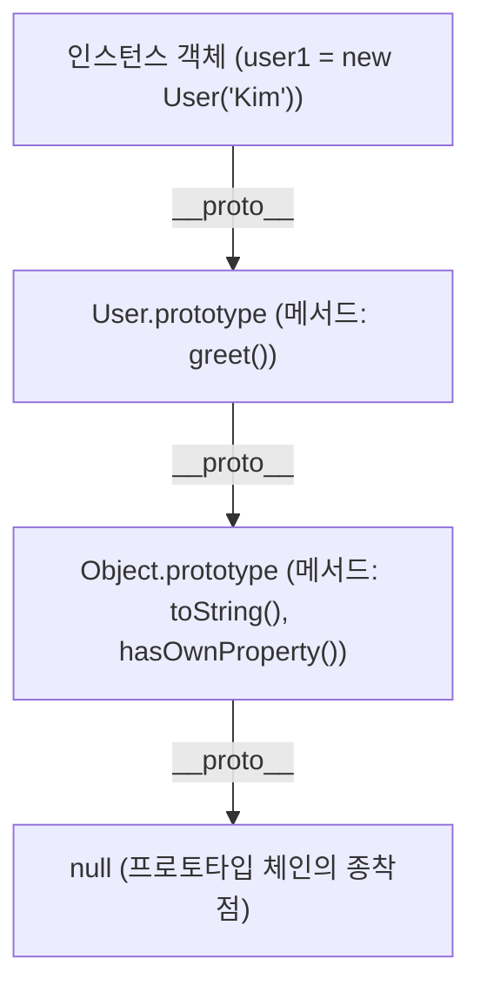

> [!abstract] 핵심 요약
> 자바스크립트는 클래스가 아닌 **프로토타입(Prototype)**을 통해 객체 간 상속과 메서드 공유를 구현하며, 속성 참조 시 상위 프로토타입으로 거슬러 올라가는 **프로토타입 체인**을 따른다.
> 함수의 **`this`**는 선언 시점이 아닌 **호출 방식(Call-site)**에 의해 동적으로 바인딩(일반 함수)되거나 상위 스코프를 그대로 계승(화살표 함수)된다. 비동기 처리는 상태 기계 모델인 **Promise**와 이를 동기식 문법으로 감싸는 **`async/await`**를 통해 제어 흐름의 명확성을 달성한다.

---

## 1. 자바스크립트 프로토타입 체인(Prototype Chain) 상속 구조



---

## 2. 4대 `this` 바인딩 규칙과 화살표 함수

| 바인딩 규칙 | 호출 형태 | `this`가 가리키는 대상 | 예외 및 특수 조건 |
| :-- | :-- | :-- | :-- |
| **기본 바인딩 (Default)** | 일반 함수 단독 호출 `foo()` | 전역 객체 (`window` / `global`) | `'use strict'` 엄격 모드에서는 `undefined` |
| **암시적 바인딩 (Implicit)** | 메서드 호출 `obj.foo()` | 메서드를 소유/호출한 객체 `obj` | 콜백으로 전달 시 암시적 바인딩 소실 발생 |
| **명시적 바인딩 (Explicit)** | `foo.call(ctx)`, `foo.bind(ctx)` | 인수로 명시 전달된 `ctx` 객체 | `bind`는 영구 바인딩된 새 함수 반환 |
| **`new` 바인딩** | `new Foo()` | 새로 생성된 빈 인스턴스 객체 | 생성자 함수 실행 후 새 인스턴스 자동 반환 |
| **화살표 함수 (Arrow)** | `() => {}` | 선언 시점의 상위 **렉시컬 `this`** | `this` 자체를 바인딩하지 않고 정적 스코프 계승 |

---

## 3. 실시간 `this` 바인딩 판별 및 Promise 상태 전이 시뮬레이터

```html preview
<div style="font-family:system-ui,-apple-system,sans-serif;padding:20px;background:var(--card);color:var(--card-foreground);border:1px solid var(--border);border-radius:var(--radius)">
  <div style="font-size:16px;font-weight:700;margin-bottom:14px;color:var(--primary);display:flex;align-items:center;gap:8px">
    <span>🧭 자바스크립트 this 바인딩 규칙 판별기</span>
  </div>

  <div style="margin-bottom:14px">
    <label style="font-size:11px;color:var(--muted-foreground)">함수 정의 및 호출 형태 선택:</label>
    <select id="selThisPattern" style="width:100%;padding:6px;background:var(--background);color:var(--foreground);border:1px solid var(--border);border-radius:var(--radius);font-weight:700">
      <option value="method">1. obj.show() (객체 메서드 호출)</option>
      <option value="normal">2. show() (일반 함수 단독 호출, strict mode)</option>
      <option value="explicit">3. show.call(customContext) (명시적 call 바인딩)</option>
      <option value="arrow">4. const show = () => { console.log(this); } (화살표 함수)</option>
      <option value="new">5. new User() (생성자 new 호출)</option>
    </select>
  </div>

  <div style="padding:12px;background:var(--background);border:1px solid var(--border);border-radius:var(--radius)">
    <div style="font-size:11px;font-weight:700;color:var(--muted-foreground);margin-bottom:4px">바인딩되는 this 대상 및 동작 분석</div>
    <div id="thisResultOut" style="font-size:13px;line-height:1.6;color:var(--foreground)">
      <strong style="color:var(--primary)">암시적 바인딩 (Implicit Binding):</strong> `this`는 메서드를 호출한 `obj` 객체를 참조합니다.
    </div>
  </div>

  <script>
    document.getElementById('selThisPattern').onchange = function() {
      var val = this.value;
      var out = document.getElementById('thisResultOut');
      if (val === 'method') {
        out.innerHTML = "<strong style='color:var(--primary)'>⚡ 암시적 바인딩:</strong> this = obj (점 앞의 객체 참조)";
      } else if (val === 'normal') {
        out.innerHTML = "<strong style='color:var(--destructive,#ef4444)'>⚡ 기본 바인딩 (Strict Mode):</strong> this = undefined (비엄격 모드에서는 window)";
      } else if (val === 'explicit') {
        out.innerHTML = "<strong style='color:var(--primary)'>⚡ 명시적 바인딩:</strong> this = customContext (명시 전달된 객체로 강제 고정)";
      } else if (val === 'arrow') {
        out.innerHTML = "<strong style='color:var(--chart-1)'>⚡ 렉시컬 this (Lexical This):</strong> 화살표 함수는 자체 this를 생성하지 않으며 선언 시점 상위 스코프의 this를 불변 계승합니다.";
      } else {
        out.innerHTML = "<strong style='color:var(--primary)'>⚡ new 바인딩:</strong> this = 새로 생성된 빈 객체 인스턴스 (User {})";
      }
    };
  </script>
</div>
```
