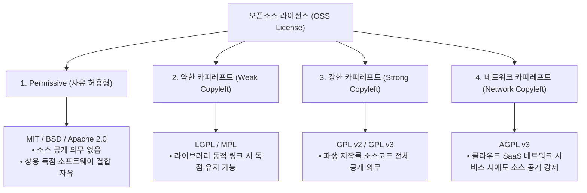

> [!abstract] 핵심 요약
> **오픈소스 라이선스**는 저작권(Copyright)을 유지하면서도 사용자에게 소스코드의 사용, 복제, 수정, 배포의 자유를 부여하는 법적 계약이다.
> 상용 소프트웨어와 결합이 자유로운 **Permissive(MIT, Apache 2.0)** 계열과 2차 저작물의 소스코드 공개를 강제하는 **Copyleft(GPLv3, AGPLv3 - 클라우드 SaaS 전염성)** 계열로 양분되며, 기업의 비즈니스 모델과 특허 정책에 맞춘 엄격한 라이선스 컴플라이언스 관리가 필수적이다.

---

## 1. 오픈소스 4대 대표 라이선스 분류 체계



---

## 2. 주요 오픈소스 라이선스 권리 및 의무 비교

| 라이선스 | 소스코드 공개 의무 | 2차 저작물 전염성 | 특허 라이선스 부여 | 상용 소프트웨어 통합 용이성 |
| :-- | :--: | :--: | :--: | :-- |
| **MIT** | ❌ 없음 | ❌ 없음 | ❌ 미언급 | **최고 (가장 널리 사용)** |
| **Apache 2.0** | ❌ 없음 | ❌ 없음 | **✅ 명시적 특허권 보호** | **최고 (기업 친화적 표준)** |
| **LGPL v3** | ⚠️ 라이브러리 수정 시 공개 | ⚠️ 정적 링크 시 전염 | ✅ 명시 | 양호 (동적 링크 필수) |
| **GPL v3** | **✅ 배포 시 전체 공개** | **✅ 강한 전염성** | ✅ 명시 | 독점 상용화 불가 (전체 오픈소스화) |
| **AGPL v3** | **✅ 네트워크 서비스 시 공개** | **✅ SaaS 전염성** | ✅ 명시 | 클라우드 백엔드 사용 시 소스 유출 위험 |

---

## 3. 실시간 비즈니스 요구사항별 오픈소스 라이선스 추천기

```html preview
<div style="font-family:system-ui,-apple-system,sans-serif;padding:20px;background:var(--card);color:var(--card-foreground);border:1px solid var(--border);border-radius:var(--radius)">
  <div style="font-size:16px;font-weight:700;margin-bottom:14px;color:var(--primary);display:flex;align-items:center;gap:8px">
    <span>⚖️ 프로젝트 목적별 오픈소스 라이선스 선택 가이드</span>
  </div>

  <div style="margin-bottom:14px">
    <label style="font-size:11px;color:var(--muted-foreground)">프로젝트의 핵심 비즈니스 요구사항:</label>
    <select id="selLicenseGoal" style="width:100%;padding:6px;background:var(--background);color:var(--foreground);border:1px solid var(--border);border-radius:var(--radius);font-weight:700">
      <option value="mit">1. 최대한 많은 사용자 확보 및 상용 라이브러리 채택 (가장 유연한 허용)</option>
      <option value="apache">2. 기업용 엔터프라이즈 프로젝트로 특허 분쟁 방지가 필수적임</option>
      <option value="gpl">3. 파생 소프트웨어의 독점화 방지 및 오픈 생태계 기여 강제</option>
      <option value="agpl">4. 클라우드 SaaS 서비스 기업의 무단 상용 호스팅 방지</option>
    </select>
  </div>

  <div style="padding:12px;background:var(--background);border:1px solid var(--border);border-radius:var(--radius)">
    <div style="font-size:11px;font-weight:700;color:var(--muted-foreground);margin-bottom:4px">추천 라이선스 및 법적 특성</div>
    <div id="licenseResultOut" style="font-size:13px;line-height:1.6;color:var(--foreground)">
      <strong style="color:var(--primary)">추천: MIT License</strong><br/>저작권 고지만 유지하면 상용 독점 소프트웨어 포함 및 재배포가 자유로운 가장 범용적인 Permissive 라이선스입니다.
    </div>
  </div>

  <script>
    document.getElementById('selLicenseGoal').onchange = function() {
      var val = this.value;
      var out = document.getElementById('licenseResultOut');
      if (val === 'mit') {
        out.innerHTML = "<strong style='color:var(--primary)'>추천: MIT License</strong><br/>저작권 고지만 유지하면 상용 독점 소프트웨어 포함 및 재배포가 자유로운 가장 범용적인 Permissive 라이선스입니다.";
      } else if (val === 'apache') {
        out.innerHTML = "<strong style='color:var(--primary)'>추천: Apache License 2.0</strong><br/>기여자의 특허권을 사용자에게 명시적으로 부여하며, 특허 소송 제기 시 라이선스가 즉시 종료되는 강력한 특허 보호 조항을 포함합니다.";
      } else if (val === 'gpl') {
        out.innerHTML = "<strong style='color:var(--chart-1)'>추천: GNU General Public License v3 (GPLv3)</strong><br/>수정본 및 파생 저작물을 바이너리로 배포할 경우 소스코드 전체를 동일 라이선스로 공개해야 하는 강력한 카피레프트입니다.";
      } else {
        out.innerHTML = "<strong style='color:var(--destructive,#ef4444)'>추천: GNU Affero General Public License v3 (AGPLv3)</strong><br/>웹/클라우드 네트워크를 통해 서비스만 제공하더라도 사용자에게 소스코드를 의무적으로 공개해야 하는 강력한 SaaS 보호 라이선스입니다.";
      }
    };
  </script>
</div>
```
