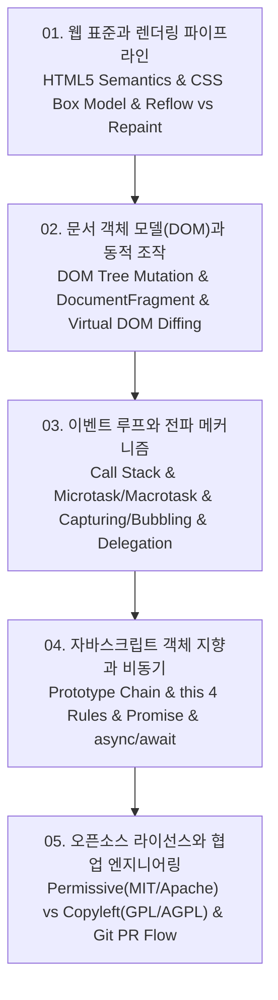

# 📚 오픈소스 소프트웨어 및 웹 엔지니어링 (Open Source Software & Web Engineering) 전체 강의 로드맵

웹 표준(W3C)과 HTML5 시맨틱 마크업, CSS 박스 모델과 브라우저 렌더링 엔진 파이프라인(DOM/CSSOM $\to$ Render Tree $\to$ Reflow $\to$ Repaint $\to$ Composite), DOM 동적 조작과 가상 DOM(Virtual DOM) Diffing 최적화, 단일 스레드 자바스크립트 이벤트 루프(Call Stack, Microtask/Macrotask Queue)와 이벤트 위임(Event Delegation), 프로토타입 체인과 4대 `this` 바인딩 규칙, 그리고 퍼미시브(MIT, Apache 2.0) vs 카피레프트(GPL, AGPL) 오픈소스 라이선스 거버넌스까지 오픈소스 프론트엔드 엔지니어링을 체계적으로 다룹니다.

---

## 🗺️ 강의 목차 (Curriculum Overview)

---

## 📑 개별 정리 문서 목록

1. [01. 웹 표준과 렌더링 파이프라인 - HTML5 시맨틱 구조, CSS 박스 모델 및 Reflow·Repaint 최적화](file:///Users/um-yunsang/work/edu/ComputerScience/05_software-engineering/open-source-software/notes/01.%20%EC%9B%B9%20%ED%91%9C%EC%A4%80%EA%B3%BC%20%EB%A0%8C%EB%8D%94%EB%A7%81%20%ED%8C%8C%EC%9D%B4%ED%48%C2%B0%EB%9D%BC%EC%9D%B8%20-%20HTML5%20%EC%8B%9C%EB%A7%A8%ED%8B%B1%20%EA%5C%EA%B5%AC%EC%A1%B0,%20CSS%20%EB%B0%95%EC%8A%A4%20%EB%AA%A8%EB%8D%B8%20%EB%B0%8F%20Reflow%C2%B7Repaint%20%EC%B5%9C%EC%A0%81%ED%99%94.md)
   - 브라우저 렌더링 6단계 파이프라인, Reflow/Repaint 유발 속성 분석, 대화형 렌더링 파이프라인 트리거 시뮬레이터
2. [02. 문서 객체 모델(DOM)과 동적 조작 - DOM 트리 탐색, 노드 조작과 가상 DOM 원리](file:///Users/um-yunsang/work/edu/ComputerScience/05_software-engineering/open-source-software/notes/02.%20%EB%AC%B8%EC%84%9C%20%EA%B0%9D%EC%B2%B4%20%EB%AA%A8%EB%8D%B8(DOM)%EA%B3%BC%20%EB%8F%99%EC%A0%81%20%EC%A1%B0%EC%9E%91%20-%20DOM%20%ED%8A%B8%EB%A6%AC%20%ED%83%90%EC%83%89,%20%EB%85%B8%EB%93%9C%20%EC%A1%B0%EC%9E%91%EA%B3%BC%20%EA%B0%80%EC%83%81%20DOM%20%EC%9B%90%EB%A6%AC.md)
   - DOM 탐색/조작 API 매트릭스, DocumentFragment 배치 삽입 기법, 대화형 DOM 동적 생성 및 성능 비교기
3. [03. 자바스크립트 이벤트 루프와 전파 메커니즘 - 캡처링·버블링, 이벤트 위임과 비동기 태스크 큐](file:///Users/um-yunsang/work/edu/ComputerScience/05_software-engineering/open-source-software/notes/03.%20%EC%9E%90%EB%B0%94%EC%8A%A4%ED%81%AC%EB%A6%BD%ED%8A%B8%20%EC%9D%B4%EB%B2%A4%ED%8A%B8%20%EB%A3%A8%ED%94%84%EC%99%80%20%EC%A0%84%ED%8C%8C%20%EB%A9%94%EC%BB%A4%EB%8B%88%EC%A6%98%20-%20%EC%BA%A1%EC%B2%98%EB%A7%81%C2%B7%EB%B2%84%EB%B8%94%EB%A7%81,%20%EC%9D%B4%EB%B2%A4%ED%8A%B8%20%EC%9C%84%EC%9E%84%EA%B3%BC%20%EB%B9%84%EB%8F%99%EA%B8%B0%20%ED%83%9C%EC%8A%A4%ED%81%AC%20%ED%81%90.md)
   - 이벤트 루프 Microtask vs Macrotask 실행 순서, W3C 3단계 이벤트 흐름, 대화형 이벤트 위임(Delegation) 시뮬레이터
4. [04. 자바스크립트 객체 지향과 비동기 제어 - 프로토타입 체인, this 바인딩, Promise와 async·await](file:///Users/um-yunsang/work/edu/ComputerScience/05_software-engineering/open-source-software/notes/04.%20%EC%9E%90%EB%B0%94%EC%8A%A4%ED%81%AC%EB%A6%BD%ED%8A%B8%20%EA%B0%9D%EC%B2%B4%20%EC%A7%80%ED%96%A5%EA%B3%BC%20%EB%B9%84%EB%8F%99%EA%B8%B0%20%EC%A0%9C%EC%96%B4%20-%20%ED%94%84%EB%A1%9C%ED%86%A0%ED%83%80%EC%9E%85%20%EC%B2%B4%EC%9D%B8,%20this%20%EB%B0%94%EC%9D%B8%EB%94%A9,%20Promise%EC%99%80%20async%C2%B7await.md)
   - 프로토타입 상속 체인 검색 메커니즘, 4대 `this` 바인딩 규칙 매트릭스, 대화형 this 판별 및 실행기
5. [05. 오픈소스 라이선스와 협업 엔지니어링 - Permissive(MIT·Apache) vs Copyleft(GPL·AGPL), Git PR 워크플로우](file:///Users/um-yunsang/work/edu/ComputerScience/05_software-engineering/open-source-software/notes/05.%20%EC%98%A4%ED%94%88%EC%86%8C%EC%8A%A4%20%EB%9D%BC%EC%9D%B4%EC%84%A0%EC%8A%A4%EC%99%80%20%ED%98%91%EC%97%85%20%EC%97%94%EC%A7%80%EB%8B%88%EC%96%B4%EB%A7%81%20-%20Permissive(MIT%C2%B7Apache)%20vs%20Copyleft(GPL%C2%B7AGPL),%20Git%20PR%20%EC%9B%8C%ED%81%AC%ED%94%8C%EB%A1%9C%EC%9A%B0.md)
   - Permissive vs Weak/Strong/Network Copyleft 라이선스 비교, 소스코드 공개 의무 및 특허 조항, 대화형 라이선스 선택 의사결정기
