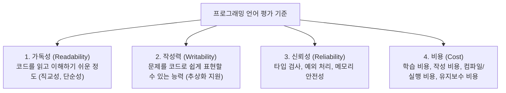

> [!abstract] 핵심 요약
> 프로그래밍 언어 설계는 **가독성(Readability)**, **작성력(Writability)**, **신뢰성(Reliability)**, **비용(Cost)**의 4대 기준을 바탕으로 평가된다. 
> 언어 구현 기법은 순수 컴파일(Pure Compilation), 순수 인터프리터(Pure Interpretation), 그리고 바이트코드와 JIT을 결합한 하이브리드(Hybrid) 방식으로 구분된다.

---

## 1. 언어 평가의 4대 핵심 기준



---

## 2. 언어 구현 모델 비교 시뮬레이터

```html preview
<div style="font-family:system-ui,-apple-system,sans-serif;padding:20px;background:var(--card);color:var(--card-foreground);border:1px solid var(--border);border-radius:var(--radius)">
  <div style="font-size:16px;font-weight:700;margin-bottom:14px;color:var(--primary);display:flex;align-items:center;gap:8px">
    <span>⚙️ 프로그래밍 언어 구현 모델 (Compiler vs Interpreter vs JIT)</span>
  </div>

  <div style="margin-bottom:14px">
    <label style="font-size:12px;font-weight:600;color:var(--muted-foreground);display:block;margin-bottom:4px">구현 모델 선택</label>
    <select id="modelSel" style="width:100%;padding:8px;background:var(--background);color:var(--foreground);border:1px solid var(--border);border-radius:var(--radius);font-size:13px">
      <option value="compile">1. 순수 컴파일 (Pure Compilation: C, C++, Rust)</option>
      <option value="interp">2. 순수 인터프리터 (Pure Interpretation: Lisp, Python Basic)</option>
      <option value="hybrid">3. 하이브리드 JIT (Hybrid Implementation: Java JVM, PyPy, Node.js)</option>
    </select>
  </div>

  <div style="display:grid;grid-template-columns:repeat(3, 1fr);gap:10px;margin-bottom:14px">
    <div style="padding:10px;background:var(--background);border:1px solid var(--border);border-radius:var(--radius);text-align:center">
      <div style="font-size:11px;color:var(--muted-foreground)">실행 속도</div>
      <div id="mSpeed" style="font-size:16px;font-weight:700;color:var(--chart-1);margin-top:2px">최고속 (Native)</div>
    </div>
    <div style="padding:10px;background:var(--background);border:1px solid var(--border);border-radius:var(--radius);text-align:center">
      <div style="font-size:11px;color:var(--muted-foreground)">메모리 공간 오버헤드</div>
      <div id="mMem" style="font-size:16px;font-weight:700;color:var(--chart-2);margin-top:2px">최소</div>
    </div>
    <div style="padding:10px;background:var(--background);border:1px solid var(--border);border-radius:var(--radius);text-align:center">
      <div style="font-size:11px;color:var(--muted-foreground)">이식성 & 디버깅</div>
      <div id="mPort" style="font-size:16px;font-weight:700;color:var(--chart-3);margin-top:2px">환경 종속적</div>
    </div>
  </div>

  <div style="background:var(--background);padding:12px;border:1px solid var(--border);border-radius:var(--radius)">
    <div style="font-size:12px;font-weight:700;color:var(--primary);margin-bottom:4px">파이프라인 아키텍처:</div>
    <div id="mDesc" style="font-size:12px;color:var(--foreground);line-height:1.5"></div>
  </div>

  <script>
    var sel = document.getElementById('modelSel');
    var sp = document.getElementById('mSpeed');
    var me = document.getElementById('mMem');
    var po = document.getElementById('mPort');
    var de = document.getElementById('mDesc');

    var data = {
      'compile': {
        speed: '최고속 (Native Bin)',
        mem: '최소 (직접 실행)',
        port: '기계 종속적 (재컴파일 필요)',
        desc: '소스 코드 -> 어휘/구문 분석 -> 중간 코드 생성 -> 기계어 최적화 -> 목적 코드(바이너리) 생성. 런타임 해석 오버헤드가 전혀 없어 최고 성능을 발휘합니다.'
      },
      'interp': {
        speed: '저속 (10~100배 지연)',
        mem: '중간 (인터프리터 상주)',
        port: '완전한 플랫폼 독립성',
        desc: '소스 코드를 한 줄씩 읽어 런타임 소프트웨어 인터프리터가 즉시 해석하여 실행합니다. 디버깅이 용이하지만 반복 루프에서 심각한 지연이 발생합니다.'
      },
      'hybrid': {
        speed: '준최고속 (Hotspot JIT)',
        mem: '높음 (가상머신 + JIT 캐시)',
        port: '바이트코드 수준 완벽 이식',
        desc: '소스 코드를 중간 바이트코드(Intermediate Bytecode)로 1차 컴파일한 후, 가상머신(VM)이 실행하며 자주 호출되는 핫스팟 코드를 JIT(Just-In-Time)으로 동적 기계어 번역합니다.'
      }
    };

    function update() {
      var item = data[sel.value];
      sp.textContent = item.speed;
      me.textContent = item.mem;
      po.textContent = item.port;
      de.textContent = item.desc;
    }

    sel.addEventListener('change', update);
    update();
  </script>
</div>
```
