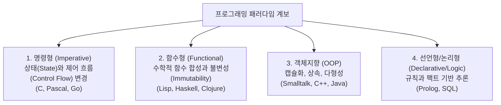

> [!abstract] 핵심 요약
> 프로그래밍 언어는 폰 노이만 구조에 기반한 **명령형(Imperative)**에서 출발하여, 수학적 함수 모델에 기반한 **함수형(Functional)**, 술어 논리 기반의 **논리형(Logic)**, 그리고 데이터와 행위를 캡슐화한 **객체지향(Object-Oriented)** 패러다임으로 발전해왔다.

---

## 1. 프로그래밍 패러다임 4대 분류

