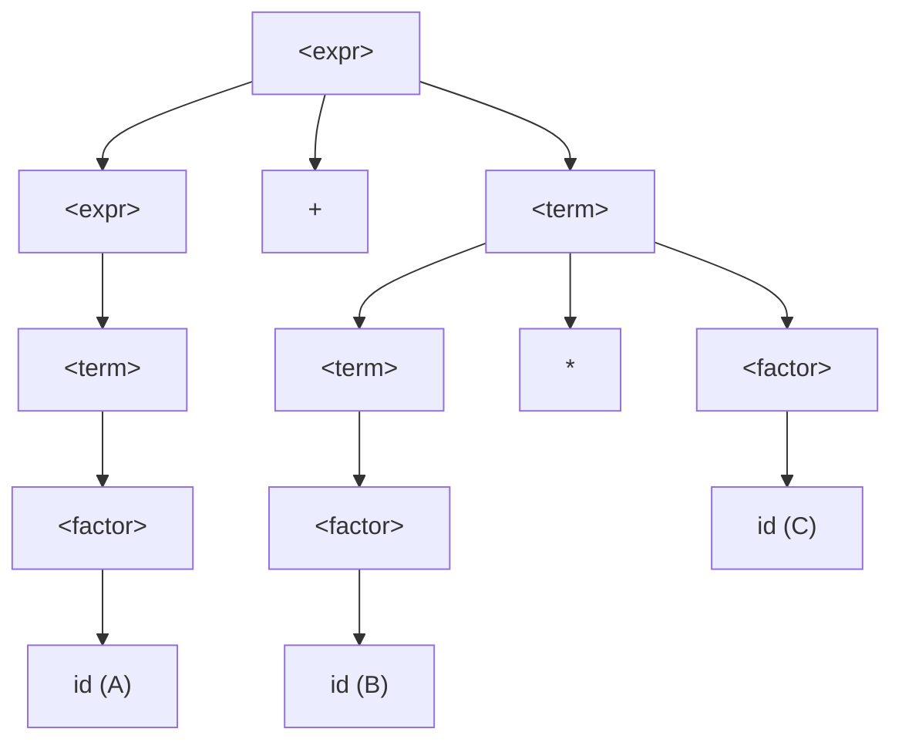

> [!abstract] 핵심 요약
> **구문론(Syntax)**은 프로그래밍 언어의 올바른 문장 구조를 수학적으로 정의하며, 노암 촘스키의 **문맥 자유 문법(CFG)**을 표현하는 **BNF(Backus-Naur Form)** 표기법이 표준으로 사용된다.
> 문법이 **모호(Ambiguous)**하다는 것은 하나의 입력 문장에 대해 2개 이상의 서로 다른 파스 트리(Parse Tree)가 도출될 수 있음을 의미하며, 이는 컴파일러의 해석 불확정성을 초래하므로 **연산자 우선순위(Precedence)**와 **결합법칙(Associativity)**을 반영한 비모호 문법으로 엄격히 재작성해야 한다.

---

## 1. 모호한 수식 문법 vs 비모호 수식 문법 비교

### 1.1 모호한 문법 (Ambiguous)

$$\langle \text{expr} \rangle \to \langle \text{expr} \rangle + \langle \text{expr} \rangle \mid \langle \text{expr} \rangle \times \langle \text{expr} \rangle \mid \text{id}$$

- 문장 `A + B * C`에 대해 `(A + B) * C` 또는 `A + (B * C)`의 2가지 파스 트리가 생성되어 모호함.

### 1.2 우선순위가 반영된 비모호 문법 (Unambiguous)

$$\langle \text{expr} \rangle \to \langle \text{expr} \rangle + \langle \text{term} \rangle \mid \langle \text{term} \rangle$$

$$\langle \text{term} \rangle \to \langle \text{term} \rangle \times \langle \text{factor} \rangle \mid \langle \text{factor} \rangle$$

$$\langle \text{factor} \rangle \to (\langle \text{expr} \rangle) \mid \text{id}$$



---

## 2. BNF vs EBNF 확장 문법 메타 기호 비교

| 기능 | 표준 BNF 표기 | 확장 BNF (EBNF) 표기 | 장점 |
| :-- | :-- | :-- | :-- |
| **선택 (Optional)** | $\langle \text{if\_stmt} \rangle \to \text{if } \langle \text{expr} \rangle \text{ then } \langle \text{stmt} \rangle \mid \text{if } \langle \text{expr} \rangle \text{ then } \langle \text{stmt} \rangle \text{ else } \langle \text{stmt} \rangle$ | `if_stmt -> if expr then stmt [else stmt]` | 대괄호 `[...]`로 선택적 구성요소를 간결하게 표현 |
| **반복 (0회 이상)** | $\langle \text{id\_list} \rangle \to \text{id} \mid \langle \text{id\_list} \rangle, \text{id}$ | `id_list -> id { , id }` | 중괄호 `{...}`로 좌재귀 없이 0회 이상 반복 기술 |
| **다중 선택 (Grouping)** | $\langle \text{term} \rangle \to \langle \text{term} \rangle * \langle \text{F} \rangle \mid \langle \text{term} \rangle / \langle \text{F} \rangle$ | `term -> term (* | /) F` | 괄호 `(...)`와 `|`로 다중 연산자 그룹화 |

---

## 3. 실시간 BNF 연산자 우선순위 파싱 계산기

```html preview
<div style="font-family:system-ui,-apple-system,sans-serif;padding:20px;background:var(--card);color:var(--card-foreground);border:1px solid var(--border);border-radius:var(--radius)">
  <div style="font-size:16px;font-weight:700;margin-bottom:14px;color:var(--primary);display:flex;align-items:center;gap:8px">
    <span>🌳 BNF 수식 파스 트리 및 결합 법칙 평가기</span>
  </div>

  <div style="margin-bottom:14px">
    <label style="font-size:11px;color:var(--muted-foreground)">평가할 산술 수식 입력:</label>
    <input id="inBnfExpr" type="text" value="3 + 4 * 5" style="width:100%;padding:6px;background:var(--background);color:var(--foreground);border:1px solid var(--border);border-radius:var(--radius);font-family:monospace;font-weight:700" />
  </div>

  <div style="display:grid;grid-template-columns:1fr 1fr;gap:12px;margin-bottom:12px">
    <div style="padding:10px;background:var(--background);border:1px solid var(--border);border-radius:var(--radius);text-align:center">
      <div style="font-size:10px;color:var(--muted-foreground)">비모호 문법 파싱 결과 (우선순위 준수)</div>
      <div id="bnfValOut" style="font-family:monospace;font-size:18px;font-weight:800;color:var(--primary);margin-top:2px">3 + (4 * 5) = 23</div>
    </div>
    <div style="padding:10px;background:var(--background);border:1px solid var(--border);border-radius:var(--radius);text-align:center">
      <div style="font-size:10px;color:var(--muted-foreground)">파스 트리 깊이 구조</div>
      <div id="bnfTreeOut" style="font-size:12px;font-weight:800;color:var(--chart-1);margin-top:4px">곱셈(*)이 트리의 더 깊은 곳에 위치</div>
    </div>
  </div>

  <script>
    document.getElementById('inBnfExpr').oninput = function() {
      var expr = this.value;
      try {
        var res = Function('"use strict";return (' + expr + ')')();
        document.getElementById('bnfValOut').textContent = expr + " = " + res;
      } catch(e) {
        document.getElementById('bnfValOut').textContent = "구문 오류 (Syntax Error)";
      }
    };
  </script>
</div>
```
