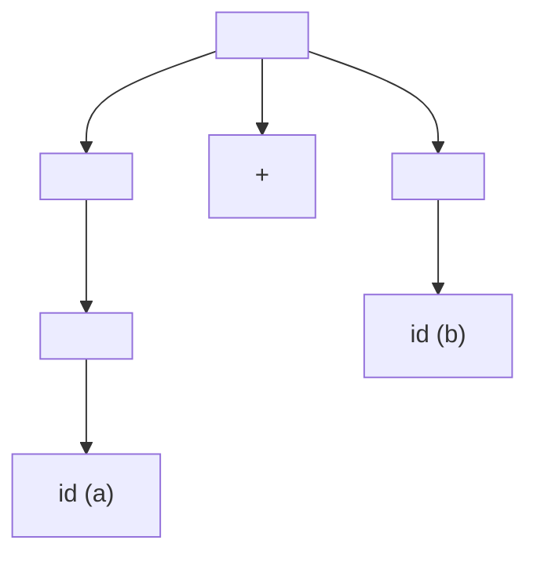

> [!abstract] 핵심 요약
> **구문론(Syntax)**은 프로그램의 형태와 구조를 정의하며, **문맥 자유 문법(CFG)**의 생성 규칙은 **BNF/EBNF**로 표현된다. 
> 하나의 문장에 대해 2개 이상의 서로 다른 파스 트리가 생성되는 문법을 **모호한 문법(Ambiguous Grammar)**이라 하며, 연산자 우선순위와 결합 법칙을 문법 계층에 반영하여 모호성을 제거한다.

---

## 1. BNF 문법 규칙의 구성 요소

$$	ext{Grammar } G = (V_N, V_T, P, S)$$

- $V_N$: 비단말 기호(Non-terminals, 문법 변수)
- $V_T$: 단말 기호(Terminals, 어휘 토큰)
- $P$: 생성 규칙(Production Rules, $A 
ightarrow lpha$)
- $S$: 시작 기호(Start Symbol)

