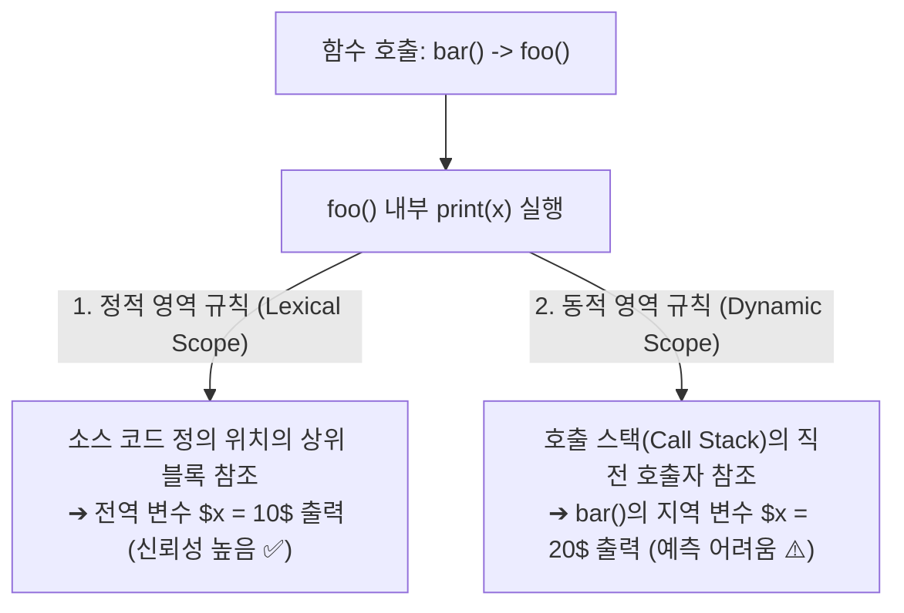

> [!abstract] 핵심 요약
> **영역(Scope)**은 프로그램 내에서 특정 변수의 이름이 가시적(Visible)이고 참조 가능한 공간적 범위를 규정한다.
> 현대 프로그래밍 언어의 99%는 소스 코드의 정적 중첩 구조만을 보고 컴파일 시점에 참조 대상을 확정할 수 있는 **정적 영역(Static / Lexical Scope)**을 채택하여 신뢰성과 최적화를 확보한다. 반면 **동적 영역(Dynamic Scope)**은 호출 체인을 역추적하여 가장 최근 호출된 함수의 변수를 참조하므로 코드 가독성을 저해하지만 특수한 동적 컨텍스트 전달에 사용된다.

---

## 1. 정적 스코프 vs 동적 스코프 변수 해석 비교

```
var x = 10;

function foo() {
    print(x);
}

function bar() {
    var x = 20;
    foo();
}

bar();
```



---

## 2. 정적 링크(Static Link) vs 동적 링크(Dynamic Link) 스택 프레임

| 메커니즘 | 링크가 가리키는 대상 | 사용 목적 | 결정 시점 |
| :-- | :-- | :-- | :-- |
| **정적 링크 (Static Link)** | 현재 함수의 정적 부모(Lexical Parent) 활성화 레코드 | 비국소(Nonlocal) 변수 스코프 체인 탐색 | 컴파일 시점 오프셋 확정, 런타임 연결 |
| **동적 링크 (Dynamic Link / Control Link)** | 현재 함수를 호출한 직전 호출자(Caller) 활성화 레코드 | 함수 반환(Return) 시 스택 프레임 복원 | 런타임 함수 호출 시점 동적 설정 |

---

## 3. 실시간 정적 vs 동적 스코프 출력 예측 시뮬레이터

```html preview
<div style="font-family:system-ui,-apple-system,sans-serif;padding:20px;background:var(--card);color:var(--card-foreground);border:1px solid var(--border);border-radius:var(--radius)">
  <div style="font-size:16px;font-weight:700;margin-bottom:14px;color:var(--primary);display:flex;align-items:center;gap:8px">
    <span>🔍 정적(Lexical) 스코프 vs 동적(Dynamic) 스코프 참조 계산기</span>
  </div>

  <div style="margin-bottom:14px">
    <label style="font-size:11px;color:var(--muted-foreground)">적용할 영역(Scope) 규칙 선택:</label>
    <select id="selScopeRule" style="width:100%;padding:6px;background:var(--background);color:var(--foreground);border:1px solid var(--border);border-radius:var(--radius);font-weight:700">
      <option value="static">1. 정적 영역 (Static / Lexical Scope - C, Java, Python, JS)</option>
      <option value="dynamic">2. 동적 영역 (Dynamic Scope - APL, 초기 LISP, Perl 'local')</option>
    </select>
  </div>

  <div style="padding:12px;background:var(--background);border:1px solid var(--border);border-radius:var(--radius)">
    <div style="font-size:11px;font-weight:700;color:var(--muted-foreground);margin-bottom:4px">bar() -> foo() 실행 시 print(x) 결과</div>
    <div id="scopeOutputText" style="font-family:monospace;font-size:14px;font-weight:800;color:var(--primary);line-height:1.6">
      출력값: x = 10 (전역 스코프 변수 바인딩)
    </div>
  </div>

  <script>
    document.getElementById('selScopeRule').onchange = function() {
      var val = this.value;
      var out = document.getElementById('scopeOutputText');
      if (val === 'static') {
        out.innerHTML = "<strong style='color:var(--primary)'>출력값: x = 10</strong><br/><span style='font-size:12px;color:var(--muted-foreground);font-family:sans-serif'>foo()는 전역 공간에 선언되었으므로 bar()의 지역 x를 무시하고 텍스트 부모인 전역 x=10을 참조합니다.</span>";
      } else {
        out.innerHTML = "<strong style='color:var(--chart-1)'>출력값: x = 20</strong><br/><span style='font-size:12px;color:var(--muted-foreground);font-family:sans-serif'>호출 스택 상에서 foo()의 직전 호출자인 bar() 활성화 레코드의 x=20을 참조합니다.</span>";
      }
    };
  </script>
</div>
```
