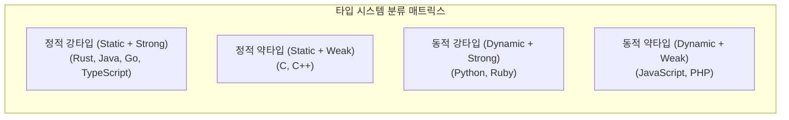

> [!abstract] 핵심 요약
> **데이터 타입(Data Type)**은 값들의 집합과 그 값들에 적용할 수 있는 연산들의 집합으로 정의된다. 
> **강타입 언어(Strongly Typed)**는 타입 오류를 항상 감지하여 메모리 오염을 방지하며, 타입 동치는 **이름 동치(Name Equivalence)**와 **구조 동치(Structural Equivalence)**로 나뉜다.

---

## 1. 타입 시스템 사분면 분류

