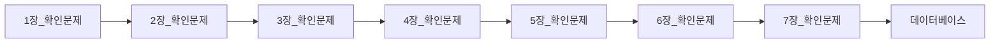

> [!abstract] 사용법
> 이 문서는 원본 PDF의 **순서 → 핵심 단서 → 학습 점검**을 한 번에 보는 지도입니다. 세부 개념은 같은 폴더의 주제 노트와 원본 PDF를 함께 대조하세요.

## 강의 흐름



<Tabs>
  <Tab label="파일 순서">파일명과 주차·장 제목을 강의 진행 신호로 삼아 처음부터 읽습니다.</Tab>
  <Tab label="읽기 전략">이론에서 실습·평가로 이동하며 같은 주제의 중복 PDF는 보조 자료로 비교합니다.</Tab>
  <Tab label="검증">텍스트가 빈약한 자료는 추출되지 않은 도식·수식을 임의로 채우지 않고 원본에서 확인합니다.</Tab>
</Tabs>

## 원본 PDF 목록

| 파일 | 쪽수 | 첫 페이지 단서 |
| :-- | --: | :-- |
| 1장_확인문제.pdf | — | Quiz #1 <!DOCTYPE html>의 의미는? 1장 확인문제 1 |
| 2장_확인문제.pdf | — | Quiz #1 spring은 java 기반 웹 애플리케이션을 만들 수 있는 framework입니다. 이번 학기 우리 가 배우는 ( )는 복잡한 설정 없이 spring 개발을 할 수 있도록 도와줍니다. 괄호 안 에 뭐가 들어갈까요? (1) php (2) js |
| 3장_확인문제.pdf | — | Quiz #1 클라이언트로부터 서버로 자료 전송 방식 2 가지는 ( )방식과 ( )방식입니다. 3장 확인문제 1 |
| 4장_확인문제.pdf | — | Quiz #1 웹에 접속한 사용자의 정보를 사용자 컴퓨터에 저장하면 이 장 소를 ( )라고 하며, 서버에 저장하면 이 장소를 ( ) 이라고 합니다. 4장 확인문제 1 |
| 5장_확인문제.pdf | — | Quiz #1 database는 어디에 속할까요? 1) software 2) hardware 3) programming language 4) 기타 5장 확인문제 1 |
| 6장_확인문제.pdf | — | Quiz #1 (다이어리) diary.html에서 틀린 부분 2가지를 찾아서 수정하세요. <!DOCTYPE html> <html><head><meta charset="UTF-8"> <title>다이어리 작성</title> <style> body{background-color:#FA |
| 7장_확인문제.pdf | — | Quiz #1 오류를 찾아서 수정하세요. <!DOCTYPE html> <html xmlns:th="http://www.thymeleaf.org"> <head><meta charset="UTF-8"><title>로그인</title> <script> body {color:#EFF2FB; } |
| 데이터베이스.pdf | — | 웹 프로그래밍 5장. 데이터베이스 세팅 동아대학교 컴퓨터•AI공학부 양 선 5장 데이터베이스 1 |
| 웹 시스템 제작.pdf | — | 웹 프로그래밍 7장. 웹 시스템 제작 (회원 관리 부분) 동아대학교 컴퓨터•AI공학부 양 선 데이터베이스 연결 후에는 이클립스 내부 브라우저 말고 크롬, 엣지 |
| 쿠키와 세션.pdf | — | 웹 프로그래밍 4장. 쿠키와 세션 동아대학교 컴퓨터공학과 양 선 4장 쿠키와 세션 1 |
| HTML 기초 실습 2.pdf | — | 웹 프로그래밍 6장 HTML 기초 실습 (2) 동아대학교 컴퓨터•AI공학부 양 선 6장 HTML (2) 1 |
| HTML 기초.pdf | — | 2024 Web Programming 동아대학교 컴퓨터•AI공학부 • 강의 :양선 • 연구실 : 공대1호관(S03) 302호 • 연락 : 연구실방문, LMS 메시지 1 |
| Spring Boot 개발 환경.pdf | — | 웹 프로그래밍 2장. Spring Boot 개발 환경 세팅 동아대학교 컴퓨터•AI공학부 양 선 웹프 2장 1 |
| Spring Boot 기초 실습.pdf | — | 텍스트 추출 빈약 — 원본 시각 자료 확인 필요 |

## 원본 단계 인터랙티브

```html preview
<div style="font-family:system-ui,sans-serif;padding:20px;color:var(--foreground)">
  <label for="flow536252" style="font-size:14px;font-weight:600">원본 자료 단계</label>
  <div id="flow536252-out" style="font-size:24px;font-weight:700;color:var(--chart-1);margin:6px 0">1장_확인문제</div>
  <input id="flow536252" type="range" min="1" max="14" step="1" value="1" style="width:100%;accent-color:var(--primary)" />
  <p style="font-size:13px;color:var(--muted-foreground)">슬라이더를 움직이면 파일명 순서대로 자료의 역할을 확인합니다.</p>
  <script>
    var flow536252 = document.getElementById('flow536252');
    var flow536252Out = document.getElementById('flow536252-out');
    var flow536252Steps = ["1장_확인문제","2장_확인문제","3장_확인문제","4장_확인문제","5장_확인문제","6장_확인문제","7장_확인문제","데이터베이스","웹 시스템 제작","쿠키와 세션","HTML 기초 실습 2","HTML 기초","Spring Boot 개발 환경","Spring Boot 기초 실습"];
    flow536252.addEventListener('input', function () {
      flow536252Out.textContent = flow536252Steps[Number(flow536252.value) - 1];
    });
  </script>
</div>
```

## 점검 포인트

- **범위:** 14개 PDF, 총 0쪽.
- **근거:** 첫 페이지 추출 단서를 표에 남겨 주제명과 흐름을 확인했습니다.
- **시각 자료:** 1개 파일은 첫 페이지 텍스트가 빈약하므로 필요한 경우 승인된 크롭 후보로만 별도 검토합니다.

> [!warning] 과해석 방지
> 이 지도에는 파일명·쪽수·추출된 첫 페이지 단서만 기록했습니다. PDF에 없는 구현 세부, 성능 수치, 권장 설정은 추가하지 않습니다.

<details>
<summary>다음 읽기</summary>

현재 단계의 파일을 선택한 뒤, 같은 폴더의 주제 노트에서 정의·절차·실습 결과를 대조하세요.

</details>
