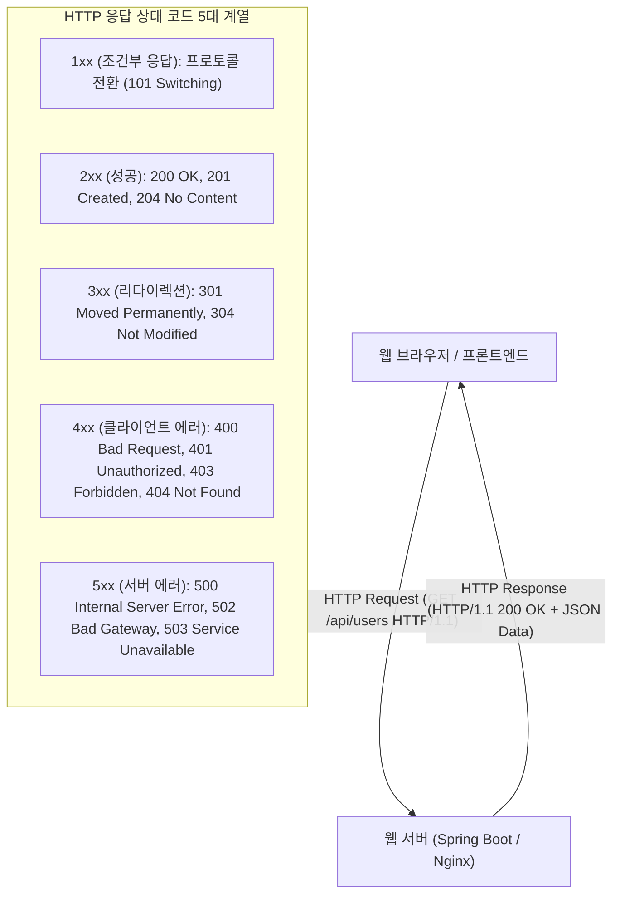

> [!abstract] 핵심 요약
> **HTTP(HyperText Transfer Protocol)**는 요청(Request)-응답(Response) 모델 기반의 무상태(Stateless) 애플리케이션 계층 프로토콜이다.
> 리소스 생성(`POST`), 조회(`GET`), 완전 치환(`PUT`), 부분 수정(`PATCH`), 삭제(`DELETE`) 등 HTTP 메서드의 **안전성(Safe)**과 **멱등성(Idempotent)**을 준수하는 것이 RESTful API 설계의 핵심이며, 3자리 **상태 코드**(200 OK, 201 Created, 400 Bad Request, 401 Unauthorized, 404 Not Found, 500 Internal Error)를 통해 처리 결과를 명확히 전달한다.

---

## 1. HTTP 요청/응답 메시지 구조 및 상태 코드 분류



---

## 2. HTTP 주요 메서드 안전성 및 멱등성 매트릭스

| HTTP 메서드 | 주요 용도 및 역할 | 안전성 (Safe) | 멱등성 (Idempotent) | 캐시 가능 여부 |
| :-- | :-- | :--: | :--: | :--: |
| **GET** | 리소스 단순 조회 | **✅ 안전 (상태 불변)** | **✅ 멱등 (동일 결과)** | ✅ 가능 |
| **POST** | 신규 리소스 생성, 주문 처리 | ❌ 상태 변경 | ❌ 비멱등 (연속 호출 시 중복 생성) | ⚠️ 제한적 |
| **PUT** | 리소스 전체 덮어쓰기/치환 | ❌ 상태 변경 | **✅ 멱등 (동일 결과 치환)** | ❌ 불가 |
| **PATCH** | 리소스 일부 필드만 수정 | ❌ 상태 변경 | ❌ 비멱등 (일반적) | ❌ 불가 |
| **DELETE** | 특정 리소스 영구 삭제 | ❌ 상태 변경 | **✅ 멱등 (재삭제 시 동일 부재)** | ❌ 불가 |

---

## 3. 실시간 HTTP 메서드 및 상태 코드 분석 시뮬레이터

```html preview
<div style="font-family:system-ui,-apple-system,sans-serif;padding:20px;background:var(--card);color:var(--card-foreground);border:1px solid var(--border);border-radius:var(--radius)">
  <div style="font-size:16px;font-weight:700;margin-bottom:14px;color:var(--primary);display:flex;align-items:center;gap:8px">
    <span>🌐 HTTP 메서드 특성 및 상태 코드(Status Code) 검증기</span>
  </div>

  <div style="display:grid;grid-template-columns:1fr 1fr;gap:12px;margin-bottom:14px">
    <div>
      <label style="font-size:11px;color:var(--muted-foreground)">HTTP 메서드 선택:</label>
      <select id="selHttpMethod" style="width:100%;padding:5px;background:var(--background);color:var(--foreground);border:1px solid var(--border);border-radius:var(--radius);font-weight:700">
        <option value="GET">GET (리소스 조회)</option>
        <option value="POST">POST (신규 생성)</option>
        <option value="PUT">PUT (전체 치환)</option>
        <option value="PATCH">PATCH (부분 수정)</option>
        <option value="DELETE">DELETE (삭제)</option>
      </select>
    </div>
    <div>
      <label style="font-size:11px;color:var(--muted-foreground)">표준 성공 응답 상태 코드:</label>
      <input id="httpStatusOut" type="text" value="200 OK (성공 조회)" readonly style="width:100%;padding:5px;background:var(--background);color:var(--primary);border:1px solid var(--border);border-radius:var(--radius);font-weight:700" />
    </div>
  </div>

  <div style="display:grid;grid-template-columns:1fr 1fr;gap:12px;margin-bottom:12px">
    <div style="padding:10px;background:var(--background);border:1px solid var(--border);border-radius:var(--radius);text-align:center">
      <div style="font-size:10px;color:var(--muted-foreground)">안전성 (Safe - 리소스 불변)</div>
      <div id="safeOut" style="font-weight:800;color:var(--primary);font-size:15px;margin-top:2px">안전함 ✅</div>
    </div>
    <div style="padding:10px;background:var(--background);border:1px solid var(--border);border-radius:var(--radius);text-align:center">
      <div style="font-size:10px;color:var(--muted-foreground)">멱등성 (Idempotent - N회 호출 동일)</div>
      <div id="idemOut" style="font-weight:800;color:var(--primary);font-size:15px;margin-top:2px">멱등성 보장 ✅</div>
    </div>
  </div>

  <script>
    document.getElementById('selHttpMethod').onchange = function() {
      var m = this.value;
      var st = document.getElementById('httpStatusOut');
      var sf = document.getElementById('safeOut');
      var id = document.getElementById('idemOut');

      if (m === 'GET') {
        st.value = "200 OK (성공 조회)";
        sf.innerHTML = "<span style='color:var(--primary)'>안전함 ✅</span>";
        id.innerHTML = "<span style='color:var(--primary)'>멱등성 보장 ✅</span>";
      } else if (m === 'POST') {
        st.value = "201 Created (신규 생성 완료)";
        sf.innerHTML = "<span style='color:var(--destructive,#ef4444)'>비안전 (수정됨) ❌</span>";
        id.innerHTML = "<span style='color:var(--destructive,#ef4444)'>비멱등 (중복 생성) ❌</span>";
      } else if (m === 'PUT') {
        st.value = "200 OK / 204 No Content";
        sf.innerHTML = "<span style='color:var(--destructive,#ef4444)'>비안전 ❌</span>";
        id.innerHTML = "<span style='color:var(--primary)'>멱등성 보장 ✅</span>";
      } else if (m === 'PATCH') {
        st.value = "200 OK";
        sf.innerHTML = "<span style='color:var(--destructive,#ef4444)'>비안전 ❌</span>";
        id.innerHTML = "<span style='color:var(--chart-1)'>일반적 비멱등 ⚠️</span>";
      } else {
        st.value = "204 No Content / 200 OK";
        sf.innerHTML = "<span style='color:var(--destructive,#ef4444)'>비안전 ❌</span>";
        id.innerHTML = "<span style='color:var(--primary)'>멱등성 보장 ✅</span>";
      }
    };
  </script>
</div>
```
