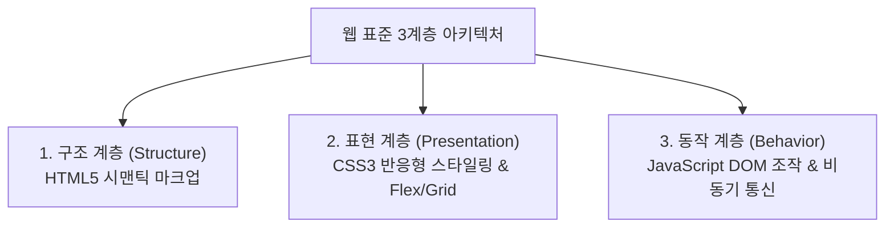

> [!abstract] 핵심 요약
> 웹 표준은 구조(**HTML5**), 표현(**CSS3**), 동작(**JavaScript**)의 3대 계층으로 분리된다. 
> 시맨틱 마크업(`<header>`, `<nav>`, `<main>`, `<article>`, `<section>`, `<footer>`)은 검색 엔진 최적화(SEO)와 스크린 리더 기반 웹 접근성을 비약적으로 향상시킨다.

