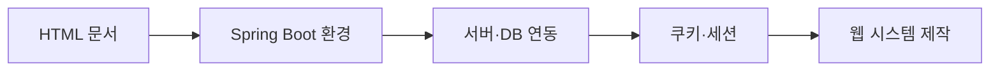

> [!abstract] 한 줄 요약
> HTML 문서를 만들고 서버 프레임워크·데이터베이스·상태 관리로 확장해 웹 시스템을 완성한다.

## 강의 흐름 지도



---
## 개념을 연결하는 순서

자료는 HTML 기초 실습에서 시작해 서버 애플리케이션의 실행 단계를 거쳐 상태와 데이터 저장을 다룬다.

- HTML 자료와 장별 확인 문제는 문서 구조·요소·입력의 기초를 점검한다.
- Spring Boot 개발 환경·기초 실습은 프로젝트를 실행하고 요청을 처리하는 최소 경로를 만든다.
- 데이터베이스 자료는 웹 요청에서 영속 데이터가 필요한 이유와 저장 경계를 구분한다.
- 쿠키와 세션 자료는 클라이언트에 남는 식별 단서와 서버가 유지하는 상태를 비교한다.
- 웹 시스템 제작 자료는 앞 단계의 문서·서버·상태를 하나의 기능 흐름으로 묶는다.

<Tabs>
  <Tab label="클라이언트">HTML 구조와 입력을 통해 브라우저 문서를 만든다.</Tab>
  <Tab label="서버">Spring Boot 프로젝트·요청 처리·데이터베이스 연결을 확인한다.</Tab>
  <Tab label="상태">쿠키·세션을 사용해 사용자 상태와 웹 시스템 기능을 연결한다.</Tab>
</Tabs>

---
## 원본에서 읽는 적용 장면

| 흐름 | 핵심 확인 | 오류가 생기는 지점 |
| :-- | :-- | :-- |
| 문서 | 태그·입력 요소 | 구조 누락 |
| 요청 | Spring Boot 컨트롤러·실행 환경 | 설정/라우팅 |
| 저장 | DB 연결과 데이터 수명 | 스키마·트랜잭션 |
| 상태 | 쿠키와 세션의 위치 | 만료·보안 |
| 통합 | 웹 시스템 제작 | 단계 간 계약 |

장별 확인 문제는 각 단계의 용어를 다시 묻는 평가 자료이므로, 구현 전에 해당 장의 질문을 먼저 풀고 요청·저장·상태의 경계를 표시한다.

```html preview
<div style="font-family:system-ui,sans-serif;padding:20px;color:var(--foreground)">
  <label for="flow104927" style="font-size:14px;font-weight:600">원본 강의 단계</label>
  <div id="flow104927-out" style="font-size:30px;font-weight:700;color:var(--chart-1);margin:6px 0">HTML 기초와 확인 문제</div>
  <input id="flow104927" type="range" min="1" max="3" step="1" value="1"
    style="width:100%;accent-color:var(--primary)" />
  <p style="font-size:13px;color:var(--muted-foreground)">슬라이더로 PDF에서 정리한 강의 단계를 순서대로 확인합니다.</p>
  <script>
    var flow104927 = document.getElementById('flow104927');
    var flow104927Out = document.getElementById('flow104927-out');
    var flow104927Steps = ["HTML 기초와 확인 문제","Spring Boot 실행·데이터베이스","쿠키·세션과 웹 시스템 제작"];
    flow104927.addEventListener('input', function () {
      flow104927Out.textContent = flow104927Steps[Number(flow104927.value) - 1] || '';
    });
  </script>
</div>
```

---
## 점검과 경계

<details>
<summary>스스로 점검하기</summary>

1. HTML 문서와 서버 응답의 책임을 구분한다.
2. 쿠키와 세션이 각각 어디에 상태를 보관하는지 설명한다.
3. 데이터베이스를 붙인 웹 기능에서 요청·저장·응답 순서를 적는다.

</details>

> [!caution] 환경 차이
> Spring Boot 실행 결과는 강의 자료의 개발 환경을 기준으로 한 절차다. 현재 시스템의 버전이나 포트가 자동으로 보장된다고 해석하지 않는다.

> [!warning] 출처 경계
> 이 노트는 현재 폴더의 `sources/*.pdf`에서 추출·대조한 강의 내용을 묶었습니다. 동일 장의 '2'·'update' 파일은 별도 새 이론으로 세지 않고 보충·개정 관계로 확인합니다. 원본 PDF 전체나 원본 슬라이드 이미지는 삽입하지 않습니다.
