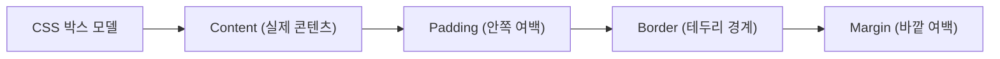

> [!abstract] 핵심 요약
> **CSS 박스 모델**은 Content, Padding, Border, Margin으로 구성되며 `box-sizing: border-box`로 크기 왜곡을 방지한다. 
> 1차원 축 정렬은 **Flexbox**, 2차원 행·열 배치는 **CSS Grid**를 적용하며, **미디어 쿼리**로 모바일·태블릿·데스크톱 반응형 뷰포트를 완성한다.

