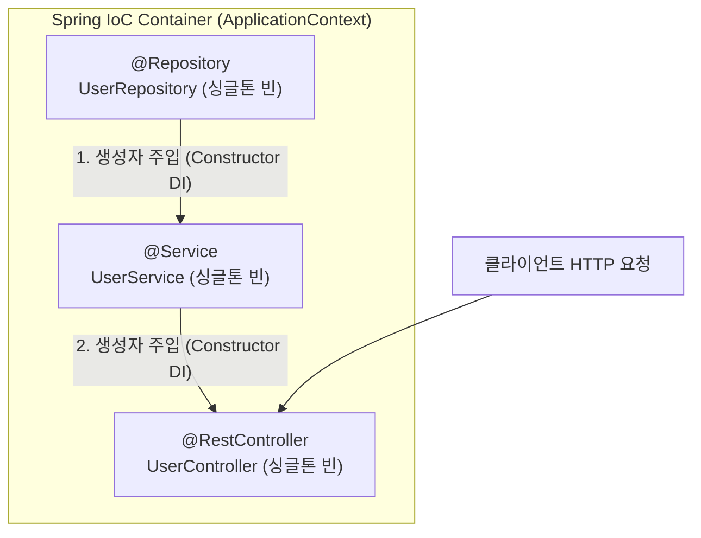

> [!abstract] 핵심 요약
> **Spring Boot**는 복잡한 XML 설정 없이 자동 구성(Auto-configuration)과 임베디드 톰캣(Tomcat)을 제공하여 빠른 웹 애플리케이션 개발을 가능하게 한다.
> 스프링의 핵심 철학은 객체의 생명주기를 개발자가 아닌 프레임워크가 주도하는 **IoC(제어의 역전)**이며, **생성자 기반 의존성 주입(DI)**을 통해 객체의 불변성(Immutability), 단위 테스트 용이성, 그리고 컴파일 시점의 순환 참조 방지를 보장한다.

---

## 1. Spring IoC 컨테이너와 의존성 주입(DI) 아키텍처



---

## 2. 3대 의존성 주입(DI) 방식 비교

| DI 주입 방식 | 코드 형태 | 불변성 보장 | 순환 참조 감지 시점 | 단위 테스트 편의성 | 권장 여부 |
| :-- | :-- | :--: | :-- | :--: | :-- |
| **생성자 주입 (Constructor)** | `public UserService(UserRepository repo)` | **✅ 필수 (`final` 필드 가능)** | **컴파일/구동 시 즉각 오류 감지** | **최고 (POJO 주입 가능)** | **강력 권장 (스프링 공식 표준) ⭐** |
| **수정자 주입 (Setter)** | `@Autowired public void setRepo(Repo r)` | ❌ 런타임 변경 위험 | 구동 완료 후 런타임 감지 | 양호 | 선택적 의존성 주입 시에만 사용 |
| **필드 주입 (Field)** | `@Autowired private Repo repo;` | ❌ 불변성 미보장 | 런타임 NullPointerException 위험 | 최악 (리플렉션 필수) | **안티패턴 (사용 지양 ❌)** |

---

## 3. 실시간 Spring DI 주입 방식별 안정성 평가기

```html preview
<div style="font-family:system-ui,-apple-system,sans-serif;padding:20px;background:var(--card);color:var(--card-foreground);border:1px solid var(--border);border-radius:var(--radius)">
  <div style="font-size:16px;font-weight:700;margin-bottom:14px;color:var(--primary);display:flex;align-items:center;gap:8px">
    <span>🌱 Spring Boot 의존성 주입(DI) 패턴 안정성 검증기</span>
  </div>

  <div style="margin-bottom:14px">
    <label style="font-size:11px;color:var(--muted-foreground)">적용할 의존성 주입(DI) 방식 선택:</label>
    <select id="selDiType" style="width:100%;padding:6px;background:var(--background);color:var(--foreground);border:1px solid var(--border);border-radius:var(--radius);font-weight:700">
      <option value="constructor">1. 생성자 주입 (Constructor Injection + final 키워드)</option>
      <option value="setter">2. 수정자 주입 (Setter Injection @Autowired)</option>
      <option value="field">3. 필드 주입 (@Autowired private Service service;)</option>
    </select>
  </div>

  <div style="padding:12px;background:var(--background);border:1px solid var(--border);border-radius:var(--radius)">
    <div style="font-size:11px;font-weight:700;color:var(--muted-foreground);margin-bottom:4px">아키텍처 품질 및 컴파일 안정성 분석</div>
    <div id="diResultOut" style="font-size:13px;line-height:1.6;color:var(--foreground)">
      <strong style="color:var(--primary)">최적 표준 (Best Practice):</strong> `final` 키워드로 불변 객체를 생성하며, 스프링 컨테이너 구동 시 순환 참조를 즉각 감지하고 Mock 주입이 매우 용이합니다.
    </div>
  </div>

  <script>
    document.getElementById('selDiType').onchange = function() {
      var val = this.value;
      var out = document.getElementById('diResultOut');
      if (val === 'constructor') {
        out.innerHTML = "<strong style='color:var(--primary)'>⭐ 스프링 공식 표준 (생성자 주입):</strong><br/>• `final` 키워드로 불변성 보장<br/>• 애플리케이션 기동 시 순환 참조(Circular Dependency) 즉각 차단<br/>• 단위 테스트 시 순수 POJO 객체 주입 가능";
      } else if (val === 'setter') {
        out.innerHTML = "<strong style='color:var(--chart-1)'>⚠️ 수정자 주입 (Setter Injection):</strong><br/>• 런타임에 의존성이 임의로 재할당될 수 있어 불변성 파괴 위험<br/>• 선택적이거나 변경 가능한 의존성에만 제한적 사용 권장";
      } else {
        out.innerHTML = "<strong style='color:var(--destructive,#ef4444)'>❌ 안티 패턴 (필드 주입):</strong><br/>• 외부에서 의존성 주입이 불가능하여 단위 테스트 작성이 매우 난해함<br/>• DI 프레임워크 없이는 인스턴스화 불가<br/>• 순환 참조 발생 시 런타임 에러 유발";
      }
    };
  </script>
</div>
```
