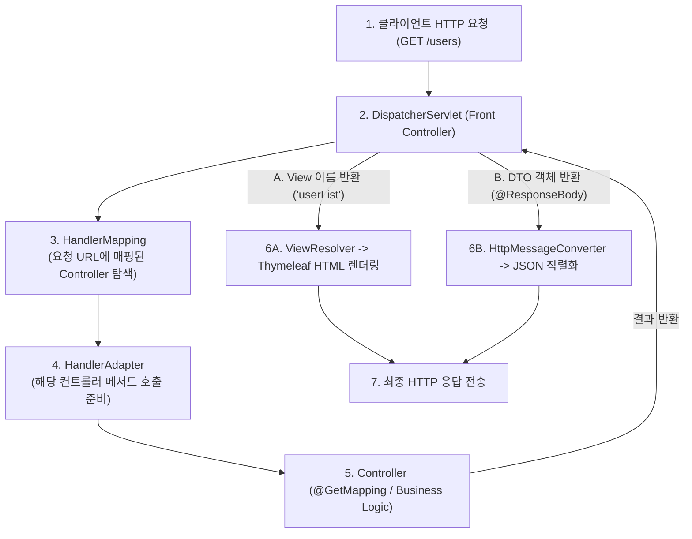

> [!abstract] 핵심 요약
> **Spring MVC**는 중앙 집중식 프론트 컨트롤러인 **DispatcherServlet**이 모든 HTTP 요청을 단일 인입점으로 받아 적절한 핸들러로 라우팅하는 구조를 가진다.
> 서버 사이드 HTML 렌더링(`@Controller` + `ViewResolver` + **Thymeleaf**)과 RESTful JSON API 제공(`@RestController` + **HttpMessageConverter**)을 명확히 분리하여 확장성과 유지보수성을 극대화한다.

---

## 1. Spring MVC DispatcherServlet 요청 처리 7단계 파이프라인



---

## 2. `@Controller` (SSR) vs `@RestController` (API) 비교

| 구분 | `@Controller` (서버 사이드 렌더링) | `@RestController` (RESTful API) |
| :-- | :-- | :-- |
| **반환 데이터 유형** | View 템플릿 논리 경로 (HTML 파일명) | DTO, 엔티티 등 순수 데이터 객체 |
| **응답 변환 엔진** | `ViewResolver` (Thymeleaf, JSP) | `HttpMessageConverter` (Jackson JSON) |
| **HTTP Body 어노테이션** | 별도 `@ResponseBody` 필요 | 클래스 레벨에 `@ResponseBody` 자동 포함 |
| **주요 활용 사례** | 전통적 웹 포털, 관리자 어드민 페이지 | SPA 프론트엔드(React, Vue), 모바일 앱 백엔드 |

---

## 3. 실시간 Spring MVC 요청 라우팅 및 렌더링 모드 시뮬레이터

```html preview
<div style="font-family:system-ui,-apple-system,sans-serif;padding:20px;background:var(--card);color:var(--card-foreground);border:1px solid var(--border);border-radius:var(--radius)">
  <div style="font-size:16px;font-weight:700;margin-bottom:14px;color:var(--primary);display:flex;align-items:center;gap:8px">
    <span>🔀 Spring MVC DispatcherServlet 요청 라우팅 시뮬레이터</span>
  </div>

  <div style="margin-bottom:14px">
    <label style="font-size:11px;color:var(--muted-foreground)">컨트롤러 어노테이션 및 반환 타입 선택:</label>
    <select id="selMvcType" style="width:100%;padding:6px;background:var(--background);color:var(--foreground);border:1px solid var(--border);border-radius:var(--radius);font-weight:700">
      <option value="rest">1. @RestController -> return new UserDto("Kim", 25)</option>
      <option value="ssr">2. @Controller -> return "user/profile" (Thymeleaf View)</option>
    </select>
  </div>

  <div style="display:grid;grid-template-columns:1fr 1fr;gap:12px;margin-bottom:12px">
    <div style="padding:10px;background:var(--background);border:1px solid var(--border);border-radius:var(--radius);text-align:center">
      <div style="font-size:10px;color:var(--muted-foreground)">동작하는 서브 컴포넌트</div>
      <div id="compNameOut" style="font-family:monospace;font-size:14px;font-weight:800;color:var(--primary);margin-top:2px">HttpMessageConverter</div>
    </div>
    <div style="padding:10px;background:var(--background);border:1px solid var(--border);border-radius:var(--radius);text-align:center">
      <div style="font-size:10px;color:var(--muted-foreground)">최종 클라이언트 응답 형식</div>
      <div id="respTypeOut" style="font-family:monospace;font-size:14px;font-weight:800;color:var(--chart-1);margin-top:2px">application/json</div>
    </div>
  </div>

  <script>
    document.getElementById('selMvcType').onchange = function() {
      var val = this.value;
      var c = document.getElementById('compNameOut');
      var r = document.getElementById('respTypeOut');

      if (val === 'rest') {
        c.textContent = "HttpMessageConverter (Jackson)";
        r.textContent = "application/json";
      } else {
        c.textContent = "ViewResolver (Thymeleaf)";
        r.textContent = "text/html (SSR 렌더링)";
      }
    };
  </script>
</div>
```
