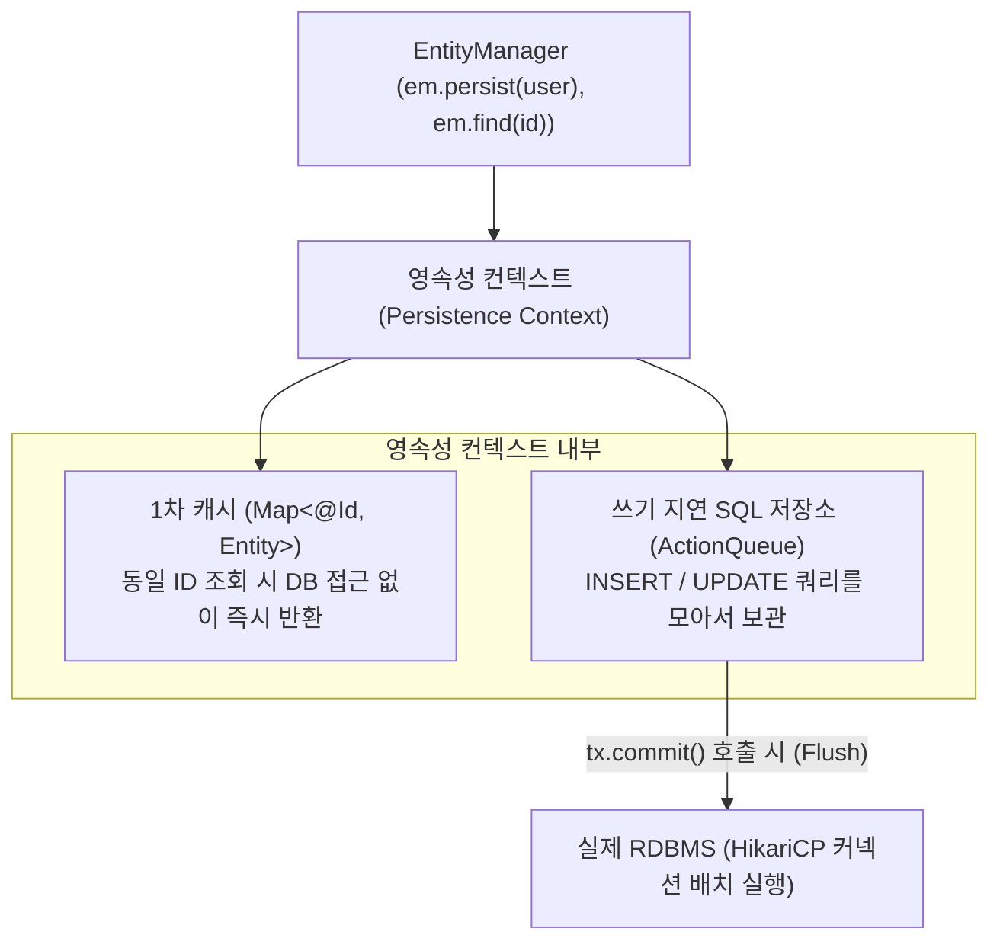

> [!abstract] 핵심 요약
> **JPA(Java Persistence API)**는 SQL 중심의 데이터베이스 접근 방식에서 벗어나 객체 지향 도메인 모델 중심으로 데이터를 영속화하는 자바 표준 ORM 스펙이다.
> JPA의 핵심 엔진인 **영속성 컨텍스트(Persistence Context)**는 엔티티를 영속 상태로 관리하며 **1차 캐시**(동일 트랜잭션 내 반복 조회 SQL 스킵), **쓰기 지연**(커밋 시점 배치 INSERT/UPDATE), **변경 감지(Dirty Checking)**를 통해 불필요한 DB I/O를 획기적으로 줄인다.

---

## 1. JPA 영속성 컨텍스트 1차 캐시 및 쓰기 지연 저장소



---

## 2. 즉시 로딩(Eager) vs 지연 로딩(Lazy) 및 N+1 문제 해결

| 로딩 전략 | 어노테이션 설정 | 동작 방식 | N+1 문제 위험도 및 해결책 |
| :-- | :-- | :-- | :-- |
| **지연 로딩 (Lazy Loading)** | `@ManyToOne(fetch = FetchType.LAZY)` | 실제 엔티티 사용 시점에 프록시 객체 초기화 SQL 실행 | **스프링 실무 표준 ⭐** (필요시 Fetch Join 또는 `@EntityGraph` 사용) |
| **즉시 로딩 (Eager Loading)** | `@ManyToOne(fetch = FetchType.EAGER)` | 엔티티 조회 시 연관된 테이블까지 무조건 즉시 JOIN 조회 | JPQL 조회 시 예상치 못한 $N+1$ 쿼리 폭발 위험 (사용 지양 ❌) |

---

## 3. 실시간 영속성 컨텍스트 1차 캐시 Hit vs DB I/O 시뮬레이터

```html preview
<div style="font-family:system-ui,-apple-system,sans-serif;padding:20px;background:var(--card);color:var(--card-foreground);border:1px solid var(--border);border-radius:var(--radius)">
  <div style="font-size:16px;font-weight:700;margin-bottom:14px;color:var(--primary);display:flex;align-items:center;gap:8px">
    <span>💾 JPA 영속성 컨텍스트 1차 캐시 조회 시뮬레이터</span>
  </div>

  <div style="display:flex;gap:8px;margin-bottom:14px">
    <button id="btnFindUser1" style="padding:6px 12px;background:var(--primary);color:#fff;border:none;border-radius:var(--radius);font-weight:700;cursor:pointer">em.find(User.class, 1L) 호출</button>
    <button id="btnFindUser2" style="padding:6px 12px;background:var(--chart-1);color:#fff;border:none;border-radius:var(--radius);font-weight:700;cursor:pointer">em.find(User.class, 2L) 호출</button>
    <button id="btnClearCache" style="padding:6px 12px;background:var(--secondary);color:var(--foreground);border:1px solid var(--border);border-radius:var(--radius);font-weight:700;cursor:pointer">em.clear() 캐시 비우기</button>
  </div>

  <div style="padding:10px;background:var(--background);border:1px solid var(--border);border-radius:var(--radius);margin-bottom:10px">
    <div style="font-size:11px;color:var(--muted-foreground)">현재 1차 캐시 보관 상태:</div>
    <div id="cacheStateOut" style="font-family:monospace;font-size:13px;font-weight:700;color:var(--primary);margin-top:2px">[Empty]</div>
  </div>

  <div id="jpaSqlLog" style="font-family:monospace;font-size:12px;font-weight:700;color:var(--foreground)">준비 완료</div>

  <script>
    var cache = {};
    var log = document.getElementById('jpaSqlLog');
    var cacheOut = document.getElementById('cacheStateOut');

    function updateCacheDisplay() {
      var keys = Object.keys(cache);
      if (keys.length === 0) {
        cacheOut.textContent = "[Empty]";
      } else {
        cacheOut.textContent = keys.map(k => "ID:" + k + " (" + cache[k] + ")").join(", ");
      }
    }

    document.getElementById('btnFindUser1').onclick = function() {
      if (cache[1]) {
        log.innerHTML = "<span style='color:var(--primary)'>⚡ [1차 캐시 HIT] DB 쿼리 없이 1차 캐시 인스턴스 즉각 반환 (SQL I/O 0회)</span>";
      } else {
        cache[1] = "User_Kim";
        log.innerHTML = "<span style='color:var(--destructive,#ef4444)'>🔍 [DB SELECT 실행] SELECT * FROM users WHERE id = 1; (결과를 1차 캐시에 저장)</span>";
      }
      updateCacheDisplay();
    };

    document.getElementById('btnFindUser2').onclick = function() {
      if (cache[2]) {
        log.innerHTML = "<span style='color:var(--primary)'>⚡ [1차 캐시 HIT] DB 쿼리 없이 1차 캐시 인스턴스 즉각 반환 (SQL I/O 0회)</span>";
      } else {
        cache[2] = "User_Lee";
        log.innerHTML = "<span style='color:var(--destructive,#ef4444)'>🔍 [DB SELECT 실행] SELECT * FROM users WHERE id = 2; (결과를 1차 캐시에 저장)</span>";
      }
      updateCacheDisplay();
    };

    document.getElementById('btnClearCache').onclick = function() {
      cache = {};
      log.textContent = "🧹 em.clear() 실행: 영속성 컨텍스트 1차 캐시가 모두 초기화되었습니다.";
      updateCacheDisplay();
    };
  </script>
</div>
```
