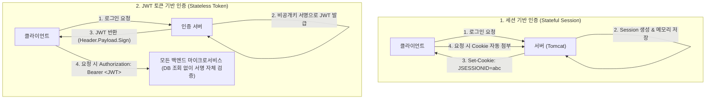

> [!abstract] 핵심 요약
> **인증 및 세션 관리**는 무상태 프로토콜인 HTTP 상에서 사용자의 식별과 권한을 안전하게 유지하는 보안의 핵심 축이다.
> 단일 모놀리식 서버에서는 `JSESSIONID`를 활용한 **서버 세션** 방식이 직관적이나, 대규모 분산 클라우드 환경에서는 서버의 상태 저장을 배제하고 서명 검증만으로 무상태 확장이 가능한 **JWT(JSON Web Token)** 및 **Redis 분산 세션 저장소** 아키텍처가 글로벌 표준으로 채택된다.

---

## 1. 세션 기반 인증 vs JWT 토큰 기반 인증 아키텍처



---

## 2. 세션(Session) vs JWT 토큰 장단점 비교

| 비교 항목 | 서버 세션 (Stateful) | JWT 토큰 (Stateless) |
| :-- | :-- | :-- |
| **상태 저장 위치** | 서버 메모리 (JVM Heap) / Redis 클러스터 | 클라이언트 저장소 (LocalStorage / HttpOnly Cookie) |
| **수평 확장성 (Scale-Out)** | 서버 증설 시 세션 동기화(Sticky Session/Redis) 필요 | **최고 (서버 간 세션 공유 불필요, 독립 검증)** |
| **보안 제어성** | 관리자가 특정 세션을 즉각 무효화(강제 로그아웃) 가능 | 토큰 만료 전까지 강제 회수 불가 (Blacklist 관리 필요) |
| **네트워크 페이로드** | 쿠키 내 32자 ID만 전송 (경량) | 사용자 Claims가 포함되어 HTTP 헤더 크기 증가 |

---

## 3. 실시간 세션 vs JWT 인증 메커니즘 시뮬레이터

```html preview
<div style="font-family:system-ui,-apple-system,sans-serif;padding:20px;background:var(--card);color:var(--card-foreground);border:1px solid var(--border);border-radius:var(--radius)">
  <div style="font-size:16px;font-weight:700;margin-bottom:14px;color:var(--primary);display:flex;align-items:center;gap:8px">
    <span>🔐 웹 사용자 인증 아키텍처(Session vs JWT) 선택기</span>
  </div>

  <div style="margin-bottom:14px">
    <label style="font-size:11px;color:var(--muted-foreground)">인증 아키텍처 패턴 선택:</label>
    <select id="selAuthArch" style="width:100%;padding:6px;background:var(--background);color:var(--foreground);border:1px solid var(--border);border-radius:var(--radius);font-weight:700">
      <option value="session">1. Stateful 세션 인증 (단일 모놀리스 웹 애플리케이션)</option>
      <option value="jwt">2. Stateless JWT 인증 (마이크로서비스 MSA & 모바일 앱)</option>
    </select>
  </div>

  <div style="padding:12px;background:var(--background);border:1px solid var(--border);border-radius:var(--radius)">
    <div style="font-size:11px;font-weight:700;color:var(--muted-foreground);margin-bottom:4px">인증 토큰/세션 처리 및 스케일아웃 특성</div>
    <div id="authDescOut" style="font-size:13px;line-height:1.6;color:var(--foreground)">
      <strong style="color:var(--primary)">세션 기반 인증:</strong> 서버 메모리에 세션 객체가 저장되므로 강제 로그아웃 등 통제가 완벽하지만, 서버 스케일아웃 시 Redis 세션 클러스터 구축이 필수적입니다.
    </div>
  </div>

  <script>
    document.getElementById('selAuthArch').onchange = function() {
      var val = this.value;
      var out = document.getElementById('authDescOut');
      if (val === 'session') {
        out.innerHTML = "<strong style='color:var(--primary)'>⚡ Stateful 세션 인증:</strong><br/>• 서버가 세션 상태를 직접 관리하여 보안 제어력 최고<br/>• 단점: 다중 서버 증설 시 Sticky Session 또는 Redis 세션 공유 저장소 필수";
      } else {
        out.innerHTML = "<strong style='color:var(--primary)'>⚡ Stateless JWT 토큰 인증:</strong><br/>• 서버 저장소가 불필요하여 수평 확장(Scale-out)에 최적화<br/>• 각 MSA 서비스가 비밀키 서명만으로 독립 검증<br/>• 주의: Refresh Token 로테이션 및 탈취 방지 전략 필수";
      }
    };
  </script>
</div>
```
