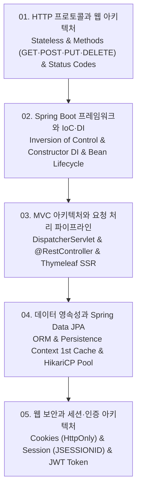

# 📚 웹 프로그래밍 및 Spring Boot 백엔드 아키텍처 (Web Programming & Spring Boot) 전체 강의 로드맵

HTTP 애플리케이션 프로토콜(Stateless, HTTP/1.1 vs HTTP/2 vs HTTP/3, 메서드 멱등성 및 상태 코드), 엔터프라이즈 자바 웹의 표준 Spring Boot 프레임워크와 IoC/DI(생성자 주입의 불변성 및 순환 참조 방지), Spring MVC의 프론트 컨트롤러 아키텍처(DispatcherServlet $\to$ HandlerMapping $\to$ Controller $\to$ ViewResolver/HttpMessageConverter), 객체-관계 매핑(ORM) 표준 JPA와 영속성 컨텍스트(1차 캐시, 쓰기 지연, 지연 로딩 Lazy Loading), 그리고 웹 상태 유지 보안 기법(HttpOnly/Secure 쿠키 vs JSESSIONID 세션 vs 분산 무상태 JWT 토큰 인증)까지 웹 풀스택 백엔드 엔지니어링을 체계적으로 다룹니다.

---

## 🗺️ 강의 목차 (Curriculum Overview)

---

## 📑 개별 정리 문서 목록

1. [01. HTTP 프로토콜과 웹 아키텍처 - 클라이언트-서버 모델, HTTP 메서드(GET·POST), 상태 코드와 헤더](file:///Users/um-yunsang/work/edu/ComputerScience/05_software-engineering/web-programming/notes/01.%20HTTP%20%ED%94%84%EB%A1%9C%ED%86%A0%EC%BD%9C%EA%B3%BC%20%EC%9B%B9%20%EC%95%84%ED%82%A4%ED%85%8D%EC%B2%98%20-%20%ED%81%B4%EB%9D%BC%EC%9D%B4%EC%96%B8%ED%8A%B8-%EC%84%9C%EB%B2%84%20%EB%AA%A8%EB%8D%B8,%20HTTP%20%EB%A9%94%EC%84%9C%EB%93%9C(GET%C2%B7POST),%20%EC%83%81%ED%83%9C%20%EC%BD%94%EB%93%9C%EC%99%80%20%ED%97%A4%EB%8D%94.md)
   - HTTP 5대 응답 코드 계열, 메서드 안전성 및 멱등성 매트릭스, 대화형 HTTP 메서드/상태코드 검증기
2. [02. Spring Boot 프레임워크와 IoC·DI - 제어의 역전(IoC), 의존성 주입(DI)과 스프링 빈 생명주기](file:///Users/um-yunsang/work/edu/ComputerScience/05_software-engineering/web-programming/notes/02.%20Spring%20Boot%20%ED%94%84%EB%A0%88%EC%9E%84%EC%9B%8C%ED%81%AC%EC%99%80%20IoC%C2%B7DI%20-%20%EC%A0%9C%EC%96%B4%EC%9D%98%20%EC%97%AD%EC%A0%84(IoC),%20%EC%9D%98%EC%A1%B4%EC%84%B1%20%EC%A3%BC%EC%9E%85(DI)%EA%B3%BC%20%EC%8A%A4%ED%94%84%EB%A7%81%20%EB%B9%88%20%EC%83%9D%EB%AA%85%EC%A3%BC%EA%B8%B0.md)
   - Spring IoC Container 구조, 3대 DI 주입 방식 비교 매트릭스, 대화형 DI 패턴 안정성 검증기
3. [03. MVC 아키텍처와 요청 처리 파이프라인 - DispatcherServlet, 컨트롤러 매핑과 Thymeleaf 템플릿](file:///Users/um-yunsang/work/edu/ComputerScience/05_software-engineering/web-programming/notes/03.%20MVC%20%EC%95%84%ED%82%A4%ED%85%8D%EC%B2%98%EC%99%80%20%EC%9A%94%EC%B2%AD%20%EC%B2%98%EB%A6%AC%20%ED%8C%8C%EC%9D%B4%ED%48%C2%B0%EB%9D%BC%EC%9D%B8%20-%20DispatcherServlet,%20%EC%BB%A8%ED%8A%B8%EB%A1%A4%EB%9F%AC%20%EB%A7%A4%ED%5C%ED%95%91%EA%B3%BC%20Thymeleaf%20%ED%85%9C%ED%94%8C%EB%A6%BF.md)
   - DispatcherServlet 7단계 처리 흐름, `@Controller` vs `@RestController` 비교, 대화형 요청 라우팅 시뮬레이터
4. [04. 데이터 영속성과 Spring Data JPA - ORM 원리, 엔티티 매핑(@Entity), 커넥션 풀(HikariCP)](file:///Users/um-yunsang/work/edu/ComputerScience/05_software-engineering/web-programming/notes/04.%20%EB%8D%B0%EC%9D%B4%ED%84%B0%20%EC%98%81%EC%86%8D%EC%84%B1%EA%B3%BC%20Spring%20Data%20JPA%20-%20ORM%20%EC%9B%90%EB%A6%AC,%20%EC%97%94%ED%8B%B0%ED%8B%B0%20%EB%A7%A4%ED%5C%ED%95%91(@Entity),%20%EC%BB%A4%EB%84%A5%EC%85%98%20%ED%92%80(HikariCP).md)
   - 영속성 컨텍스트 1차 캐시 및 쓰기 지연 저장소, 지연 로딩(Lazy) vs 즉시 로딩(Eager), 대화형 JPA 1차 캐시 시뮬레이터
5. [05. 웹 보안과 세션·인증 아키텍처 - 쿠키(HttpOnly·Secure) vs 세션(JSESSIONID), JWT와 토큰 기반 인증](file:///Users/um-yunsang/work/edu/ComputerScience/05_software-engineering/web-programming/notes/05.%20%EC%9B%B9%20%EB%B3%B4%EC%95%88%EA%B3%BC%20%EC%84%B8%EC%85%98%C2%B7%EC%9D%B8%EC%A6%9D%20%EC%95%84%ED%82%A4%ED%85%8D%EC%B2%98%20-%20%EC%BF%A0%ED%82%A4(HttpOnly%C2%B7Secure)%20vs%20%EC%84%B8%EC%85%98(JSESSIONID),%20JWT%EC%99%80%20%ED%86%A0%ED%81%B0%20%EA%B8%B0%EB%B0%98%20%EC%9D%B8%EC%A6%9D.md)
   - 세션 vs JWT 토큰 장단점 비교 매트릭스, Redis 세션 클러스터링, 대화형 웹 인증 아키텍처 선택기
