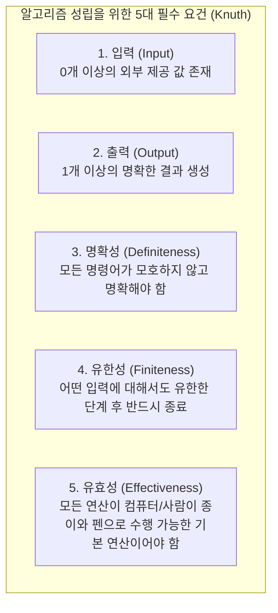
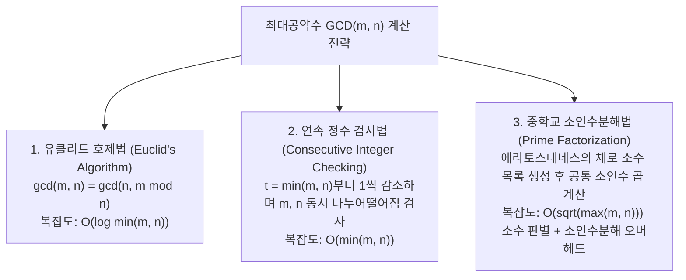
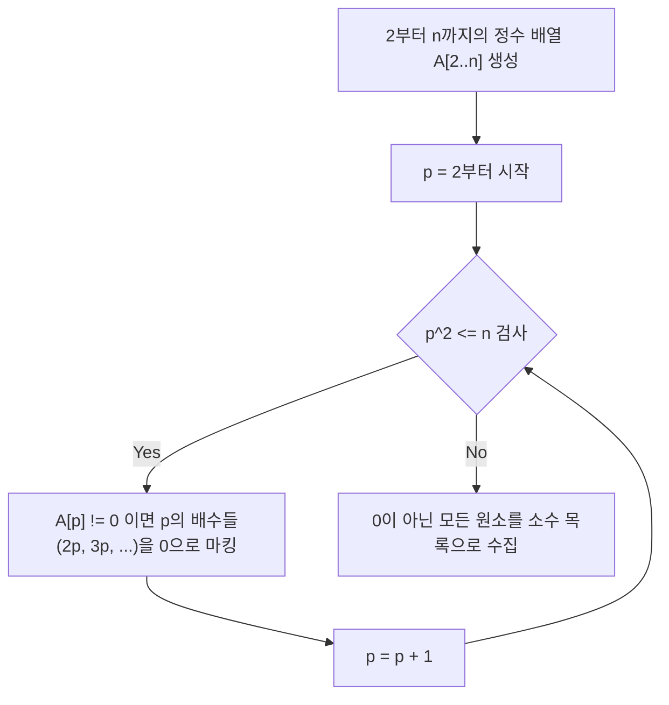
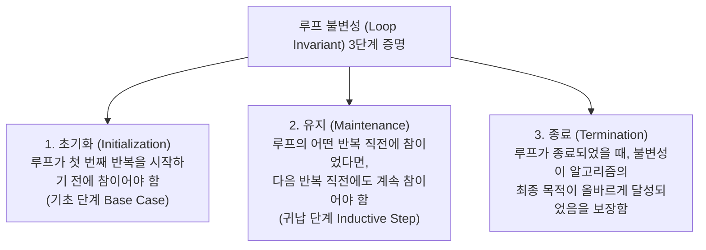

> [!abstract] 핵심 요약
> 알고리즘은 **명확하게 정의된 유한한 단계의 계산 절차**로서, 주어진 입력을 원하는 출력으로 변환하는 문제 해결의 청사진이다.
> 본 강의에서는 최대공약수(GCD)를 구하는 3가지 상이한 접근법(유클리드 호제법, 연속 정수 검사, 소인수분해)의 복잡도 격차를 분석하고, **루프 불변성(Loop Invariant)**을 통한 수학적 정확성 증명 기법과 피보나치 수열의 $O(\log n)$ 행렬 거듭제곱 해법을 체득한다.

---

## 1. 알고리즘의 본질과 5대 필수 조건

알고리즘(Algorithm)은 9세기 페르시아의 수학자 알 콰리즈미(al-Khowarizmi)의 이름에서 유래하였으며, 컴퓨터가 특정 작업을 수행할 수 있도록 명확하게 서술된 일련의 명령어 집합이다.



---

## 2. 문제 해결 6단계 라이프사이클

알고리즘을 설계하고 실제 상용 시스템에 배포하기까지 거치는 표준 공학 절차:


---

## 3. 최대공약수(GCD) 문제로 보는 3대 알고리즘 패러다임 비교

두 양의 정수 $m, n$의 최대공약수 $\gcd(m, n)$을 계산하는 세 가지 설계 전략의 구조와 실행 복잡도를 심층 비교한다.



### 3.1. 유클리드 호제법 (Euclid's Algorithm)

#### 수학적 정리 및 증명
두 정수 $m, n$ ($m \ge n$)에 대해 $m = q \cdot n + r$ ($0 \le r < n$)일 때, $\gcd(m, n) = \gcd(n, r)$이 성립한다.

- **증명**:
  1. $d$가 $m$과 $n$의 공약수라면, $m = k_1 d$, $n = k_2 d$이다.
  2. $r = m - q \cdot n = k_1 d - q \cdot k_2 d = d(k_1 - q \cdot k_2)$이므로, $d$는 $r$의 약수이다. 즉 $d$는 $n$과 $r$의 공약수이다.
  3. 역으로 $c$가 $n$과 $r$의 공약수라면 $m = q \cdot n + r$ 역시 $c$의 배수가 되므로 $c$는 $m$과 $n$의 공약수이다.
  4. 따라서 $m, n$의 공약수 집합과 $n, r$의 공약수 집합은 완전히 일치하며, 최대공약수 역시 동일하다: $\gcd(m, n) = \gcd(n, m \bmod n)$.

```python
def gcd_euclid(m: int, n: int) -> int:
    while n != 0:
        r = m % n
        m = n
        n = r
    return m
```

- **라메의 정리 (Lamé's Theorem)**:
  유클리드 알고리즘에서 $m > n$일 때 필요한 나눗셈 연산 횟수는 $n$의 십진 자릿수 $D$의 5배를 넘지 않는다 ($T(n) \le 5 \log_{10} n$).
  따라서 시간 복잡도는 **$O(\log \min(m, n))$**이다.

---

### 3.2. 연속 정수 검사법 (Consecutive Integer Checking)

1. $t \leftarrow \min(m, n)$으로 초기화한다.
2. $m \bmod t == 0$인지 검사한다. 참이면 3단계로, 거짓이면 4단계로 간다.
3. $n \bmod t == 0$인지 검사한다. 참이면 $t$를 반환하고 종료한다.
4. $t \leftarrow t - 1$ 감소 후 2단계로 분기한다.

```python
def gcd_consecutive(m: int, n: int) -> int:
    t = min(m, n)
    while t > 0:
        if m % t == 0 and n % t == 0:
            return t
        t -= 1
    return 1
```

- **복잡도**: 최악의 경우(서로소, 예: $m=1000, n=997$) $t$가 $1$까지 감소하므로 **$\Theta(\min(m, n))$**의 단계가 소요되어 매우 비효율적이다.

---

### 3.3. 중학교 소인수분해법과 에라토스테네스의 체 (Sieve of Eratosthenes)

주어진 정수 $n$ 이하의 모든 소수를 구하기 위해 합성수를 체로 걸러내는 고대 알고리즘이다.



```python
def sieve_of_eratosthenes(n: int) -> list[int]:
    primes = [True] * (n + 1)
    primes[0] = primes[1] = False
    p = 2
    while p * p <= n:
        if primes[p]:
            for i in range(p * p, n + 1, p):
                primes[i] = False
        p += 1
    return [i for i, is_p in enumerate(primes) if is_p]
```

- **시간 복잡도**: $\sum_{p \le n} \frac{n}{p} = n \left( \sum_{p \le n} \frac{1}{p} \right) = \mathbf{\Theta(n \log \log n)}$

---

## 4. 피보나치 수열의 4대 계산 복잡도 패러다임

피보나치 수열 정의: $F_0 = 0, \; F_1 = 1, \; F_n = F_{n-1} + F_{n-2} \; (n \ge 2)$

| 구현 기법 | 시간 복잡도 | 공간 복잡도 | 알고리즘 패러다임 | 특징 및 한계 |
| :-- | :--: | :--: | :-- | :-- |
| **1. 단순 재귀 (Naive Recursion)** | **$O(2^n)$** ($\approx 1.618^n$) | $O(n)$ (스택) | 억지 기법 (Brute Force) | 하위 트리의 극심한 중복 계산으로 $n > 40$ 시 다운 |
| **2. 메모이제이션 (Memoization)** | **$O(n)$** | $O(n)$ | 하향식 동적 계획법 (Top-down DP) | 캐시 배열에 기록하여 중복 호출 완전 소거 |
| **3. 반복문 변수 슬라이딩 (Iterative)** | **$O(n)$** | **$O(1)$** | 상향식 동적 계획법 (Bottom-up DP) | 두 개의 변수($a, b$)만 유지하여 메모리 최적화 |
| **4. $Q$-행렬 거듭제곱 (Matrix Exponentiation)** | **$\mathbf{O(\log n)}$** | $O(1)$ | 분할 정복 (Divide and Conquer) | $2 \times 2$ 행렬의 $n$승을 이진 거듭제곱으로 계산 |

### 4.1. $O(\log n)$ 행렬 거듭제곱 수학적 유도
$$\begin{pmatrix} F_{n+1} & F_n \\ F_n & F_{n-1} \end{pmatrix} = \begin{pmatrix} 1 & 1 \\ 1 & 0 \end{pmatrix}^n$$

- $M^n$을 분할 정복으로 계산:
  $$M^n = \begin{cases} (M^{n/2})^2, & \text{if } n \text{ is even} \\ M \times (M^{(n-1)/2})^2, & \text{if } n \text{ is odd} \end{cases}$$
- 행렬 곱셈 횟수가 $\lfloor \log_2 n \rfloor$번으로 단축되어 $n=1,000,000$도 단 수십 회의 곱셈으로 즉각 계산 가능하다.

---

## 5. 알고리즘의 정확성 증명과 루프 불변성 (Loop Invariant)

루프(반복문)를 포함하는 알고리즘이 올바르게 동작함을 수학적 귀납법(Mathematical Induction)의 원리로 증명하는 표준 도구이다.



---

## 6. 실시간 유클리드 vs 연속 정수 검사 단계별 시뮬레이터

```html preview
<div style="font-family:system-ui,-apple-system,sans-serif;padding:20px;background:var(--card);color:var(--card-foreground);border:1px solid var(--border);border-radius:var(--radius)">
  <div style="font-size:16px;font-weight:700;margin-bottom:12px;color:var(--primary)">
    ⚡ 최대공약수(GCD) 알고리즘별 실행 연산 단계(Step) 비교기
  </div>

  <div style="display:grid;grid-template-columns:1fr 1fr;gap:10px;margin-bottom:14px">
    <div>
      <label style="font-size:11px;color:var(--muted-foreground)">정수 m 입력:</label>
      <input id="inGcdM" type="number" value="31415" style="width:100%;padding:6px;background:var(--background);color:var(--foreground);border:1px solid var(--border);border-radius:var(--radius);font-weight:700" />
    </div>
    <div>
      <label style="font-size:11px;color:var(--muted-foreground)">정수 n 입력:</label>
      <input id="inGcdN" type="number" value="14142" style="width:100%;padding:6px;background:var(--background);color:var(--foreground);border:1px solid var(--border);border-radius:var(--radius);font-weight:700" />
    </div>
  </div>

  <div style="display:grid;grid-template-columns:1fr 1fr;gap:10px;margin-bottom:12px">
    <div style="padding:12px;background:var(--background);border:1px solid var(--border);border-radius:var(--radius)">
      <div style="font-size:11px;color:var(--muted-foreground);font-weight:700">유클리드 호제법 (O(log n))</div>
      <div id="outEucSteps" style="font-family:monospace;font-size:18px;font-weight:800;color:var(--primary);margin:4px 0">9 단계</div>
      <div id="outEucLog" style="font-size:11px;color:var(--muted-foreground);line-height:1.4"></div>
    </div>
    <div style="padding:12px;background:var(--background);border:1px solid var(--border);border-radius:var(--radius)">
      <div style="font-size:11px;color:var(--muted-foreground);font-weight:700">연속 정수 검사법 (O(n))</div>
      <div id="outConSteps" style="font-family:monospace;font-size:18px;font-weight:800;color:var(--destructive,#ef4444);margin:4px 0">14,141 단계</div>
      <div style="font-size:11px;color:var(--muted-foreground)">t = 14142부터 1까지 매 정수마다 2회 나눗셈 검사 수행</div>
    </div>
  </div>

  <div style="padding:10px;background:var(--card);border:1px dashed var(--border);border-radius:var(--radius);text-align:center">
    <span style="font-size:12px;color:var(--muted-foreground)">최종 계산된 최대공약수 GCD(m, n) = </span>
    <strong id="outGcdVal" style="font-size:16px;color:var(--primary);font-family:monospace">1 (서로소)</strong>
  </div>

  <script>
    function runGcdCompare() {
      var m = parseInt(document.getElementById('inGcdM').value) || 1;
      var n = parseInt(document.getElementById('inGcdN').value) || 1;
      if (m < n) { var tmp = m; m = n; n = tmp; }

      var a = m, b = n;
      var eucSteps = 0;
      var trace = [];
      while (b !== 0) {
        var r = a % b;
        trace.push("gcd(" + a + ", " + b + ") → r=" + r);
        a = b;
        b = r;
        eucSteps++;
      }
      var gcd = a;

      document.getElementById('outEucSteps').textContent = eucSteps + " 단계 실행 완료";
      document.getElementById('outEucLog').innerHTML = trace.slice(0, 4).join("<br/>") + (trace.length > 4 ? "<br/>...외 " + (trace.length - 4) + "단계" : "");

      var conSteps = n - gcd + 1;
      document.getElementById('outConSteps').textContent = conSteps.toLocaleString() + " 회 루프 검사";
      document.getElementById('outGcdVal').textContent = gcd + (gcd === 1 ? " (서로소, Coprime)" : "");
    }

    document.getElementById('inGcdM').addEventListener('input', runGcdCompare);
    document.getElementById('inGcdN').addEventListener('input', runGcdCompare);
    runGcdCompare();
  </script>
</div>
