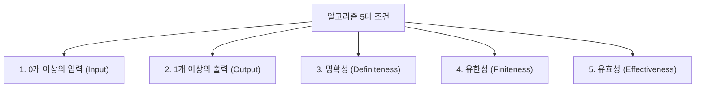
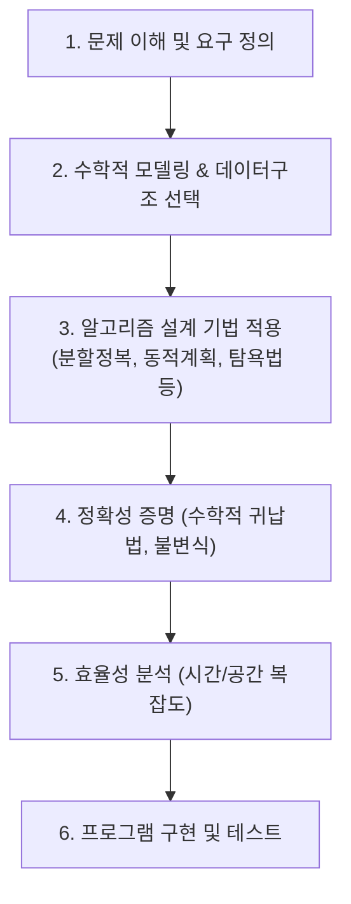

> [!abstract] 핵심 요약
> **알고리즘(Algorithm)**이란 주어진 문제를 해결하기 위해 명확하게 정의된 유한한 단계의 계산 절차이다. 
> 알고리즘은 **입력, 출력, 명확성, 유한성, 유효성**의 5대 조건을 반드시 만족해야 하며, 단순 코딩 이전에 수학적 모델링과 효율성 분석이 선행되어야 한다.

---

## 1. 알고리즘의 정의와 5대 필수 조건



---

## 2. 알고리즘 설계 및 분석 수명주기



---

## 3. 실시간 유클리드 호제법(Euclid's GCD) 시뮬레이터

두 양의 정수 $a, b$ ($a \ge b$)에 대해, $\gcd(a, b) = \gcd(b, a \bmod b)$의 원리를 재귀적으로 적용하여 최대공약수를 구한다.

```html preview
<div style="font-family:system-ui,-apple-system,sans-serif;padding:20px;background:var(--card);color:var(--card-foreground);border:1px solid var(--border);border-radius:var(--radius)">
  <div style="font-size:16px;font-weight:700;margin-bottom:14px;color:var(--primary);display:flex;align-items:center;gap:8px">
    <span>📐 유클리드 호제법 (Euclid GCD) 단계별 시뮬레이터</span>
  </div>

  <div style="display:grid;grid-template-columns:1fr 1fr;gap:12px;margin-bottom:16px">
    <div>
      <label style="font-size:12px;font-weight:600;color:var(--muted-foreground);display:block;margin-bottom:4px">정수 A</label>
      <input id="numA" type="number" value="1071" style="width:100%;padding:8px;background:var(--background);color:var(--foreground);border:1px solid var(--border);border-radius:var(--radius);font-size:13px" />
    </div>
    <div>
      <label style="font-size:12px;font-weight:600;color:var(--muted-foreground);display:block;margin-bottom:4px">정수 B</label>
      <input id="numB" type="number" value="462" style="width:100%;padding:8px;background:var(--background);color:var(--foreground);border:1px solid var(--border);border-radius:var(--radius);font-size:13px" />
    </div>
  </div>

  <div style="padding:12px;background:var(--background);border:1px solid var(--border);border-radius:var(--radius);margin-bottom:12px">
    <div style="font-size:12px;font-weight:700;color:var(--chart-1);margin-bottom:6px">단계별 나머지 계산 과정:</div>
    <div id="stepLog" style="font-family:monospace;font-size:12px;line-height:1.6;color:var(--foreground);white-space:pre-wrap"></div>
  </div>

  <div style="padding:10px;background:var(--background);border:1px solid var(--primary);border-radius:var(--radius);text-align:center">
    <span style="font-size:13px;color:var(--muted-foreground)">최대공약수 (GCD): </span>
    <span id="gcdResult" style="font-size:18px;font-weight:800;color:var(--primary)">21</span>
  </div>

  <script>
    var inputA = document.getElementById('numA');
    var inputB = document.getElementById('numB');
    var stepLog = document.getElementById('stepLog');
    var gcdRes = document.getElementById('gcdResult');

    function runGCD() {
      var a = parseInt(inputA.value) || 1;
      var b = parseInt(inputB.value) || 1;
      var steps = [];
      var step = 1;
      
      while (b !== 0) {
        var r = a % b;
        var q = Math.floor(a / b);
        steps.push("Step " + step + ": " + a + " = " + b + " × " + q + " + " + r + " (나머지 " + r + ")");
        a = b;
        b = r;
        step++;
      }
      stepLog.textContent = steps.join("\n");
      gcdRes.textContent = a;
    }

    inputA.addEventListener('input', runGCD);
    inputB.addEventListener('input', runGCD);
    runGCD();
  </script>
</div>
```

---

## 4. 파이썬 구현 및 재귀 vs 반복 구조

```python
def gcd_recursive(a: int, b: int) -> int:
    """유클리드 호제법 (재귀 구현)"""
    if b == 0:
        return a
    return gcd_recursive(b, a % b)

def gcd_iterative(a: int, b: int) -> int:
    """유클리드 호제법 (반복 구현)"""
    while b != 0:
        a, b = b, a % b
    return a
```
