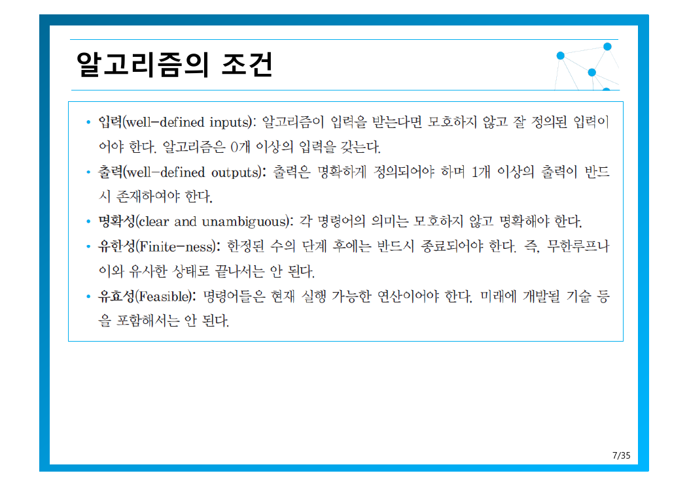
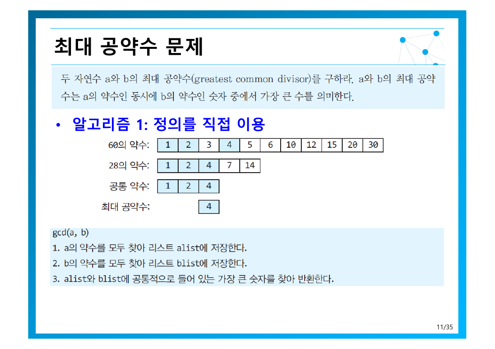
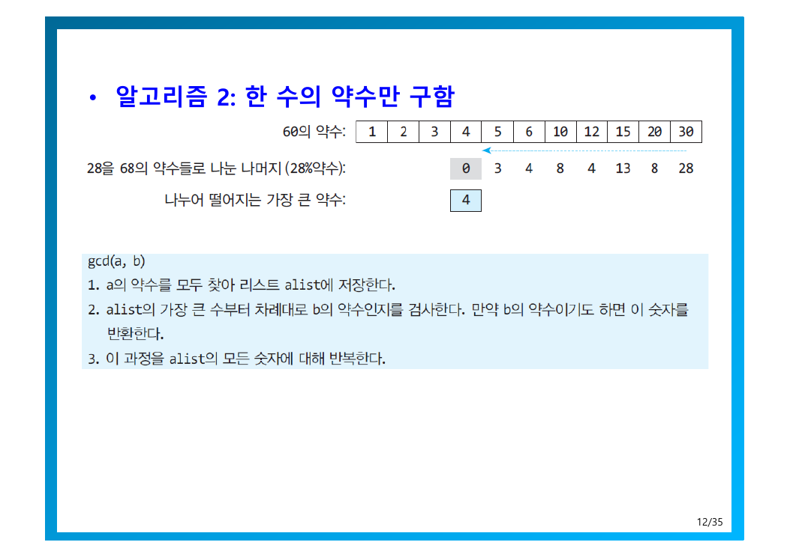
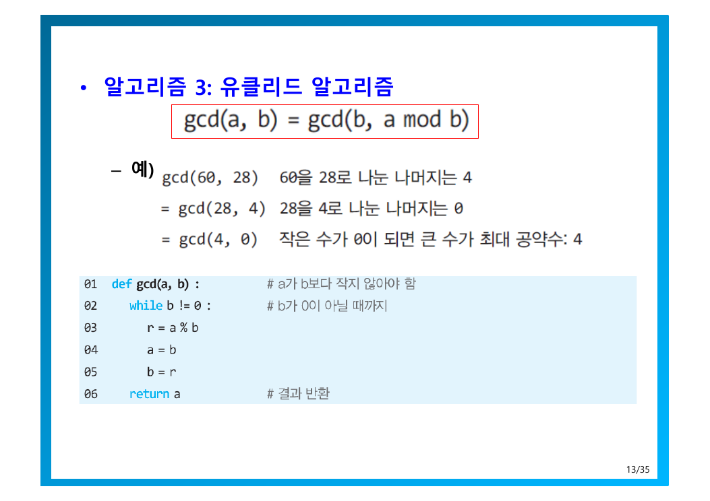
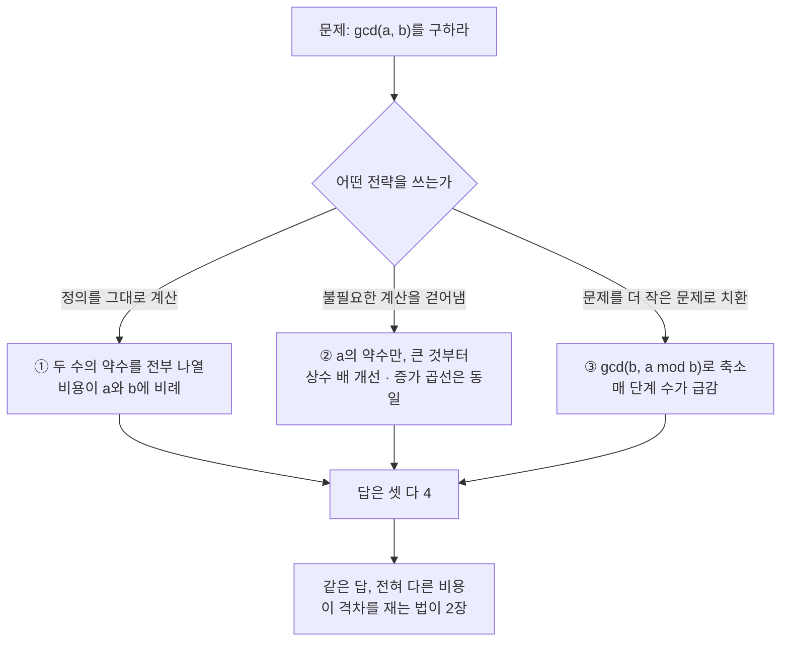
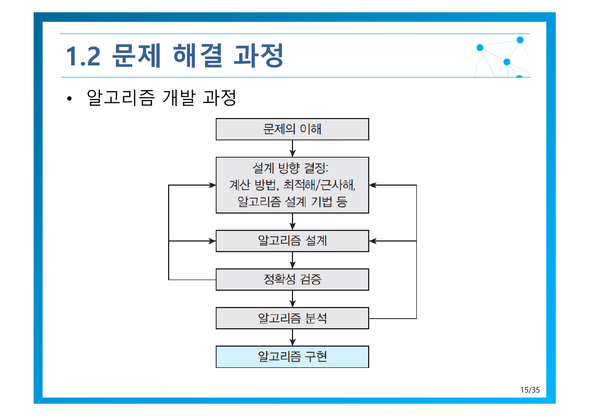
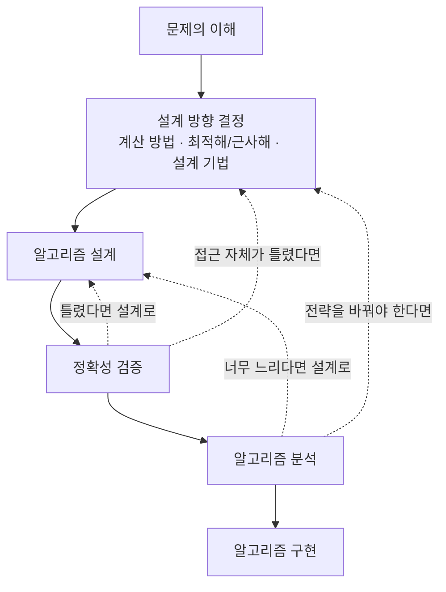
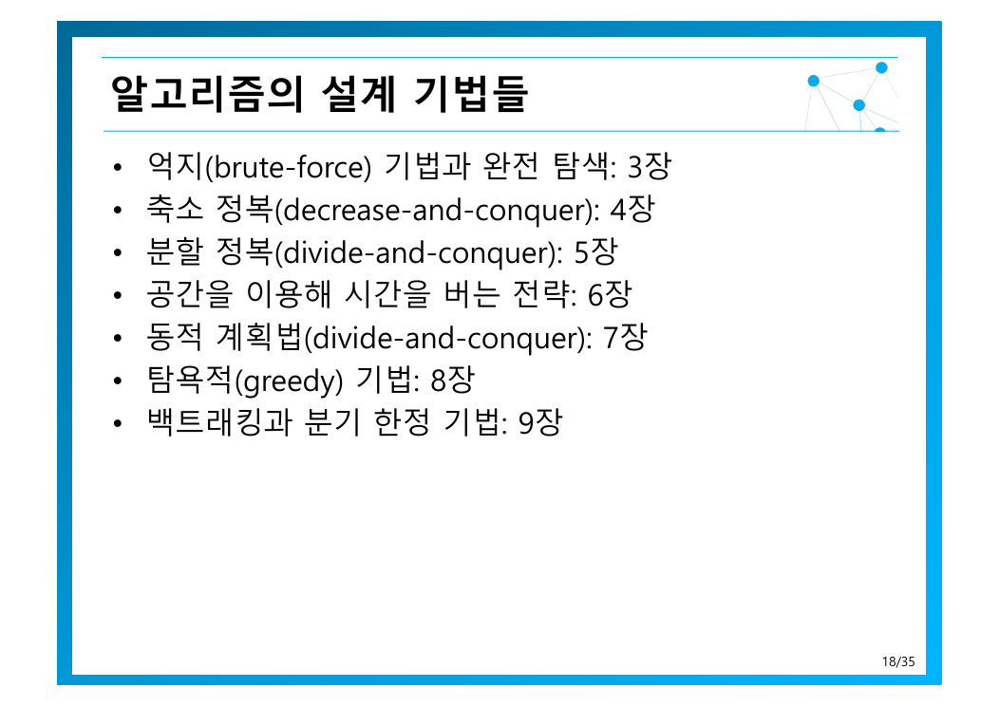
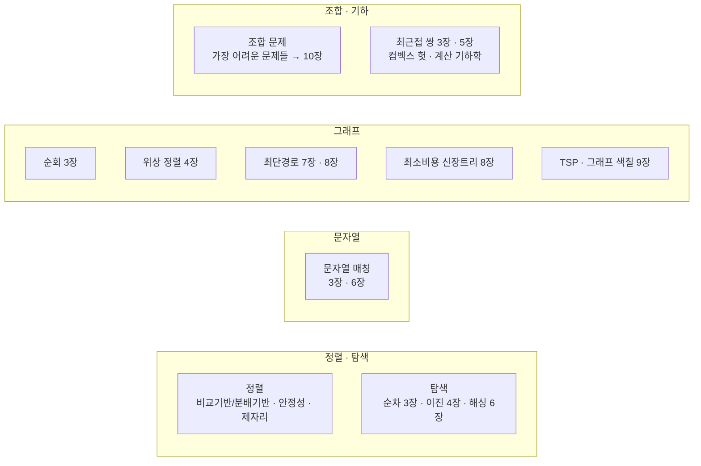

> [!abstract] 이 장이 실제로 하는 말
> 이 장의 절반은 정의와 용어지만, 진짜 메시지는 **11~13쪽 세 장**에 있다. 최대공약수라는 한 문제를 놓고 세 가지 알고리즘을 나란히 세워 보인 뒤, 원본은 14쪽에서 이렇게 못 박는다 — *동일한 문제에 대해 매우 다른 전략을 기반으로 알고리즘을 작성할 수 있고, 이들은 **매우 다른 속도**로 문제를 해결할 수 있다.*
> 이 한 문장이 남은 9개 장 전체의 존재 이유다. 그래서 이 정리도 정의부터 시작하지 않고, **세 알고리즘을 직접 돌려보는 것**부터 시작한다.

---

## 먼저, 직접 돌려보자 — gcd(60, 28)

두 자연수 $a$와 $b$의 최대공약수는 *$a$의 약수인 동시에 $b$의 약수인 숫자 중에서 가장 큰 수*다 (원본 11쪽). 답은 어느 방법으로 구하든 **4**로 같다. 다른 것은 **거기까지 가는 데 드는 연산 횟수**뿐이다.

아래에서 두 수를 바꿔가며, 세 알고리즘이 각각 몇 번의 나눗셈과 비교를 하는지 직접 확인해 보라.

```html preview h=580px
<div style="font-family:system-ui,-apple-system,sans-serif;padding:20px;color:var(--foreground)">
  <div style="display:flex;gap:16px;flex-wrap:wrap;align-items:flex-end;margin-bottom:18px">
    <div>
      <label for="na" style="font-size:12px;color:var(--muted-foreground);display:block;margin-bottom:4px">a (큰 수)</label>
      <input id="na" type="number" value="60" min="1" max="200000"
        style="width:120px;padding:8px;font-size:15px;border:1px solid var(--border);border-radius:var(--radius);background:var(--card);color:var(--foreground)" />
    </div>
    <div>
      <label for="nb" style="font-size:12px;color:var(--muted-foreground);display:block;margin-bottom:4px">b (작은 수)</label>
      <input id="nb" type="number" value="28" min="1" max="200000"
        style="width:120px;padding:8px;font-size:15px;border:1px solid var(--border);border-radius:var(--radius);background:var(--card);color:var(--foreground)" />
    </div>
    <div style="display:flex;gap:6px;flex-wrap:wrap">
      <button class="preset" data-a="60" data-b="28">60, 28</button>
      <button class="preset" data-a="1071" data-b="462">1071, 462</button>
      <button class="preset" data-a="46368" data-b="28657">피보나치 최악</button>
      <button class="preset" data-a="99991" data-b="99989">서로소 큰 수</button>
    </div>
  </div>

  <div id="gcdout" style="font-size:14px;margin-bottom:14px;padding:11px 13px;background:var(--card);border:1px solid var(--border);border-radius:var(--radius);line-height:1.6"></div>
  <div id="bars"></div>
  <div id="trace" style="margin-top:14px;font-size:13px;color:var(--muted-foreground);line-height:1.7"></div>

  <style>
    .preset{padding:7px 11px;font-size:12px;cursor:pointer;background:var(--card);
      color:var(--foreground);border:1px solid var(--border);border-radius:var(--radius)}
    .preset:hover{border-color:var(--primary);color:var(--primary)}
  </style>

  <script>
    // 알고리즘 1 — 두 수의 약수를 모두 구한 뒤 공통 약수 중 최댓값 (원본 11쪽)
    function alg1(a, b) {
      var ops = 0, al = [], bl = [], i;
      for (i = 1; i <= a; i++) { ops++; if (a % i === 0) al.push(i); }
      for (i = 1; i <= b; i++) { ops++; if (b % i === 0) bl.push(i); }
      var set = {}, k;
      for (k = 0; k < bl.length; k++) { set[bl[k]] = 1; }
      var best = 1;
      for (k = 0; k < al.length; k++) { ops++; if (set[al[k]] && al[k] > best) best = al[k]; }
      return { g: best, ops: ops };
    }
    // 알고리즘 2 — a의 약수만 구하고 큰 것부터 b의 약수인지 검사 (원본 12쪽)
    function alg2(a, b) {
      var ops = 0, al = [], i;
      for (i = 1; i <= a; i++) { ops++; if (a % i === 0) al.push(i); }
      for (i = al.length - 1; i >= 0; i--) { ops++; if (b % al[i] === 0) return { g: al[i], ops: ops }; }
      return { g: 1, ops: ops };
    }
    // 알고리즘 3 — 유클리드: gcd(a,b) = gcd(b, a mod b) (원본 13쪽)
    function alg3(a, b) {
      var ops = 0, steps = [];
      while (b !== 0) { ops++; steps.push(a + ' mod ' + b + ' = ' + (a % b)); var r = a % b; a = b; b = r; }
      return { g: a, ops: ops, steps: steps };
    }

    function render() {
      var a = Math.max(1, Math.min(200000, parseInt(document.getElementById('na').value, 10) || 1));
      var b = Math.max(1, Math.min(200000, parseInt(document.getElementById('nb').value, 10) || 1));
      if (b > a) { var t = a; a = b; b = t; }
      var r1 = alg1(a, b), r2 = alg2(a, b), r3 = alg3(a, b);

      document.getElementById('gcdout').innerHTML =
        '<b style="font-size:15px">gcd(' + a + ', ' + b + ') = ' + r3.g + '</b><br>' +
        '<span style="color:var(--muted-foreground)">세 알고리즘 모두 같은 답에 도달한다. 유클리드는 알고리즘 1보다 ' +
        '<b style="color:var(--chart-2)">' + Math.round(r1.ops / Math.max(1, r3.ops)).toLocaleString() +
        '배</b> 적은 연산을 쓴다.</span>';

      var rows = [
        ['① 정의를 직접 이용', r1.ops, 'var(--chart-5)'],
        ['② 한 수의 약수만 검사', r2.ops, 'var(--chart-3)'],
        ['③ 유클리드', r3.ops, 'var(--chart-2)']
      ];
      var max = Math.max(r1.ops, r2.ops, r3.ops);
      document.getElementById('bars').innerHTML = rows.map(function (d) {
        var pct = Math.max(0.5, d[1] / max * 100);
        return '<div style="margin-bottom:11px">' +
          '<div style="display:flex;justify-content:space-between;font-size:13px;margin-bottom:4px">' +
          '<span>' + d[0] + '</span>' +
          '<b style="color:' + d[2] + '">' + d[1].toLocaleString() + ' 연산</b></div>' +
          '<div style="height:22px;background:var(--border);border-radius:var(--radius);overflow:hidden">' +
          '<div style="width:' + pct + '%;height:100%;background:' + d[2] + '"></div>' +
          '</div></div>';
      }).join('');

      document.getElementById('trace').innerHTML =
        '<b style="color:var(--foreground)">유클리드 추적 — ' + r3.steps.length + '단계</b><br>' +
        r3.steps.join(' → ') + ' → 나머지 0 이므로 답은 ' + r3.g;
    }

    document.getElementById('na').addEventListener('input', render);
    document.getElementById('nb').addEventListener('input', render);
    Array.prototype.forEach.call(document.querySelectorAll('.preset'), function (btn) {
      btn.addEventListener('click', function () {
        document.getElementById('na').value = btn.getAttribute('data-a');
        document.getElementById('nb').value = btn.getAttribute('data-b');
        render();
      });
    });
    render();
  </script>
</div>
```

> [!important] 여기서 읽어야 할 것
> `60, 28`에서는 세 알고리즘의 차이가 눈에 잘 띄지 않는다. **`서로소 큰 수` 버튼을 눌러 보라.** 알고리즘 ①은 20만 번 가까이 돌고, 유클리드는 **두세 단계**만에 끝난다. 문제 크기를 키울수록 벌어지는 이 간격이 3장부터 10장까지 계속 다룰 주제다.

---

## 1. 알고리즘이라 부를 수 있으려면 — 다섯 가지 조건

원본은 알고리즘을 *주어진 문제를 해결하기 위한 단계적인 절차*로 정의하고, 곱바로 **C·Java·파이썬 같은 프로그래밍 언어와 무관하다**는 점을 강조한다(6쪽). 알고리즘은 코드가 아니라 **절차 그 자체**다.

그 절차가 알고리즘의 자격을 얻으려면 다섯 조건을 만족해야 한다.



조건을 외우는 것보다, **각 조건을 어기면 무엇이 무너지는지** 보는 편이 빠르다.

| 조건 | 원본의 규정 | 어겼을 때 벌어지는 일 |
| --- | --- | --- |
| **입력** (well-defined inputs) | 입력을 받는다면 모호하지 않고 잘 정의되어야 한다. **0개 이상** | “적당히 큰 수를 받아” — 무엇을 넣어야 할지 알 수 없어 실행 자체가 불가능 |
| **출력** (well-defined outputs) | 명확히 정의되고 **1개 이상** 반드시 존재 | 아무것도 내놓지 않는 절차는 문제를 푸는 것이 아니다 |
| **명확성** (clear and unambiguous) | 각 명령어의 의미가 모호하지 않아야 한다 | “적절히 정렬하라” — 실행자마다 결과가 달라진다 |
| **유한성** (finite-ness) | 한정된 수의 단계 후 **반드시 종료** | 무한 루프. 답이 있어도 영원히 도달하지 못한다 |
| **유효성** (feasible) | 명령어가 **현재 실행 가능한** 연산이어야 한다 | “미래에 개발될 기술로 계산하라” — 절차가 아니라 소망 |

입력이 **0개 이상**이라는 조항은 사소해 보이지만 정확한 표현이다. 난수 생성이나 상수 출력처럼 외부 입력 없이도 성립하는 알고리즘이 있기 때문이다. 반면 출력은 **1개 이상**으로 하한이 다르다 — 결과가 없으면 알고리즘일 이유가 없다.

유한성 조건은 뒤에서 다시 등장한다. 9장의 백트래킹은 탐색 공간이 유한함에 기대고, 10장의 근사 알고리즘은 *유한하지만 현실적으로 끝나지 않는* 경우를 다루기 위해 존재한다.

---

## 2. 같은 알고리즘을 적는 네 가지 높이

원본 8~10쪽은 알고리즘을 표현하는 방법을 네 가지로 든다. 이것들은 **대등한 선택지가 아니라 추상화 수준이 다른 사다리**다. 위로 갈수록 사람이 읽기 쉽고, 아래로 갈수록 기계가 실행하기 쉽다.

```html preview h=390px
<div style="font-family:system-ui,-apple-system,sans-serif;padding:16px;color:var(--foreground)">
  <svg viewBox="0 0 700 330" width="100%" role="img" aria-label="알고리즘 표현의 네 가지 추상화 수준">
    <text x="56" y="18" font-size="12" style="fill: var(--muted-foreground)">▲ 사람이 읽기 쉽음 · 모호함이 큼</text>
    <text x="56" y="324" font-size="12" style="fill: var(--muted-foreground)">▼ 기계가 실행 가능 · 모호함이 없음</text>
    <rect x="56" y="32" width="630" height="58" rx="10" style="fill: var(--card); stroke: var(--chart-5); stroke-width: 2" />
    <text x="76" y="56" font-size="15" font-weight="700" style="fill: var(--chart-5)">① 자연어</text>
    <text x="76" y="77" font-size="12.5" style="fill: var(--muted-foreground)">“a의 약수를 모두 찾아 리스트에 저장한다” — 누구나 읽지만 해석이 갈릴 수 있다</text>
    <rect x="56" y="100" width="630" height="58" rx="10" style="fill: var(--card); stroke: var(--chart-3); stroke-width: 2" />
    <text x="76" y="124" font-size="15" font-weight="700" style="fill: var(--chart-3)">② 흐름도 (flowchart)</text>
    <text x="76" y="145" font-size="12.5" style="fill: var(--muted-foreground)">제어 흐름이 눈에 보인다 — 분기·반복 구조 파악에 강하나 규모가 커지면 감당 안 됨</text>
    <rect x="56" y="168" width="630" height="58" rx="10" style="fill: var(--card); stroke: var(--chart-1); stroke-width: 2" />
    <text x="76" y="192" font-size="15" font-weight="700" style="fill: var(--chart-1)">③ 유사 코드 (pseudo-code)</text>
    <text x="76" y="213" font-size="12.5" style="fill: var(--muted-foreground)">문법의 잡음 없이 절차만 남긴다 — 교재·논문이 알고리즘을 기술하는 표준 형식</text>
    <rect x="56" y="236" width="630" height="58" rx="10" style="fill: var(--card); stroke: var(--chart-2); stroke-width: 2" />
    <text x="76" y="260" font-size="15" font-weight="700" style="fill: var(--chart-2)">④ 프로그래밍 언어 (파이썬)</text>
    <text x="76" y="281" font-size="12.5" style="fill: var(--muted-foreground)">바로 실행해 결과를 확인할 수 있다 — 유사 코드와 거의 같아 번역 비용이 낮다</text>
    <path d="M 30 36 L 30 292" style="stroke: var(--border); stroke-width: 2" marker-end="url(#arrowdown)" />
    <defs>
      <marker id="arrowdown" markerWidth="9" markerHeight="9" refX="4" refY="4.5" orient="auto">
        <path d="M0,0 L9,4.5 L0,9 z" style="fill: var(--border)" />
      </marker>
    </defs>
  </svg>
</div>
```

원본이 파이썬을 택한 이유도 10쪽에 명시돼 있다 — *유사 코드 표현과 매우 유사함*, 그리고 *바로 실행하여 결과를 확인할 수도 있다*. ③와 ④ 사이의 거리가 짧다는 점이 파이썬을 알고리즘 교육 언어로 만든다.

---

## 3. 세 알고리즘 해부 — 왜 이렇게까지 차이가 나는가

### ① 정의를 그대로 옮긴 알고리즘



원본의 절차는 정의를 문장 그대로 코드로 번역한 것이다.

```text
gcd(a, b)
1. a의 약수를 모두 찾아 리스트 alist에 저장한다.
2. b의 약수를 모두 찾아 리스트 blist에 저장한다.
3. alist와 blist에 공통으로 들어 있는 가장 큰 숫자를 찾아 반환한다.
```

60과 28이면 각각 `{1,2,3,4,5,6,10,12,15,20,30}`과 `{1,2,4,7,14}`를 만들고, 교집합 `{1,2,4}`에서 최댓값 4를 얻는다. 논리적으로 완벽하고, **정의에서 한 걸음도 벗어나지 않았다**는 것이 장점이자 치명적 약점이다.

약수를 모두 찾으려면 1부터 $a$까지, 그리고 1부터 $b$까지 전부 나누어 봐야 한다. 연산 횟수는 대략 $a + b$에 비례한다. 두 수가 6자리면 **20만 번**의 나눗셈이 필요하다.

### ② 한쪽 약수만 구하고 큰 것부터 검사



```text
gcd(a, b)
1. a의 약수를 모두 찾아 리스트 alist에 저장한다.
2. alist의 가장 큰 수부터 차례대로 b의 약수인지를 검사한다.
   만약 b의 약수이기도 하면 이 숫자를 반환한다.
3. 이 과정을 alist의 모든 숫자에 대해 반복한다.
```

두 가지 개선이 들어 있다. **b의 약수 목록을 만들지 않는다** — 나누어지는지만 확인하면 되므로 목록 자체가 불필요하다. 그리고 **큰 약수부터 내려온다** — 처음 만나는 공통 약수가 곳 최대공약수이므로 즉시 멈출 수 있다.

원본 슬라이드의 숫자를 따라가 보면, 60의 약수를 큰 쪽에서부터 28로 나눠 나머지를 보다가 4에서 0이 나와 종료한다. 실제로 개선 효과는 있지만, **1단계가 그대로 남아 있다**는 것이 한계다. $a$의 약수를 구하는 비용은 사라지지 않았으므로, **상수 배 빨라졌을 뿐 증가 곱선의 모양은 ①과 같다**.

### ③ 유클리드 — 문제 자체를 줄인다



$$
\gcd(a, b) = \gcd(b,\ a \bmod b)
$$

앞의 둘과 결정적으로 다른 점은, **약수를 하나도 구하지 않는다**는 것이다. 대신 문제를 더 작은 같은 종류의 문제로 바꿈다.

```text
gcd(60, 28)   60을 28로 나눈 나머지는 4
= gcd(28, 4)  28을 4로 나눈 나머지는 0
= gcd(4, 0)   작은 수가 0이 되면 큰 수가 최대 공약수: 4
```

원본이 제시한 파이썬 구현은 여섯 줄이다.

```python
def gcd(a, b):        # a가 b보다 작지 않아야 함
    while b != 0:     # b가 0이 아닐 때까지
        r = a % b
        a = b
        b = r
    return a          # 결과 반환
```

한 번 반복할 때마다 두 수가 **나머지 연산으로 급격히 줄어든다**. 그래서 60·28처럼 작은 수는 3단계, 다섯 자리 수도 열 단계 남줁3이면 끝난다. 위 인터렉티브에서 `서로소 큰 수`를 눌렀을 때 유클리드만 유독 짧은 막대로 남는 이유다.

> [!warning] 원본이 붙인 단서 — 전제 조건도 알고리즘의 일부다
> 주석 `# a가 b보다 작지 않아야 함`은 장식이 아니다. 원본은 14쪽에서 *알고리즘의 정확한 동작을 위한 **제한 조건이나 입력의 범위**를 신중하게 고려해야 한다*고 하며 바로 이 사례를 든다.
> 실제로 $a < b$이면 첫 반복에서 `a % b`가 `a` 그대로가 되어 두 값이 자동으로 뒤바뀌므로 결과는 맞다. 하지만 *맞더라도 왜 맞는지 설명할 수 있어야* 알고리즘을 이해한 것이다. 이 태도가 다음 절의 **정확성 검증**으로 이어진다.

### 세 알고리즘이 갈라진 지점



③가 속한 전략에는 이름이 있다. 문제를 **더 작은 같은 문제로 줄여 푸는 것**을 축소 정복(decrease-and-conquer)이라 하고, [4장](./04.%20%EC%B6%95%EC%86%8C%20%EC%A0%95%EB%B3%B5%20%EA%B8%B0%EB%B2%95.md)에서 정식으로 다룬다. 유클리드는 이 과목에서 만나는 첫 번째 축소 정복 사례다.

---

## 4. 알고리즘 개발은 직선이 아니다

원본 15쪽의 개발 과정 도식은 흔히 보는 선형 파이프라인이 **아니다**. 화살표를 자세히 보면 뒤로 돌아가는 경로가 있다.





되돌아가는 화살표가 이 그림의 핵심이다.

- **정확성 검증에서 실패**하면 설계로 돌아간다. 구현까지 갔다가 오는 것이 아니라, 코드를 짜기 **전에** 걸러낸다.
- **분석 결과가 나쁜면** 설계 또는 설계 방향 결정으로 되돌아간다. 위의 알고리즘 ①이 정확히 이 경우다 — 답은 맞지만 느려서 되돌아가야 했고, 그 결과가 ②과 ③다.
- **구현은 맨 마지막**이다. 이 순서를 뒤집어 코드부터 쓰면, 위 두 고리에서 걸러졌어야 할 문제를 디버깅으로 만나게 된다.

### 문제의 이해 — “대부분”이 아니라 “모든”

원본 16쪽에서 눈여겨볼 문장은 이것이다. *올바른 알고리즘은 **“대부분의 입력”이 아니라 “모든 유효한 입력”**에 대해 정확한 해답을 구한다.*

입력 하나하나는 문제의 **사례**(instance)이고, 알고리즘은 사례 하나가 아니라 사례 전체의 집합을 상대한다. 이 비대칭 때문에 정확성 논증도 비대칭이 된다 — 원본 19쪽:

| | 실험적 분석 (testing) | 증명적 분석 (proving) |
| --- | --- | --- |
| 방법 | 다양한 입력을 적용해 본다 | 수학적으로 증명한다 (수학적 귀납법 등) |
| **틀렸음**을 보이려면 | **반례 하나면 충분하다** | — |
| **맞음**을 보이려면 | 충분한 테스트가 어느 정도인지 애매하다 | 가능하지만 매우 어려울 수 있다 |

반례 하나로 무너뜨릴 수는 있어도, 테스트를 아무리 많이 해도 옳음은 증명되지 않는다. 이 비대칭이 알고리즘 분야가 수학적 증명에 기대는 이유다.

### 설계 전에 결정해야 할 것들

원본 17쪽은 설계에 들어가기 전 갈림길을 둘로 정리한다.

- **순서적(sequential) 알고리즘 / 병렬처리(parallel) 알고리즘**
- **최적해 / 근사해**

그리고 근사 알고리즘을 고려해야 하는 상황을 셋으로 못 박는다.

1. **많은 사례에 대해 정확한 해를 구할 수 없는 경우** — 예: $\sqrt{2}$ 처럼 유한한 자릿수로 정확히 적을 수 없는 값
2. **계산량이 너무 많아 현실적인 시간이 불가능한 경우** → [10장](./10.%20NP-%EC%99%84%EC%A0%84%EC%84%B1%EA%B3%BC%20%EA%B7%BC%EC%82%AC%20%EC%95%8C%EA%B3%A0%EB%A6%AC%EC%A6%98.md)
3. **알고리즘의 중간 단계에서 사용되는 경우** — 예: [9장](./09.%20%EB%B0%B1%ED%8A%B8%EB%9E%98%ED%82%B9%EA%B3%BC%20%EB%B6%84%EA%B8%B0%20%ED%95%9C%EC%A0%95.md)의 분기 한정에서 쓰는 한계값 추정

3번이 흥미롭다. 근사는 최종 답을 포기하는 것만이 아니라, **정확한 답을 더 빨리 찾기 위한 중간 도구**로도 쓰인다. 분기 한정이 유망하지 않은 가지를 쳐낼 때 쓰는 추정값이 바로 그것이다.

분석 단계에서 재는 것도 하나가 아니다 — 원본 20쪽은 **시간 효율성·공간 효율성·코드 효율성** 세 가지를 든다. 이 중 시간과 공간의 맞교환을 정면으로 다루는 것이 [6장 공간으로 시간 벌기](./06.%20%EA%B3%B5%EA%B0%84%EC%9C%BC%EB%A1%9C%20%EC%8B%9C%EA%B0%84%20%EB%B2%8C%EA%B8%B0.md)다.

---

## 5. 이 과목의 지도 — 문제 유형과 설계 기법

원본 18쪽과 21~23쪽은 앞으로 배울 것을 **장 번호까지 붙여** 미리 펼쳐 놓는다. 개론 장에서 가장 실용적인 부분이다.



| 설계 기법 | 장 | 한 줄 요약 |
| --- | --- | --- |
| 억지(brute-force) 기법과 완전 탐색 | [3장](./03.%20%EC%96%B5%EC%A7%80%20%EA%B8%B0%EB%B2%95%EA%B3%BC%20%EC%99%84%EC%A0%84%20%ED%83%90%EC%83%89.md) | 가능한 것을 전부 해 본다 — 언제나 통하지만 대개 느리다 |
| 축소 정복(decrease-and-conquer) | [4장](./04.%20%EC%B6%95%EC%86%8C%20%EC%A0%95%EB%B3%B5%20%EA%B8%B0%EB%B2%95.md) | 문제를 한 단계 작게 만든다 — 유클리드가 여기 속한다 |
| 분할 정복(divide-and-conquer) | [5장](./05.%20%EB%B6%84%ED%95%A0%20%EC%A0%95%EB%B3%B5%20%EA%B8%B0%EB%B2%95.md) | 절반씩 쫪개고 합친다 |
| 공간을 이용해 시간을 버는 전략 | [6장](./06.%20%EA%B3%B5%EA%B0%84%EC%9C%BC%EB%A1%9C%20%EC%8B%9C%EA%B0%84%20%EB%B2%8C%EA%B8%B0.md) | 미리 저장해 두고 다시 계산하지 않는다 |
| 동적 계획법 | [7장](./07.%20%EB%8F%99%EC%A0%81%20%EA%B3%84%ED%9A%8D%EB%B2%95.md) | 겹치는 부분 문제의 답을 기록해 재사용한다 |
| 탐욕적(greedy) 기법 | [8장](./08.%20%ED%83%90%EC%9A%95%EC%A0%81%20%EA%B8%B0%EB%B2%95.md) | 매 순간 가장 좋아 보이는 것을 고른다 |
| 백트래킹과 분기 한정 | [9장](./09.%20%EB%B0%B1%ED%8A%B8%EB%9E%98%ED%82%B9%EA%B3%BC%20%EB%B6%84%EA%B8%B0%20%ED%95%9C%EC%A0%95.md) | 가망 없는 가지를 잘라내며 탐색한다 |

> [!note] 원본의 오탈자
> 18쪽 슬라이드에는 동적 계획법이 `동적 계획법(divide-and-conquer)`으로 적혀 있다. 영문 표기가 바로 윗줄의 분할 정복과 중복된 것으로, 동적 계획법의 영문은 **dynamic programming**이다.

### 문제 유형 → 장



원본이 **조합 문제**에 대해 붙인 설명이 특히 중요하다 — *보통 조합 객체의 수가 문제의 크기에 따라 매우 빠르게 증가*하며, *컴퓨팅에서 가장 어려운 문제*라는 것. 이 어려움의 정체를 규명하는 것이 10장의 NP-완전성이다. 개론 장에서 이미 마지막 장을 예고하고 있는 셈이다.

정렬 항목에 딸린 용어들(레코드와 정렬 키, 비교기반/분배기반, 안정성, 제자리 정렬)은 3~6장에서 정렬 알고리즘을 비교할 때의 축이 되므로, 지금은 **비교의 축이 여럿 있다**는 것만 기억해 두면 된다.

---

## 6. 연장통 — 기본 자료구조와 파이썬 대응

원본 24쪽은 자료구조를 *자료들을 정리하고 조직화하는 여러 가지 구조*로 정의하며, **알고리즘의 설계에 큰 영향을 미친다**고 덧붙인다.

<details>
<summary><b>8종 자료구조 — 성질 · 파이썬 대응 · 쓰이는 장</b> (펼쳐 보기)</summary>

| 자료구조 | 핵심 성질 | 파이썬에서 쓰려면 | 이 과목에서 |
| --- | --- | --- | --- |
| **리스트** | 항목이 순서대로 나열되고 각 항목이 위치를 가짐 | `list` — 리스트를 배열 구조로 구현한 클래스, 가장 많이 쓰임 | 거의 모든 장 |
| **스택** | 후입선출 (LIFO) | ① `list` ② `queue.LifoQueue` ③ 직접 구현 | 재귀 · 백트래킹(9장) |
| **큐** | 선입선출 (FIFO) | ① `queue.Queue` ② 직접 구현 | 그래프 순회(3장) |
| **우선순위 큐** | 우선순위 개념을 도입, **선형 자료구조가 아님**. 힙이 가장 효율적 | `heapq` 모듈 | 탐욕적 기법(8장) |
| **그래프** | $G = (V, E)$ — 정점은 객체, 간선은 관계. 방향/무방향/가중치 | 인접 행렬 또는 인접 리스트 | 인접 행렬 7.5·9.4절, 인접 리스트 3.6·4.2절 |
| **트리** | 자유트리 = 사이클 없는 연결 그래프. 한 정점을 루트로 택하면 루트 트리 | 배열 구조 / 연결된 구조 | 이진 트리 5.4절, 개념은 3·8·9·10장 |
| **집합** | 순서가 없고 중복을 허용하지 않음. **“위치”가 없음** | `set` | 조합 문제 전반 |
| **맵 / 딜셔너리** | 탐색용. 키(탐색키) + 값의 엔트리 집합 | `dict` | 해싱(6장), 메모이제이션(7장) |

**그래프 용어** (30쪽): 인접 정점, 정점의 차수(진입 차수/진출 차수), 경로와 경로의 길이, 단순 경로/사이클, 연결 그래프, 트리, 완전 그래프.

</details>

원본이 반복해서 강조하는 대비가 하나 있다 — **배열 구조와 연결된 구조**, 즉 **직접 접근**과 **순서 접근**의 차이다(24쪽). 같은 리스트라도 어느 쪽으로 구현했느냐에 따라 연산 비용이 달라지고, 그 비용 차이가 알고리즘 전체의 성능을 좌우한다.

우선순위 큐와 집합이 **선형 자료구조가 아니라고** 명시된 점도 짚어 둘 만하다. 리스트·스택·큐가 “몇 번째”라는 위치 개념 위에 서 있는 반면, 이 둘은 위치 대신 **우선순위**와 **소속 여부**라는 다른 질서를 쓴다. 자료구조 선택은 곳 *이 문제에서 무엇이 질서인가*를 정하는 일이다.

---

## 정리 — 이 장에서 가져갈 것

> [!tip] 세 문장 요약
>
> 1. **알고리즘은 코드가 아니라 절차다.** 언어와 무관하며, 입력·출력·명확성·유한성·유효성의 다섯 조건을 만족해야 한다.
> 2. **한 문제에 여러 알고리즘이 있고, 속도는 크게 갈린다.** gcd(60, 28)을 구하는 세 방법이 그 증거이며, 유클리드가 빠른 이유는 계산을 줄인 것이 아니라 **문제 자체를 줄였기** 때문이다.
> 3. **개발 과정은 되먹임 고리를 갖는다.** 정확성 검증과 분석에서 실패하면 설계로 되돌아가며, 구현은 마지막이다.

다음 장은 이 장이 남긴 질문 하나에 답한다 — **“매우 다른 속도”를 어떻게 재는가?** 막대그래프의 길이를 눈으로 비교하는 대신, 입력 크기에 따른 증가율을 수학적으로 다루는 도구가 [2장의 점근적 표기법](./02.%20%EC%95%8C%EA%B3%A0%EB%A6%AC%EC%A6%98%20%ED%9A%A8%EC%9C%A8%EC%84%B1%20%EB%B6%84%EC%84%9D%EA%B3%BC%20%EC%A0%90%EA%B7%BC%EC%A0%81%20%ED%91%9C%EA%B8%B0%EB%B2%95.md)이다.

---

### 근거 자료

이 문서의 모든 내용은 강의 원본 슬라이드 `01장.알고리즘개요-파알.pdf` (37쪽)에 근거한다. 인용한 슬라이드는 7쪽(알고리즘의 조건), 11~13쪽(최대공약수 세 알고리즘), 15쪽(개발 과정), 18쪽(설계 기법과 장 매핑)이다. 인터렉티브 비교기의 세 알고리즘은 원본 11~13쪽의 절차를 그대로 구현했고, 유클리드 추적 예시(60→28→4)는 13쪽 슬라이드의 숫자와 일치한다.
