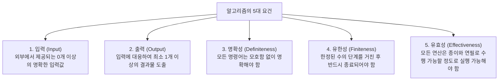
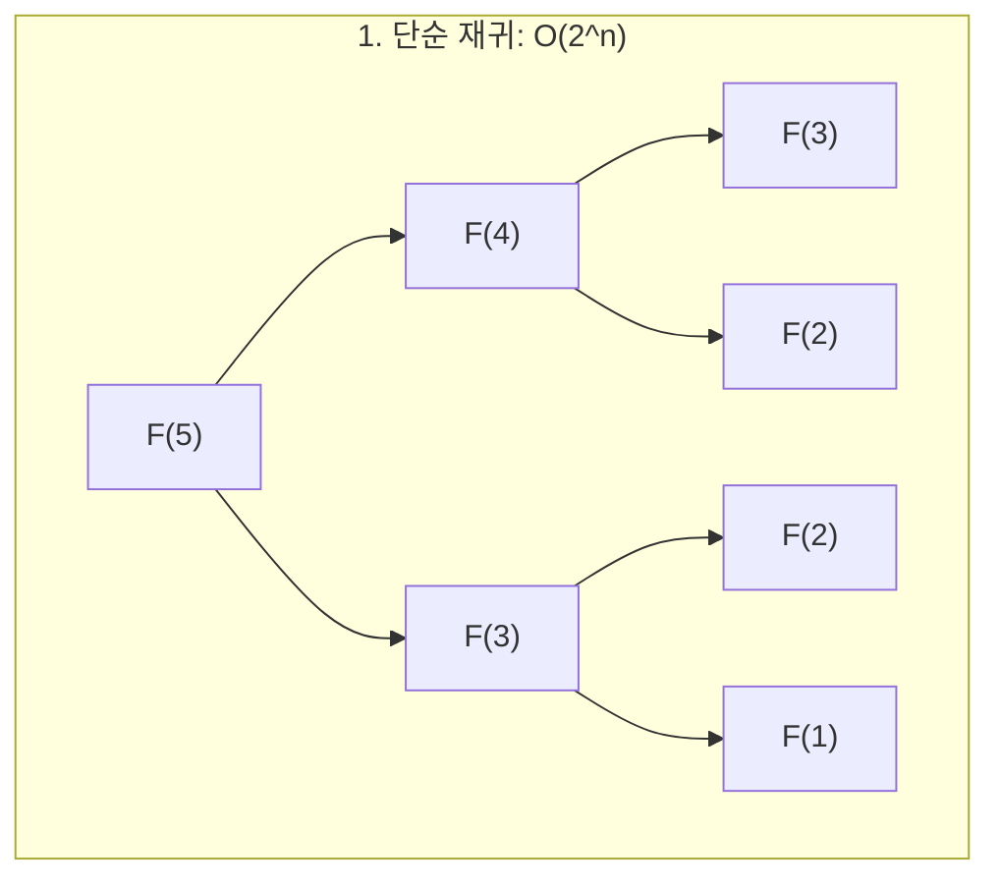

> [!abstract] 핵심 요약
> **알고리즘(Algorithm)**이란 특정한 문제를 해결하기 위해 명확하게 정의된 유한한 단계의 절차적 명령어 집합이다.
> 단순한 코드 작성을 넘어 **알고리즘의 정확성(Correctness)**을 수학적 귀납법 및 **루프 불변성(Loop Invariant)**으로 엄밀하게 증명하고, 문제에 따라 $O(2^n)$의 지수 시간 복잡도를 $O(\log n)$의 대수 시간 복잡도로 혁신적으로 단축하는 알고리즘적 사고의 힘을 체득한다.

---

## 1. 알고리즘의 본질과 5대 성립 조건

알고리즘은 임의의 컴퓨터 하드웨어나 특정 프로그래밍 언어에 종속되지 않는 **수학적·논리적 추상 모델**이다. 하나의 알고리즘이 유효하게 성립하기 위해서는 다음 5가지 엄격한 요건을 만족해야 한다.



---

## 2. 알고리즘 개발 및 문제 해결 5단계 파이프라인

1. **문제의 완벽한 이해 (Understanding the Problem)**:
   - 입력과 출력의 정확한 도메인 및 제약조건 파악 (예: $n \le 10^5$, 음수 포함 여부 등)
   - 극단적인 경계 조건(Edge Cases: 빈 배열, 중복 원소, 0 또는 음수) 식별
2. **해결 기법 결정 (Decision on Design Strategy)**:
   - 억지 기법(Brute Force), 분할 정복(Divide-and-Conquer), 축소 정복(Decrease-and-Conquer), 동적 계획법(DP), 탐욕적 기법(Greedy), 백트래킹(Backtracking) 중 적합한 패러다임 선택
3. **알고리즘 명세화 (Algorithm Specification)**:
   - 자연어, 순서도(Flowchart), 또는 표준 **의사코드(Pseudocode)**를 통한 구조화
4. **정확성 검증 (Proving Correctness)**:
   - 수학적 귀납법(Mathematical Induction) 또는 루프 불변성(Loop Invariant)을 통한 무결성 증명
5. **효율성 분석 (Efficiency Analysis)**:
   - 시간 복잡도(Time Complexity)와 공간 복잡도(Space Complexity)를 점근적 표기법($O, \Omega, \Theta$)으로 도출

---

## 3. 알고리즘 정확성 증명의 핵심: 루프 불변성 (Loop Invariant)

루프 불변성은 반복문(Loop)이 실행되는 동안 항상 참(True)으로 유지되는 성질을 의미하며, 수학적 귀납법과 완전히 동일한 3단계 논리 구조를 가진다.

| 증명 단계 | 수학적 귀납법 대응 | 루프 불변성 검증 내용 |
| :-- | :-- | :-- |
| **1. 초기화 (Initialization)** | 기저 조건 (Base Step, $n=1$) | 루프가 첫 번째 반복을 시작하기 직전에 불변 조건이 참임을 입증 |
| **2. 유지 (Maintenance)** | 귀납 단계 (Inductive Step, $k \implies k+1$) | 루프의 특정 반복 시작 전에 참이었다면, 해당 반복이 끝난 후(다음 반복 직전)에도 여전히 참임을 증명 |
| **3. 종료 (Termination)** | 무한 귀납 결론 ($orall n, P(n)$) | 루프가 종료되었을 때, 유지된 불변 조건이 알고리즘이 목표로 한 출력의 정확성을 보장함을 증명 |

---

## 4. 최대공약수(GCD) 문제와 알고리즘별 효율성 비교

두 양의 정수 $a, b$의 최대공약수 $\gcd(a, b)$를 구하는 3가지 상이한 접근 방식을 분석한다.

### 4.1. 유클리드 호제법 (Euclidean Algorithm)
- **수학적 원리**: $a = bq + r$ ($0 \le r < b$)일 때, $\gcd(a, b) = \gcd(b, r) = \gcd(b, a mod b)$
- **점화 관계**:
  $$\gcd(a, 0) = a$$
  $$\gcd(a, b) = \gcd(b, a mod b) \quad (b > 0)$$
- **시간 복잡도**: $O(\log \min(a, b))$ (라메의 정리: 두 수가 연속된 피보나치 수일 때 최악의 경우 발생)

```python
def gcd_euclid(a: int, b: int) -> int:
    while b != 0:
        a, b = b, a % b
    return a
```

### 4.2. 연속 정수 검사법 (Consecutive Integer Checking)
- $t = \min(a, b)$부터 시작하여 $t$를 1씩 감소시키며 $a mod t == 0$ 이고 $b mod t == 0$ 인 최초의 $t$ 탐색
- **시간 복잡도**: 최악의 경우(서로소) $O(\min(a, b))$ $\implies$ 유클리드에 비해 기하급수적으로 느림.

### 4.3. 에라토스테네스의 체 소인수분해 (Prime Factorization)
- $a$와 $b$를 소인수분해한 후 공통 소인수들의 곱 계산.
- 소수 판별 및 인수분해 오버헤드로 인해 $O(\sqrt{a} + \sqrt{b})$ 소요.

---

## 5. 피보나치 수열(Fibonacci)의 4대 계산 패러다임

$$F_0 = 0, \quad F_1 = 1, \quad F_n = F_{n-1} + F_{n-2} \quad (n \ge 2)$$



### 5.1. 계산 방식별 복잡도 비교 매트릭스

| 방식 | 접근법 | 시간 복잡도 | 공간 복잡도 | 특징 및 한계 |
| :-- | :-- | :--: | :--: | :-- |
| **1. 단순 재귀** | 하향식 분할 | $O\left(\left(rac{1+\sqrt{5}}{2}
ight)^n
ight) pprox O(1.618^n)$ | $O(n)$ | 동일 부분 문제의 중복 호출로 지수 폭발 |
| **2. 메모이제이션** | 하향식 DP | $O(n)$ | $O(n)$ | 캐시 배열을 활용하여 중복 연산 제거 |
| **3. 반복문 (반복)** | 상향식 DP | $O(n)$ | $O(1)$ | 이전 두 변수($prev, curr$)만 유지하여 메모리 최적화 |
| **4. 행렬 거듭제곱** | 분할 정복 거듭제곱 | **$O(\log n)$** | $O(\log n)$ | 행렬 곱의 $n-1$승을 분할 정복으로 계산 |

### 5.2. 행렬 거듭제곱 유도 공식
$$egin{pmatrix} F_{n+1} & F_n \ F_n & F_{n-1} \end{pmatrix} = egin{pmatrix} 1 & 1 \ 1 & 0 \end{pmatrix}^n$$

이때 $M^n$은 $n$이 짝수일 때 $M^{n/2} 	imes M^{n/2}$, 홀수일 때 $M 	imes M^{n-1}$로 분할 정복하면 **$O(\log n)$**만에 정확히 계산된다.

---

## 6. 실시간 유클리드 호제법 vs 연속 정수 검사 시뮬레이터

```html preview
<div style="font-family:system-ui,-apple-system,sans-serif;padding:20px;background:var(--card);color:var(--card-foreground);border:1px solid var(--border);border-radius:var(--radius)">
  <div style="font-size:16px;font-weight:700;margin-bottom:14px;color:var(--primary);display:flex;align-items:center;gap:8px">
    <span>⚡ 최대공약수(GCD) 알고리즘 스텝 수 비교 계산기</span>
  </div>

  <div style="display:grid;grid-template-columns:1fr 1fr;gap:12px;margin-bottom:14px">
    <div>
      <label style="font-size:11px;color:var(--muted-foreground)">정수 A 입력:</label>
      <input id="inGcdA" type="number" value="123456" style="width:100%;padding:6px;background:var(--background);color:var(--foreground);border:1px solid var(--border);border-radius:var(--radius);font-weight:700" />
    </div>
    <div>
      <label style="font-size:11px;color:var(--muted-foreground)">정수 B 입력:</label>
      <input id="inGcdB" type="number" value="7890" style="width:100%;padding:6px;background:var(--background);color:var(--foreground);border:1px solid var(--border);border-radius:var(--radius);font-weight:700" />
    </div>
  </div>

  <div style="display:grid;grid-template-columns:1fr 1fr;gap:10px;margin-bottom:12px">
    <div style="padding:12px;background:var(--background);border:1px solid var(--border);border-radius:var(--radius)">
      <div style="font-size:11px;font-weight:700;color:var(--muted-foreground)">유클리드 호제법 (Euclidean)</div>
      <div id="outEuclidSteps" style="font-family:monospace;font-size:18px;font-weight:800;color:var(--primary);margin-top:4px">6 단계</div>
      <div style="font-size:11px;color:var(--muted-foreground);margin-top:2px">복잡도: O(log min(a,b))</div>
    </div>
    <div style="padding:12px;background:var(--background);border:1px solid var(--border);border-radius:var(--radius)">
      <div style="font-size:11px;font-weight:700;color:var(--muted-foreground)">연속 정수 검사법 (Naive)</div>
      <div id="outNaiveSteps" style="font-family:monospace;font-size:18px;font-weight:800;color:var(--destructive,#ef4444);margin-top:4px">7,884 단계</div>
      <div style="font-size:11px;color:var(--muted-foreground);margin-top:2px">복잡도: O(min(a,b))</div>
    </div>
  </div>

  <div style="padding:10px;background:var(--background);border:1px solid var(--border);border-radius:var(--radius);font-size:13px">
    최종 최대공약수 GCD: <strong id="outGcdResult" style="color:var(--primary)">6</strong>
  </div>

  <script>
    function calcGcdSim() {
      var a = parseInt(document.getElementById('inGcdA').value) || 1;
      var b = parseInt(document.getElementById('inGcdB').value) || 1;
      if (a < 1) a = 1; if (b < 1) b = 1;
      
      // Euclid
      var ea = a, eb = b, eSteps = 0;
      while (eb !== 0) {
        var temp = eb;
        eb = ea % eb;
        ea = temp;
        eSteps++;
      }
      var gcdVal = ea;

      // Naive steps
      var minVal = Math.min(a, b);
      var nSteps = 0;
      for (var t = minVal; t >= 1; t--) {
        nSteps++;
        if (a % t === 0 && b % t === 0) break;
      }

      document.getElementById('outEuclidSteps').textContent = eSteps + " 단계";
      document.getElementById('outNaiveSteps').textContent = nSteps.toLocaleString() + " 단계";
      document.getElementById('outGcdResult').textContent = gcdVal;
    }

    document.getElementById('inGcdA').addEventListener('input', calcGcdSim);
    document.getElementById('inGcdB').addEventListener('input', calcGcdSim);
    calcGcdSim();
  </script>
</div>
```
