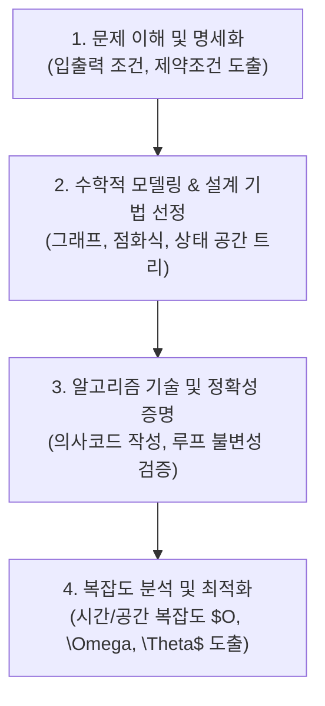

> [!abstract] 핵심 요약
> **알고리즘(Algorithm)**은 주어진 문제를 해결하기 위해 명확하게 정의된 유한한 단계의 절차적 명령어 집합이다.
> 알고리즘의 설계는 단순 코딩이 아니라 **수학적 모델링**, **루프 불변성(Loop Invariant)**을 통한 정확성 증명, 그리고 입력 크기 $n$에 대한 **시간/공간 복잡도 분석**이 일관된 파이프라인으로 수행되어야 한다.

---

## 1. 알고리즘 문제 해결 4단계 파이프라인



---

## 2. 유클리드 호제법 (Euclidean Algorithm)과 정확성 증명

$$\gcd(a, b) = \gcd(b, a mod b) \quad (	ext{단, } \gcd(a, 0) = a)$$

### 🏆 루프 불변성 (Loop Invariant) 3단계 검증
1. **초기조건 (Initialization)**: 루프 진입 직전, $\gcd(a_0, b_0)$는 원래 구하고자 하는 $\gcd(a, b)$와 같다.
2. **유지조건 (Maintenance)**: $a_{k+1} = b_k, b_{k+1} = a_k mod b_k$ 변환 시, 나눗셈 정리에 의해 $\gcd(a_k, b_k) = \gcd(b_k, a_k mod b_k)$가 보존된다.
3. **종료조건 (Termination)**: $b_k = 0$이 되는 순간 루프가 종료되며, 이때 $a_k$는 $\gcd(a_0, b_0)$와 정확히 일치한다.

---

## 3. 실시간 유클리드 최대공약수(GCD) 계산기

```html preview
<div style="font-family:system-ui,-apple-system,sans-serif;padding:20px;background:var(--card);color:var(--card-foreground);border:1px solid var(--border);border-radius:var(--radius)">
  <div style="font-size:16px;font-weight:700;margin-bottom:14px;color:var(--primary);display:flex;align-items:center;gap:8px">
    <span>📐 유클리드 호제법 GCD 단계별 계산기</span>
  </div>

  <div style="display:grid;grid-template-columns:1fr 1fr;gap:12px;margin-bottom:14px">
    <div>
      <label style="font-size:11px;color:var(--muted-foreground)">정수 A:</label>
      <input id="inGcdA" type="number" value="1071" style="width:100%;padding:4px;background:var(--background);color:var(--foreground);border:1px solid var(--border);border-radius:var(--radius);font-weight:700" />
    </div>
    <div>
      <label style="font-size:11px;color:var(--muted-foreground)">정수 B:</label>
      <input id="inGcdB" type="number" value="462" style="width:100%;padding:4px;background:var(--background);color:var(--foreground);border:1px solid var(--border);border-radius:var(--radius);font-weight:700" />
    </div>
  </div>

  <div style="padding:12px;background:var(--background);border:1px solid var(--border);border-radius:var(--radius)">
    <div style="font-size:11px;font-weight:700;color:var(--muted-foreground);margin-bottom:4px">최대공약수 및 단계 수</div>
    <div id="gcdResultOut" style="font-family:monospace;font-size:14px;line-height:1.6;color:var(--primary)">
      GCD(1071, 462) = 21 (총 4회 연산)
    </div>
  </div>

  <script>
    function calcGcd() {
      var a = parseInt(document.getElementById('inGcdA').value) || 1;
      var b = parseInt(document.getElementById('inGcdB').value) || 1;
      var origA = a, origB = b;
      var steps = 0;
      while (b !== 0) {
        var temp = b;
        b = a % b;
        a = temp;
        steps++;
      }
      document.getElementById('gcdResultOut').innerHTML = "<strong>GCD(" + origA + ", " + origB + ") = " + a + "</strong> (총 " + steps + "단계 소요)";
    }
    document.getElementById('inGcdA').addEventListener('input', calcGcd);
    document.getElementById('inGcdB').addEventListener('input', calcGcd);
  </script>
</div>
```
